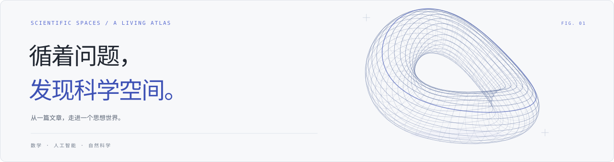

<p align="center">
  
</p>

<h1 align="center">科学空间文章索引</h1>

<p align="center"><strong>在科学与公式之间，找到下一篇值得读的文章。</strong></p>
<p align="center">
  <a href="https://caojiaolong.github.io/spaces-index/"><strong>在线探索</strong></a>
  ·
  <a href="https://spaces.ac.cn/">访问科学空间</a>
  ·
  <a href="docs/index.md">详细元数据</a>
</p>
<p align="center"><sub>非官方、持续更新、只保存元数据，不镜像文章正文。</sub></p>

## 最近更新

> **2026-07-10 · 交互式 GitHub Pages 体验升级**

- **更适合手机浏览**：重做移动端首屏、统计卡片和底部导航，筛选使用底部抽屉，并提供右下角返回顶部按钮。
- **最近文章更有上下文**：在线首页直接展示文章小结；属于系列的文章可以一键进入完整系列时间线。
- **探索筛选更完整**：支持搜索、主题、标签、年份、难度、系列文章、非系列文章以及已读/未读组合筛选，筛选状态可以随 URL 分享。
- **本地阅读进度**：点击原文会自动标为已读，也可以手动切换；记录只保存在当前浏览器，不会上传。

[前往在线索引体验这些功能 →](https://caojiaolong.github.io/spaces-index/)

## 为什么做这个索引

苏剑林老师在科学空间积累了大量高质量文章，主题横跨大模型、生成模型、优化、数学、NLP、工程实践和科普随笔。网上也有不少人工整理帖，例如 [这类知乎整理](https://zhuanlan.zhihu.com/p/1935115608074196190)，但人工清单常见的问题是：刚发布时很好用，时间一长就容易停止更新，新文章、系列续篇和分类调整很难持续同步。

这个仓库的目标是把科学空间的所有文章做成一个持续更新的元数据索引：不复制全文，只保存标题、日期、原文链接、原站分类、标签、自动主题和系列信息，并通过 GitHub Actions 定时更新。这样读者可以直接按主题或系列查找文章，跳转回原站阅读，也不用担心索引长期失修。

| 文章 | 主题 | 系列 | 最近更新 |
| ---: | ---: | ---: | :---: |
| 1326 篇 | 17 个 | 55 个 | 2026-07-06 |

> 本项目保存标题、链接、日期、分类、标签、自动主题、系列信息和少量小结短摘录；不镜像、复制或保存文章全文。

## 三种浏览方式

- [全文检索](https://caojiaolong.github.io/spaces-index/#/explore)：按标题、标签、系列和小结快速搜索，组合主题、年份、系列状态与已读状态等筛选条件。
- [主题漫游](https://caojiaolong.github.io/spaces-index/#/topics)：从大模型、数学、自然科学等方向逐层发现文章。
- [系列阅读](https://caojiaolong.github.io/spaces-index/#/series)：按章节顺序阅读 Transformer、扩散模型等长篇系列。

## 目录

<details>
<summary><strong>展开完整主题、系列与非系列目录</strong></summary>

- [深度学习基础（121 篇）](#topic-deep-learning)
  - [重新思考学习率与Batch Size（4 篇）](https://caojiaolong.github.io/spaces-index/#/series/series-7e434c5c57cd)
  - [多任务学习漫谈（3 篇）](https://caojiaolong.github.io/spaces-index/#/series/series-0ac96064005b)
  - [“让Keras更酷一些！”（7 篇）](https://caojiaolong.github.io/spaces-index/#/series/series-578e6271b73c)
  - [文本情感分类（4 篇）](https://caojiaolong.github.io/spaces-index/#/series/series-4b0540d8f579)
  - [非系列文章（103 篇）](#series-deep-learning-standalone)
- [词向量与Embedding（24 篇）](#topic-embeddings)
  - [CoSENT（3 篇）](https://caojiaolong.github.io/spaces-index/#/series/series-380e395e0231)
  - [更别致的词向量模型（6 篇）](https://caojiaolong.github.io/spaces-index/#/series/series-83ff2143be8b)
  - [不可思议的Word2Vec（6 篇）](https://caojiaolong.github.io/spaces-index/#/series/series-b9f4ef1c4dfa)
  - [非系列文章（9 篇）](#series-embeddings-standalone)
- [大模型与Transformer（151 篇）](#topic-transformer)
  - [MoE环游记（9 篇）](https://caojiaolong.github.io/spaces-index/#/series/series-34fc554ca8f0)
  - [MuP之上（4 篇）](https://caojiaolong.github.io/spaces-index/#/series/series-894387d0ec66)
  - [Transformer升级之路（21 篇）](https://caojiaolong.github.io/spaces-index/#/series/series-43ce6f7a2fb9)
  - [“闭门造车”之多模态思路浅谈（3 篇）](https://caojiaolong.github.io/spaces-index/#/series/series-2e7d3298470e)
  - [对齐全量微调！这是我看过最精彩的LoRA改进（2 篇）](https://caojiaolong.github.io/spaces-index/#/series/series-2e10ffe13211)
  - [重温SSM（4 篇）](https://caojiaolong.github.io/spaces-index/#/series/series-5070561d10c9)
  - [非系列文章（108 篇）](#series-transformer-standalone)
- [生成模型（124 篇）](#topic-generative-models)
  - [生成扩散模型漫谈（31 篇）](https://caojiaolong.github.io/spaces-index/#/series/series-e48ccca641f8)
  - [细水长flow（5 篇）](https://caojiaolong.github.io/spaces-index/#/series/series-9738e76a3125)
  - [变分自编码器（8 篇）](https://caojiaolong.github.io/spaces-index/#/series/series-c26095ce70d7)
  - [搜出来的文本（4 篇）](https://caojiaolong.github.io/spaces-index/#/series/series-efbc1f2b0e42)
  - [能量视角下的GAN模型（3 篇）](https://caojiaolong.github.io/spaces-index/#/series/series-bf3266b9c1b3)
  - [非系列文章（73 篇）](#series-generative-models-standalone)
- [优化与训练（104 篇）](#topic-optimization)
  - [让炼丹更科学一些（7 篇）](https://caojiaolong.github.io/spaces-index/#/series/series-22f3c6204559)
  - [流形上的最速下降（6 篇）](https://caojiaolong.github.io/spaces-index/#/series/series-9aa52368b14f)
  - [基于流式幂迭代的Muon实现（5 篇）](https://caojiaolong.github.io/spaces-index/#/series/series-b7bbf4382414)
  - [AdamW的Weight RMS的渐近估计（2 篇）](https://caojiaolong.github.io/spaces-index/#/series/series-ae309a12502d)
  - [通过msign来计算奇异值裁剪mclip（2 篇）](https://caojiaolong.github.io/spaces-index/#/series/series-297337ae72f8)
  - [msign算子的Newton-Schulz迭代（2 篇）](https://caojiaolong.github.io/spaces-index/#/series/series-a60856a07854)
  - [从动力学角度看优化算法（7 篇）](https://caojiaolong.github.io/spaces-index/#/series/series-4b38446b55a8)
  - [非系列文章（73 篇）](#series-optimization-standalone)
- [数学工具（377 篇）](#topic-math)
  - [低秩近似之路（5 篇）](https://caojiaolong.github.io/spaces-index/#/series/series-6689ddf615c5)
  - [SVD分解（3 篇）](https://caojiaolong.github.io/spaces-index/#/series/series-cb4267a83e5b)
  - [外微分浅谈（7 篇）](https://caojiaolong.github.io/spaces-index/#/series/series-07dc7181b71c)
  - [路径积分系列（5 篇）](https://caojiaolong.github.io/spaces-index/#/series/series-f5eea49ebf11)
  - [“熵”不起：从熵、最大熵原理到最大熵模型（3 篇）](https://caojiaolong.github.io/spaces-index/#/series/series-8ebf25071da3)
  - [高斯型积分的微扰展开（3 篇）](https://caojiaolong.github.io/spaces-index/#/series/series-06b60440b9ca)
  - [从费马大定理谈起（12 篇）](https://caojiaolong.github.io/spaces-index/#/series/series-df510aaec380)
  - [新理解矩阵（6 篇）](https://caojiaolong.github.io/spaces-index/#/series/series-26a49a282f58)
  - [求解微分方程的李对称方法（2 篇）](https://caojiaolong.github.io/spaces-index/#/series/series-aeb91e162348)
  - [数学基本技艺之23、24（2 篇）](https://caojiaolong.github.io/spaces-index/#/series/series-c295ed4753b1)
  - [纠缠的时空（3 篇）](https://caojiaolong.github.io/spaces-index/#/series/series-ce0fb9687384)
  - [费曼积分法（4 篇）](https://caojiaolong.github.io/spaces-index/#/series/series-ec7e1e24d2d0)
  - [轻微的扰动——摄动法简介（3 篇）](https://caojiaolong.github.io/spaces-index/#/series/series-4c07e201c9e6)
  - [费曼路径积分思想的发展（4 篇）](https://caojiaolong.github.io/spaces-index/#/series/series-246a7a31d942)
  - [算子与线性常微分方程（2 篇）](https://caojiaolong.github.io/spaces-index/#/series/series-7a80644aeae9)
  - [费曼积分法——积分符号内取微分（4 篇）](https://caojiaolong.github.io/spaces-index/#/series/series-e14089cebdfb)
  - [《教材如何写》（3 篇）](https://caojiaolong.github.io/spaces-index/#/series/series-f9866e4ce115)
  - [自然极值（8 篇）](https://caojiaolong.github.io/spaces-index/#/series/series-5e3917ad3216)
  - [向量（5 篇）](https://caojiaolong.github.io/spaces-index/#/series/series-fae158475ede)
  - [微积分学习（2 篇）](https://caojiaolong.github.io/spaces-index/#/series/series-d050b16b4d9c)
  - [非系列文章（291 篇）](#series-math-standalone)
- [概率统计与信息论（84 篇）](#topic-probability-info)
  - [最小熵原理（6 篇）](https://caojiaolong.github.io/spaces-index/#/series/series-2e7e2c469894)
  - [非系列文章（78 篇）](#series-probability-info-standalone)
- [几何与方程（106 篇）](#topic-geometry-equations)
  - [理解黎曼几何（8 篇）](https://caojiaolong.github.io/spaces-index/#/series/series-41868e210e17)
  - [非系列文章（98 篇）](#series-geometry-equations-standalone)
- [NLP与信息抽取（92 篇）](#topic-nlp)
  - [中文分词系列（8 篇）](https://caojiaolong.github.io/spaces-index/#/series/series-73a0edf1cd6e)
  - [OCR技术浅探（10 篇）](https://caojiaolong.github.io/spaces-index/#/series/series-2315cbccffcf)
  - [非系列文章（74 篇）](#series-nlp-standalone)
- [工程工具（124 篇）](#topic-engineering)
  - [通用爬虫探索（3 篇）](https://caojiaolong.github.io/spaces-index/#/series/series-c6d727fb3c99)
  - [非系列文章（121 篇）](#series-engineering-standalone)
- [天文科普（197 篇）](#topic-astronomy)
  - [非系列文章（197 篇）](#series-astronomy-standalone)
- [物理化学（123 篇）](#topic-physics-chemistry)
  - [一本对称闯物理：相对论力学（2 篇）](https://caojiaolong.github.io/spaces-index/#/series/series-0ca64e521336)
  - [一维弹簧的运动（2 篇）](https://caojiaolong.github.io/spaces-index/#/series/series-b0ed9e05e7b3)
  - [力学系统及其对偶性（3 篇）](https://caojiaolong.github.io/spaces-index/#/series/series-e231e49a335f)
  - [电偶极子浅探（2 篇）](https://caojiaolong.github.io/spaces-index/#/series/series-04bb391ccb3d)
  - [非系列文章（114 篇）](#series-physics-chemistry-standalone)
- [生物自然（30 篇）](#topic-biology)
  - [非系列文章（30 篇）](#series-biology-standalone)
- [图片摄影（68 篇）](#topic-photography)
  - [非系列文章（68 篇）](#series-photography-standalone)
- [科普问答与百科（97 篇）](#topic-popular-science)
  - [非系列文章（97 篇）](#series-popular-science-standalone)
- [资源与站务（113 篇）](#topic-resources)
  - [语料（2 篇）](https://caojiaolong.github.io/spaces-index/#/series/series-12d8681743bb)
  - [非系列文章（111 篇）](#series-resources-standalone)
- [阅读写作与随笔（176 篇）](#topic-essays)
  - [非系列文章（176 篇）](#series-essays-standalone)
- [其他（0 篇）](#topic-other)

注：系列文章会统一归入该系列的众数主题；非系列文章仍可能属于多个主题，因此目录中的主题数量之和可能大于文章总数。

</details>

## 最近 10 篇文章

- 2026-07-06 - [让炼丹更科学一些（七）：步长调度与权重平均](https://spaces.ac.cn/archives/11804) - [查看系列](https://caojiaolong.github.io/spaces-index/#/series/series-22f3c6204559)
- 2026-06-25 - [矩阵函数近似中的暴力美学](https://spaces.ac.cn/archives/11787)
- 2026-06-19 - [强制间隔投影（Margin-Enforcing Projection）](https://spaces.ac.cn/archives/11784)
- 2026-06-17 - [MoE环游记：9、门控归一化之争](https://spaces.ac.cn/archives/11782) - [查看系列](https://caojiaolong.github.io/spaces-index/#/series/series-34fc554ca8f0)
- 2026-06-08 - [流形上的最速下降：6. Muon + 双旋转](https://spaces.ac.cn/archives/11777) - [查看系列](https://caojiaolong.github.io/spaces-index/#/series/series-9aa52368b14f)
- 2026-06-03 - [为什么官方版Muon比MuP版多出一个max(1, ⋅)？](https://spaces.ac.cn/archives/11772)
- 2026-05-29 - [矩阵参数的奇异值熵越高越好吗？](https://spaces.ac.cn/archives/11767)
- 2026-05-22 - [MoE环游记：8、强制序列级均衡](https://spaces.ac.cn/archives/11760) - [查看系列](https://caojiaolong.github.io/spaces-index/#/series/series-34fc554ca8f0)
- 2026-05-15 - [DeepSeek V4的tid2eid是怎么来的？](https://spaces.ac.cn/archives/11750)
- 2026-05-08 - [直接以FID为Loss：从梯度计算到流式训练](https://spaces.ac.cn/archives/11738)

## 主题分类

<a id="topic-deep-learning"></a>
<details>
<summary><strong>深度学习基础</strong> · 121 篇</summary>

[返回目录](#目录)

<a id="series-deep-learning-69126a7846"></a>
#### 重新思考学习率与Batch Size [返回目录](#目录)

- 2025-09-01 - [重新思考学习率与Batch Size（一）：现状](https://spaces.ac.cn/archives/11260)
- 2025-09-10 - [重新思考学习率与Batch Size（二）：平均场](https://spaces.ac.cn/archives/11280)
- 2025-09-15 - [重新思考学习率与Batch Size（三）：Muon](https://spaces.ac.cn/archives/11285)
- 2025-09-22 - [重新思考学习率与Batch Size（四）：EMA](https://spaces.ac.cn/archives/11301)

<a id="series-deep-learning-0ac9606400"></a>
#### 多任务学习漫谈 [返回目录](#目录)

- 2022-01-18 - [多任务学习漫谈（一）：以损失之名](https://spaces.ac.cn/archives/8870)
- 2022-02-08 - [多任务学习漫谈（二）：行梯度之事](https://spaces.ac.cn/archives/8896)
- 2022-02-14 - [多任务学习漫谈（三）：分主次之序](https://spaces.ac.cn/archives/8907)

<a id="series-deep-learning-e73395bb77"></a>
#### “让Keras更酷一些！” [返回目录](#目录)

- 2018-08-06 - [“让Keras更酷一些！”：精巧的层与花式的回调](https://spaces.ac.cn/archives/5765)
- 2018-09-08 - [“让Keras更酷一些！”：小众的自定义优化器](https://spaces.ac.cn/archives/5879)
- 2019-01-27 - [“让Keras更酷一些！”：随意的输出和灵活的归一化](https://spaces.ac.cn/archives/6311)
- 2019-03-10 - [“让Keras更酷一些！”：分层的学习率和自由的梯度](https://spaces.ac.cn/archives/6418)
- 2019-04-28 - [“让Keras更酷一些！”：中间变量、权重滑动和安全生成器](https://spaces.ac.cn/archives/6575)
- 2019-07-16 - [“让Keras更酷一些！”：层中层与mask](https://spaces.ac.cn/archives/6810)
- 2019-09-29 - [“让Keras更酷一些！”：层与模型的重用技巧](https://spaces.ac.cn/archives/6985)

<a id="series-deep-learning-4b0540d8f5"></a>
#### 文本情感分类 [返回目录](#目录)

- 2015-06-22 - [文本情感分类（一）：传统模型](https://spaces.ac.cn/archives/3360)
- 2015-08-04 - [文本情感分类（二）：深度学习模型](https://spaces.ac.cn/archives/3414)
- 2016-06-29 - [文本情感分类（三）：分词 OR 不分词](https://spaces.ac.cn/archives/3863)
- 2017-03-30 - [文本情感分类（四）：更好的损失函数](https://spaces.ac.cn/archives/4293)

<a id="series-deep-learning-standalone"></a>
#### 非系列文章 [返回目录](#目录)

- 2026-06-19 - [强制间隔投影（Margin-Enforcing Projection）](https://spaces.ac.cn/archives/11784)
- 2026-05-08 - [直接以FID为Loss：从梯度计算到流式训练](https://spaces.ac.cn/archives/11738)
- 2026-03-19 - [Attention Residuals 回忆录](https://spaces.ac.cn/archives/11664)
- 2025-08-16 - [ReLU/GeLU/Swish的一个恒等式](https://spaces.ac.cn/archives/11233)
- 2025-03-24 - [高阶MuP：更简明但更高明的谱条件缩放](https://spaces.ac.cn/archives/10795)
- 2025-03-13 - [初探MuP：超参数的跨模型尺度迁移规律](https://spaces.ac.cn/archives/10770)
- 2024-11-18 - [Adam的epsilon如何影响学习率的Scaling Law？](https://spaces.ac.cn/archives/10563)
- 2024-11-14 - [当Batch Size增大时，学习率该如何随之变化？](https://spaces.ac.cn/archives/10542)
- 2024-06-14 - [通向概率分布之路：盘点Softmax及其替代品](https://spaces.ac.cn/archives/10145)
- 2023-10-13 - [EMO：基于最优传输思想设计的分类损失函数](https://spaces.ac.cn/archives/9797)
- 2023-05-18 - [基于量子化假设推导模型的尺度定律（Scaling Law）](https://spaces.ac.cn/archives/9607)
- 2023-03-14 - [缓解交叉熵过度自信的一个简明方案](https://spaces.ac.cn/archives/9526)
- 2022-11-30 - [用热传导方程来指导自监督学习](https://spaces.ac.cn/archives/9359)
- 2022-07-15 - [不成功的尝试：将多标签交叉熵推广到“n个m分类”上去](https://spaces.ac.cn/archives/9158)
- 2022-06-01 - [如何训练你的准确率？](https://spaces.ac.cn/archives/9098)
- 2022-05-07 - [多标签“Softmax+交叉熵”的软标签版本](https://spaces.ac.cn/archives/9064)
- 2022-04-28 - [在bert4keras中使用混合精度和XLA加速训练](https://spaces.ac.cn/archives/9059)
- 2022-04-15 - [GlobalPointer下的“KL散度”应该是怎样的？](https://spaces.ac.cn/archives/9039)
- 2022-03-19 - [为什么需要残差？一个来自DeepNet的视角](https://spaces.ac.cn/archives/8994)
- 2021-12-29 - [SquarePlus：可能是运算最简单的ReLU光滑近似](https://spaces.ac.cn/archives/8833)
- 2021-12-17 - [Seq2Seq+前缀树：检索任务新范式（以KgCLUE为例）](https://spaces.ac.cn/archives/8802)
- 2021-11-29 - [Dropout视角下的MLM和MAE：一些新的启发](https://spaces.ac.cn/archives/8770)
- 2021-11-22 - [ChildTuning：试试把Dropout加到梯度上去？](https://spaces.ac.cn/archives/8764)
- 2021-10-31 - [bert4keras在手，baseline我有：CLUE基准代码](https://spaces.ac.cn/archives/8739)
- 2021-09-01 - [从三角不等式到Margin Softmax](https://spaces.ac.cn/archives/8656)
- 2021-07-26 - [FlatNCE：小批次对比学习效果差的原因竟是浮点误差？](https://spaces.ac.cn/archives/8586)
- 2021-07-01 - [又是Dropout两次！这次它做到了有监督任务的SOTA](https://spaces.ac.cn/archives/8496)
- 2021-04-16 - [搜狐文本匹配：基于条件LayerNorm的多任务baseline](https://spaces.ac.cn/archives/8337)
- 2021-04-03 - [P-tuning：自动构建模版，释放语言模型潜能](https://spaces.ac.cn/archives/8295)
- 2021-03-05 - [短文本匹配Baseline：脱敏数据使用预训练模型的尝试](https://spaces.ac.cn/archives/8213)
- 2020-11-20 - [跟风玩玩目前最大的中文GPT2模型（bert4keras）](https://spaces.ac.cn/archives/7912)
- 2020-11-13 - [也来谈谈RNN的梯度消失/爆炸问题](https://spaces.ac.cn/archives/7888)
- 2020-08-31 - [再谈类别不平衡问题：调节权重与魔改Loss的对比联系](https://spaces.ac.cn/archives/7708)
- 2020-08-14 - [L2正则没有想象那么好？可能是“权重尺度偏移”惹的祸](https://spaces.ac.cn/archives/7681)
- 2020-07-31 - [我们真的需要把训练集的损失降低到零吗？](https://spaces.ac.cn/archives/7643)
- 2020-07-19 - [通过互信息思想来缓解类别不平衡问题](https://spaces.ac.cn/archives/7615)
- 2020-06-28 - [积分梯度：一种新颖的神经网络可视化方法](https://spaces.ac.cn/archives/7533)
- 2020-04-29 - [节省显存的重计算技巧也有了Keras版了](https://spaces.ac.cn/archives/7367)
- 2020-04-25 - [将“Softmax+交叉熵”推广到多标签分类问题](https://spaces.ac.cn/archives/7359)
- 2020-04-13 - [突破瓶颈，打造更强大的Transformer](https://spaces.ac.cn/archives/7325)
- 2020-04-02 - [bert4keras在手，baseline我有：百度LIC2020](https://spaces.ac.cn/archives/7321)
- 2020-03-26 - [GELU的两个初等函数近似是怎么来的](https://spaces.ac.cn/archives/7309)
- 2020-03-23 - [AdaFactor优化器浅析（附开源实现）](https://spaces.ac.cn/archives/7302)
- 2020-03-16 - [现在可以用Keras玩中文GPT2了（GPT2_ML）](https://spaces.ac.cn/archives/7292)
- 2020-03-01 - [对抗训练浅谈：意义、方法和思考（附Keras实现）](https://spaces.ac.cn/archives/7234)
- 2020-01-03 - [用bert4keras做三元组抽取](https://spaces.ac.cn/archives/7161)
- 2019-11-25 - [6个派生优化器的简单介绍及其实现](https://spaces.ac.cn/archives/7094)
- 2019-11-06 - [Keras：Tensorflow的黄金标准](https://spaces.ac.cn/archives/7055)
- 2019-10-11 - [BN究竟起了什么作用？一个闭门造车的分析](https://spaces.ac.cn/archives/6992)
- 2019-09-03 - [百度实体链接比赛后记：行为建模和实体链接](https://spaces.ac.cn/archives/6919)
- 2019-08-27 - [自己实现了一个bert4keras](https://spaces.ac.cn/archives/6915)
- 2019-08-20 - [开源一版DGCNN阅读理解问答模型（Keras版）](https://spaces.ac.cn/archives/6906)
- 2019-08-09 - [seq2seq之双向解码](https://spaces.ac.cn/archives/6877)
- 2019-07-30 - [Keras实现两个优化器：Lookahead和LazyOptimizer](https://spaces.ac.cn/archives/6869)
- 2019-07-08 - [用时间换取效果：Keras梯度累积优化器](https://spaces.ac.cn/archives/6794)
- 2019-06-29 - [基于Bert的NL2SQL模型：一个简明的Baseline](https://spaces.ac.cn/archives/6771)
- 2019-06-18 - [当Bert遇上Keras：这可能是Bert最简单的打开姿势](https://spaces.ac.cn/archives/6736)
- 2019-05-28 - [ON-LSTM：用有序神经元表达层次结构](https://spaces.ac.cn/archives/6621)
- 2019-02-22 - [巧断梯度：单个loss实现GAN模型](https://spaces.ac.cn/archives/6387)
- 2018-10-07 - [深度学习中的Lipschitz约束：泛化与生成模型](https://spaces.ac.cn/archives/6051)
- 2018-10-02 - [深度学习的互信息：无监督提取特征](https://spaces.ac.cn/archives/6024)
- 2018-09-01 - [玩转Keras之seq2seq自动生成标题](https://spaces.ac.cn/archives/5861)
- 2018-07-29 - [基于GRU和AM-Softmax的句子相似度模型](https://spaces.ac.cn/archives/5743)
- 2018-07-18 - [用变分推断统一理解生成模型（VAE、GAN、AAE、ALI）](https://spaces.ac.cn/archives/5716)
- 2018-07-07 - [从SamplePairing到mixup：神奇的正则项](https://spaces.ac.cn/archives/5693)
- 2018-05-18 - [简明条件随机场CRF介绍（附带纯Keras实现）](https://spaces.ac.cn/archives/5542)
- 2018-05-10 - [用Numpy实现高效的Apriori算法](https://spaces.ac.cn/archives/5525)
- 2018-04-15 - [基于CNN的阅读理解式问答模型：DGCNN](https://spaces.ac.cn/archives/5409)
- 2018-03-02 - [三味Capsule：矩阵Capsule与EM路由](https://spaces.ac.cn/archives/5155)
- 2018-02-12 - [再来一顿贺岁宴：从K-Means到Capsule](https://spaces.ac.cn/archives/5112)
- 2018-01-23 - [分享一个slide：花式自然语言处理](https://spaces.ac.cn/archives/4823)
- 2018-01-23 - [揭开迷雾，来一顿美味的Capsule盛宴](https://spaces.ac.cn/archives/4819)
- 2018-01-06 - [《Attention is All You Need》浅读（简介+代码）](https://spaces.ac.cn/archives/4765)
- 2017-12-25 - [从loss的硬截断、软化到focal loss](https://spaces.ac.cn/archives/4733)
- 2017-10-26 - [浅谈神经网络中激活函数的设计](https://spaces.ac.cn/archives/4647)
- 2017-10-14 - [训练集、验证集和测试集的意义](https://spaces.ac.cn/archives/4638)
- 2017-10-13 - [基于fine tune的图像分类（百度分狗竞赛）](https://spaces.ac.cn/archives/4611)
- 2017-09-10 - [RNN模型中输入的重要性的评估](https://spaces.ac.cn/archives/4582)
- 2017-09-03 - [开学啦！咱们来做完形填空～（讯飞杯）](https://spaces.ac.cn/archives/4564)
- 2017-08-27 - [fashion mnist的一个baseline (MobileNet 95%)](https://spaces.ac.cn/archives/4556)
- 2017-08-26 - [fashion-mnist的gan玩具](https://spaces.ac.cn/archives/4540)
- 2017-08-08 - [【备忘】谈谈dropout](https://spaces.ac.cn/archives/4521)
- 2017-07-24 - [基于Xception的腾讯验证码识别（样本+代码）](https://spaces.ac.cn/archives/4503)
- 2017-07-22 - [Keras中自定义复杂的loss函数](https://spaces.ac.cn/archives/4493)
- 2017-05-04 - [记录一次半监督的情感分析](https://spaces.ac.cn/archives/4374)
- 2017-03-14 - [泰迪杯赛前培训之数据挖掘与建模“慢谈”](https://spaces.ac.cn/archives/4271)
- 2016-12-14 - [端到端的腾讯验证码识别（46%正确率）](https://spaces.ac.cn/archives/4138)
- 2016-12-03 - [词向量与Embedding究竟是怎么回事？](https://spaces.ac.cn/archives/4122)
- 2016-12-01 - [基于双向GRU和语言模型的视角情感分析](https://spaces.ac.cn/archives/4118)
- 2016-11-29 - [轻便的深度学习分词系统：NNCWS v0.1](https://spaces.ac.cn/archives/4114)
- 2016-11-25 - [三顾碎纸复原：基于CNN的碎纸复原](https://spaces.ac.cn/archives/4100)
- 2016-07-01 - [从Boosting学习到神经网络：看山是山？](https://spaces.ac.cn/archives/3873)
- 2016-05-15 - [Coming Back...](https://spaces.ac.cn/archives/3735)
- 2016-01-18 - [当大数据进入厨房：让大数据教你做菜！](https://spaces.ac.cn/archives/3587)
- 2015-12-06 - [人生苦短，我用Python！](https://spaces.ac.cn/archives/3546)
- 2015-11-13 - [ARXIV数学论文分布：偏微分方程最热门！](https://spaces.ac.cn/archives/3511)
- 2015-07-02 - [用Pandas实现高效的Apriori算法](https://spaces.ac.cn/archives/3380)
- 2015-06-06 - [闲聊：神经网络与深度学习](https://spaces.ac.cn/archives/3331)
- 2014-12-31 - [我的写论文软件组合](https://spaces.ac.cn/archives/3171)
- 2014-12-18 - [迟到一年的建模：再探碎纸复原](https://spaces.ac.cn/archives/3134)
- 2014-12-15 - [两生物种群竞争模型：LaTeX+Python](https://spaces.ac.cn/archives/3120)
- 2014-09-11 - [\[备份\]全国大学生数学建模竞赛论文LaTex模板](https://spaces.ac.cn/archives/2935)
- 2013-09-22 - [一个人的数学建模：碎纸复原](https://spaces.ac.cn/archives/2067)

</details>

<a id="topic-embeddings"></a>
<details>
<summary><strong>词向量与Embedding</strong> · 24 篇</summary>

[返回目录](#目录)

<a id="series-embeddings-2949022b50"></a>
#### CoSENT [返回目录](#目录)

- 2022-01-06 - [CoSENT（一）：比Sentence-BERT更有效的句向量方案](https://spaces.ac.cn/archives/8847)
- 2022-01-12 - [CoSENT（二）：特征式匹配与交互式匹配有多大差距？](https://spaces.ac.cn/archives/8860)
- 2022-11-09 - [CoSENT（三）：作为交互式相似度的损失函数](https://spaces.ac.cn/archives/9341)

<a id="series-embeddings-83ff2143be"></a>
#### 更别致的词向量模型 [返回目录](#目录)

- 2017-11-19 - [更别致的词向量模型(一)：simpler glove](https://spaces.ac.cn/archives/4667)
- 2017-11-19 - [更别致的词向量模型(二)：对语言进行建模](https://spaces.ac.cn/archives/4669)
- 2017-11-19 - [更别致的词向量模型(三)：描述相关的模型](https://spaces.ac.cn/archives/4671)
- 2017-11-19 - [更别致的词向量模型(四)：模型的求解](https://spaces.ac.cn/archives/4675)
- 2017-11-19 - [更别致的词向量模型(五)：有趣的结果](https://spaces.ac.cn/archives/4677)
- 2017-11-19 - [更别致的词向量模型(六)：代码、分享与结语](https://spaces.ac.cn/archives/4681)

<a id="series-embeddings-5025fd40f6"></a>
#### 不可思议的Word2Vec [返回目录](#目录)

- 2017-04-02 - [【不可思议的Word2Vec】 1.数学原理](https://spaces.ac.cn/archives/4299)
- 2017-04-03 - [【不可思议的Word2Vec】 2.训练好的模型](https://spaces.ac.cn/archives/4304)
- 2017-04-07 - [【不可思议的Word2Vec】 3.提取关键词](https://spaces.ac.cn/archives/4316)
- 2017-05-01 - [【不可思议的Word2Vec】 4.不一样的“相似”](https://spaces.ac.cn/archives/4368)
- 2017-05-27 - [【不可思议的Word2Vec】5. Tensorflow版的Word2Vec](https://spaces.ac.cn/archives/4402)
- 2017-08-06 - [【不可思议的Word2Vec】6. Keras版的Word2Vec](https://spaces.ac.cn/archives/4515)

<a id="series-embeddings-standalone"></a>
#### 非系列文章 [返回目录](#目录)

- 2023-08-28 - [Lion/Tiger优化器训练下的Embedding异常和对策](https://spaces.ac.cn/archives/9736)
- 2023-07-20 - [语言模型输出端共享Embedding的重新探索](https://spaces.ac.cn/archives/9698)
- 2021-09-27 - [关于维度公式“n > 8.33 log N”的可用性分析](https://spaces.ac.cn/archives/8711)
- 2021-06-11 - [SimBERTv2来了！融合检索和生成的RoFormer-Sim模型](https://spaces.ac.cn/archives/8454)
- 2021-02-09 - [一个二值化词向量模型，是怎么跟果蝇搭上关系的？](https://spaces.ac.cn/archives/8159)
- 2020-05-18 - [鱼与熊掌兼得：融合检索和生成的SimBERT模型](https://spaces.ac.cn/archives/7427)
- 2019-11-11 - [JoSE：球面上的词向量和句向量](https://spaces.ac.cn/archives/7063)
- 2018-06-13 - [“噪声对比估计”杂谈：曲径通幽之妙](https://spaces.ac.cn/archives/5617)
- 2016-12-03 - [词向量与Embedding究竟是怎么回事？](https://spaces.ac.cn/archives/4122)

</details>

<a id="topic-transformer"></a>
<details>
<summary><strong>大模型与Transformer</strong> · 151 篇</summary>

[返回目录](#目录)

<a id="series-transformer-f5569856ba"></a>
#### MoE环游记 [返回目录](#目录)

- 2025-02-08 - [MoE环游记：1、从几何意义出发](https://spaces.ac.cn/archives/10699)
- 2025-02-21 - [MoE环游记：2、不患寡而患不均](https://spaces.ac.cn/archives/10735)
- 2025-03-05 - [MoE环游记：3、换个思路来分配](https://spaces.ac.cn/archives/10757)
- 2025-03-28 - [MoE环游记：4、难处应当多投入](https://spaces.ac.cn/archives/10815)
- 2025-05-16 - [MoE环游记：5、均匀分布的反思](https://spaces.ac.cn/archives/10945)
- 2026-02-22 - [MoE环游记：6、最优分配促均衡](https://spaces.ac.cn/archives/11619)
- 2026-02-23 - [MoE环游记：7、动态激活极简解](https://spaces.ac.cn/archives/11626)
- 2026-05-22 - [MoE环游记：8、强制序列级均衡](https://spaces.ac.cn/archives/11760)
- 2026-06-17 - [MoE环游记：9、门控归一化之争](https://spaces.ac.cn/archives/11782)

<a id="series-transformer-86fdf79074"></a>
#### MuP之上 [返回目录](#目录)

- 2025-10-21 - [MuP之上：1. 好模型的三个特征](https://spaces.ac.cn/archives/11340)
- 2026-02-15 - [MuP之上：2. 线性层与最速下降](https://spaces.ac.cn/archives/11605)
- 2026-03-02 - [MuP之上：3. 特殊情况特殊处理](https://spaces.ac.cn/archives/11647)
- 2026-04-24 - [MuP之上：4. 坚守参数的稳定性](https://spaces.ac.cn/archives/11729)

<a id="series-transformer-34e65637fd"></a>
#### Transformer升级之路 [返回目录](#目录)

- 2021-03-08 - [Transformer升级之路：1、Sinusoidal位置编码追根溯源](https://spaces.ac.cn/archives/8231)
- 2021-03-23 - [Transformer升级之路：2、博采众长的旋转式位置编码](https://spaces.ac.cn/archives/8265)
- 2021-04-22 - [Transformer升级之路：3、从Performer到线性Attention](https://spaces.ac.cn/archives/8338)
- 2021-05-10 - [Transformer升级之路：4、二维位置的旋转式位置编码](https://spaces.ac.cn/archives/8397)
- 2021-08-06 - [Transformer升级之路：5、作为无限维的线性Attention](https://spaces.ac.cn/archives/8601)
- 2022-12-28 - [Transformer升级之路：6、旋转位置编码的完备性分析](https://spaces.ac.cn/archives/9403)
- 2023-01-12 - [Transformer升级之路：7、长度外推性与局部注意力](https://spaces.ac.cn/archives/9431)
- 2023-01-31 - [Transformer升级之路：8、长度外推性与位置鲁棒性](https://spaces.ac.cn/archives/9444)
- 2023-05-12 - [Transformer升级之路：9、一种全局长度外推的新思路](https://spaces.ac.cn/archives/9603)
- 2023-07-06 - [Transformer升级之路：10、RoPE是一种β进制编码](https://spaces.ac.cn/archives/9675)
- 2023-07-31 - [Transformer升级之路：11、将β进制位置进行到底](https://spaces.ac.cn/archives/9706)
- 2023-08-07 - [Transformer升级之路：12、无限外推的ReRoPE？](https://spaces.ac.cn/archives/9708)
- 2023-08-14 - [Transformer升级之路：13、逆用Leaky ReRoPE](https://spaces.ac.cn/archives/9728)
- 2023-08-24 - [Transformer升级之路：14、当HWFA遇见ReRoPE](https://spaces.ac.cn/archives/9731)
- 2023-11-20 - [Transformer升级之路：15、Key归一化助力长度外推](https://spaces.ac.cn/archives/9859)
- 2024-01-26 - [Transformer升级之路：16、“复盘”长度外推技术](https://spaces.ac.cn/archives/9948)
- 2024-03-29 - [Transformer升级之路：17、多模态位置编码的简单思考](https://spaces.ac.cn/archives/10040)
- 2024-05-29 - [Transformer升级之路：18、RoPE的底数选择原则](https://spaces.ac.cn/archives/10122)
- 2025-04-18 - [Transformer升级之路：19、第二类旋转位置编码](https://spaces.ac.cn/archives/10862)
- 2025-05-04 - [Transformer升级之路：20、MLA好在哪里?（上）](https://spaces.ac.cn/archives/10907)
- 2025-07-10 - [Transformer升级之路：21、MLA好在哪里?（下）](https://spaces.ac.cn/archives/11111)

<a id="series-transformer-2e7d329847"></a>
#### “闭门造车”之多模态思路浅谈 [返回目录](#目录)

- 2024-02-21 - [“闭门造车”之多模态思路浅谈（一）：无损输入](https://spaces.ac.cn/archives/9984)
- 2024-07-08 - [“闭门造车”之多模态思路浅谈（二）：自回归](https://spaces.ac.cn/archives/10197)
- 2024-09-06 - [“闭门造车”之多模态思路浅谈（三）：位置编码](https://spaces.ac.cn/archives/10352)

<a id="series-transformer-32697fc150"></a>
#### 对齐全量微调！这是我看过最精彩的LoRA改进 [返回目录](#目录)

- 2024-07-12 - [对齐全量微调！这是我看过最精彩的LoRA改进（一）](https://spaces.ac.cn/archives/10226)
- 2024-07-29 - [对齐全量微调！这是我看过最精彩的LoRA改进（二）](https://spaces.ac.cn/archives/10266)

<a id="series-transformer-7e9346ae49"></a>
#### 重温SSM [返回目录](#目录)

- 2024-05-24 - [重温SSM（一）：线性系统和HiPPO矩阵](https://spaces.ac.cn/archives/10114)
- 2024-06-05 - [重温SSM（二）：HiPPO的一些遗留问题](https://spaces.ac.cn/archives/10137)
- 2024-06-20 - [重温SSM（三）：HiPPO的高效计算（S4）](https://spaces.ac.cn/archives/10162)
- 2024-06-27 - [重温SSM（四）：有理生成函数的新视角](https://spaces.ac.cn/archives/10180)

<a id="series-transformer-standalone"></a>
#### 非系列文章 [返回目录](#目录)

- 2026-06-03 - [为什么官方版Muon比MuP版多出一个max(1, ⋅)？](https://spaces.ac.cn/archives/11772)
- 2026-05-15 - [DeepSeek V4的tid2eid是怎么来的？](https://spaces.ac.cn/archives/11750)
- 2026-03-19 - [Attention Residuals 回忆录](https://spaces.ac.cn/archives/11664)
- 2026-01-26 - [DeltaNet的核心逆矩阵的元素总是在\[-1, 1\]内](https://spaces.ac.cn/archives/11563)
- 2025-12-23 - [为什么DeltaNet要加L2 Normalize？](https://spaces.ac.cn/archives/11486)
- 2025-10-27 - [低精度Attention可能存在有偏的舍入误差](https://spaces.ac.cn/archives/11371)
- 2025-10-05 - [为什么线性注意力要加Short Conv？](https://spaces.ac.cn/archives/11320)
- 2025-07-12 - [QK-Clip：让Muon在Scaleup之路上更进一步](https://spaces.ac.cn/archives/11126)
- 2025-07-01 - [“对角+低秩”三角阵的高效求逆方法](https://spaces.ac.cn/archives/11072)
- 2025-06-20 - [线性注意力简史：从模仿、创新到反哺](https://spaces.ac.cn/archives/11033)
- 2025-03-24 - [高阶MuP：更简明但更高明的谱条件缩放](https://spaces.ac.cn/archives/10795)
- 2025-03-13 - [初探MuP：超参数的跨模型尺度迁移规律](https://spaces.ac.cn/archives/10770)
- 2024-09-19 - [Softmax后传：寻找Top-K的光滑近似](https://spaces.ac.cn/archives/10373)
- 2024-09-01 - [Decoder-only的LLM为什么需要位置编码？](https://spaces.ac.cn/archives/10347)
- 2024-07-24 - [Monarch矩阵：计算高效的稀疏型矩阵分解](https://spaces.ac.cn/archives/10249)
- 2024-06-14 - [通向概率分布之路：盘点Softmax及其替代品](https://spaces.ac.cn/archives/10145)
- 2024-05-13 - [缓存与效果的极限拉扯：从MHA、MQA、GQA到MLA](https://spaces.ac.cn/archives/10091)
- 2024-03-18 - [时空之章：将Attention视为平方复杂度的RNN](https://spaces.ac.cn/archives/10017)
- 2024-02-27 - [配置不同的学习率，LoRA还能再涨一点？](https://spaces.ac.cn/archives/10001)
- 2023-12-12 - [注意力机制真的可以“集中注意力”吗？](https://spaces.ac.cn/archives/9889)
- 2023-11-29 - [我在Performer中发现了Transformer-VQ的踪迹](https://spaces.ac.cn/archives/9862)
- 2023-11-09 - [VQ一下Key，Transformer的复杂度就变成线性了](https://spaces.ac.cn/archives/9844)
- 2023-10-22 - [从梯度最大化看Attention的Scale操作](https://spaces.ac.cn/archives/9812)
- 2023-10-08 - [预训练一下，Transformer的长序列成绩还能涨不少！](https://spaces.ac.cn/archives/9787)
- 2023-09-26 - [脑洞大开：非线性RNN居然也可以并行计算？](https://spaces.ac.cn/archives/9783)
- 2023-09-13 - [大词表语言模型在续写任务上的一个问题及对策](https://spaces.ac.cn/archives/9762)
- 2023-07-20 - [语言模型输出端共享Embedding的重新探索](https://spaces.ac.cn/archives/9698)
- 2023-06-08 - [Naive Bayes is all you need ?](https://spaces.ac.cn/archives/9648)
- 2023-05-31 - [关于NBCE方法的一些补充说明和分析](https://spaces.ac.cn/archives/9632)
- 2023-05-23 - [NBCE：使用朴素贝叶斯扩展LLM的Context处理长度](https://spaces.ac.cn/archives/9617)
- 2023-04-25 - [注意力和Softmax的两点有趣发现：鲁棒性和信息量](https://spaces.ac.cn/archives/9593)
- 2023-04-17 - [梯度视角下的LoRA：简介、分析、猜测及推广](https://spaces.ac.cn/archives/9590)
- 2023-04-10 - [从JL引理看熵不变性Attention](https://spaces.ac.cn/archives/9588)
- 2023-04-03 - [Bias项的神奇作用：RoPE + Bias = 更好的长度外推性](https://spaces.ac.cn/archives/9577)
- 2023-03-28 - [Google新作试图“复活”RNN：RNN能否再次辉煌？](https://spaces.ac.cn/archives/9554)
- 2023-03-20 - [《为什么现在的LLM都是Decoder-only的架构？》FAQ](https://spaces.ac.cn/archives/9547)
- 2023-03-17 - [为什么现在的LLM都是Decoder-only的架构？](https://spaces.ac.cn/archives/9529)
- 2022-06-20 - [Ladder Side-Tuning：预训练模型的“过墙梯”](https://spaces.ac.cn/archives/9138)
- 2022-06-07 - [相对位置编码Transformer的一个理论缺陷与对策](https://spaces.ac.cn/archives/9105)
- 2022-05-18 - [当BERT-whitening引入超参数：总有一款适合你](https://spaces.ac.cn/archives/9079)
- 2022-05-07 - [多标签“Softmax+交叉熵”的软标签版本](https://spaces.ac.cn/archives/9064)
- 2022-04-22 - [GAU-α：尝鲜体验快好省的下一代Attention](https://spaces.ac.cn/archives/9052)
- 2022-04-20 - [你的语言模型有没有“无法预测的词”？](https://spaces.ac.cn/archives/9046)
- 2022-04-11 - [熵不变性Softmax的一个快速推导](https://spaces.ac.cn/archives/9034)
- 2022-04-07 - [听说Attention与Softmax更配哦～](https://spaces.ac.cn/archives/9019)
- 2022-03-29 - [为什么Pre Norm的效果不如Post Norm？](https://spaces.ac.cn/archives/9009)
- 2022-03-21 - [RoFormerV2：自然语言理解的极限探索](https://spaces.ac.cn/archives/8998)
- 2022-03-11 - [门控注意力单元（GAU）还需要Warmup吗？](https://spaces.ac.cn/archives/8990)
- 2022-03-09 - [训练1000层的Transformer究竟有什么困难？](https://spaces.ac.cn/archives/8978)
- 2022-02-25 - [FLASH：可能是近来最有意思的高效Transformer设计](https://spaces.ac.cn/archives/8934)
- 2021-12-21 - [从熵不变性看Attention的Scale操作](https://spaces.ac.cn/archives/8823)
- 2021-09-10 - [曾被嫌弃的预训练任务NSP，做出了优秀的Zero Shot效果](https://spaces.ac.cn/archives/8671)
- 2021-09-01 - [从三角不等式到Margin Softmax](https://spaces.ac.cn/archives/8656)
- 2021-08-17 - [浅谈Transformer的初始化、参数化与标准化](https://spaces.ac.cn/archives/8620)
- 2021-08-09 - [线性Transformer应该不是你要等的那个模型](https://spaces.ac.cn/archives/8610)
- 2021-07-19 - [用开源的人工标注数据来增强RoFormer-Sim](https://spaces.ac.cn/archives/8541)
- 2021-06-29 - [UniVAE：基于Transformer的单模型、多尺度的VAE模型](https://spaces.ac.cn/archives/8475)
- 2021-06-11 - [SimBERTv2来了！融合检索和生成的RoFormer-Sim模型](https://spaces.ac.cn/archives/8454)
- 2021-06-02 - [我们可以无损放大一个Transformer模型吗（一）](https://spaces.ac.cn/archives/8444)
- 2021-05-24 - [也来盘点一些最近的非Transformer工作](https://spaces.ac.cn/archives/8431)
- 2021-04-26 - [中文任务还是SOTA吗？我们给SimCSE补充了一些实验](https://spaces.ac.cn/archives/8348)
- 2021-04-16 - [搜狐文本匹配：基于条件LayerNorm的多任务baseline](https://spaces.ac.cn/archives/8337)
- 2021-04-11 - [无监督语义相似度哪家强？我们做了个比较全面的评测](https://spaces.ac.cn/archives/8321)
- 2021-04-03 - [P-tuning：自动构建模版，释放语言模型潜能](https://spaces.ac.cn/archives/8295)
- 2021-03-05 - [短文本匹配Baseline：脱敏数据使用预训练模型的尝试](https://spaces.ac.cn/archives/8213)
- 2021-03-03 - [T5 PEGASUS：开源一个中文生成式预训练模型](https://spaces.ac.cn/archives/8209)
- 2021-02-16 - [Nyströmformer：基于矩阵分解的线性化Attention方案](https://spaces.ac.cn/archives/8180)
- 2021-02-03 - [让研究人员绞尽脑汁的Transformer位置编码](https://spaces.ac.cn/archives/8130)
- 2021-01-26 - [Seq2Seq重复解码现象的理论分析尝试](https://spaces.ac.cn/archives/8128)
- 2021-01-11 - [你可能不需要BERT-flow：一个线性变换媲美BERT-flow](https://spaces.ac.cn/archives/8069)
- 2020-12-24 - [RealFormer：把残差转移到Attention矩阵上面去](https://spaces.ac.cn/archives/8027)
- 2020-12-04 - [层次分解位置编码，让BERT可以处理超长文本](https://spaces.ac.cn/archives/7947)
- 2020-12-01 - [Performer：用随机投影将Attention的复杂度线性化](https://spaces.ac.cn/archives/7921)
- 2020-11-20 - [跟风玩玩目前最大的中文GPT2模型（bert4keras）](https://spaces.ac.cn/archives/7912)
- 2020-11-11 - [当GPT遇上中国象棋：写过文章解过题，要不再来下盘棋？](https://spaces.ac.cn/archives/7877)
- 2020-11-06 - [那个屠榜的T5模型，现在可以在中文上玩玩了](https://spaces.ac.cn/archives/7867)
- 2020-10-29 - [用ALBERT和ELECTRA之前，请确认你真的了解它们](https://spaces.ac.cn/archives/7846)
- 2020-10-27 - [TeaForN：让Teacher Forcing更有“远见”一些](https://spaces.ac.cn/archives/7818)
- 2020-10-19 - [BERT可以上几年级了？Seq2Seq“硬刚”小学数学应用题](https://spaces.ac.cn/archives/7809)
- 2020-09-27 - [必须要GPT3吗？不，BERT的MLM模型也能小样本学习](https://spaces.ac.cn/archives/7764)
- 2020-09-18 - [提速不掉点：基于词颗粒度的中文WoBERT](https://spaces.ac.cn/archives/7758)
- 2020-09-07 - [动手做个DialoGPT：基于LM的生成式多轮对话模型](https://spaces.ac.cn/archives/7718)
- 2020-08-07 - [修改Transformer结构，设计一个更快更好的MLM模型](https://spaces.ac.cn/archives/7661)
- 2020-07-25 - [学会提问的BERT：端到端地从篇章中构建问答对](https://spaces.ac.cn/archives/7630)
- 2020-07-17 - [BERT-of-Theseus：基于模块替换的模型压缩方法](https://spaces.ac.cn/archives/7575)
- 2020-07-04 - [线性Attention的探索：Attention必须有个Softmax吗？](https://spaces.ac.cn/archives/7546)
- 2020-06-16 - [如何应对Seq2Seq中的“根本停不下来”问题？](https://spaces.ac.cn/archives/7500)
- 2020-05-25 - [Google新作Synthesizer：我们还不够了解自注意力](https://spaces.ac.cn/archives/7430)
- 2020-05-18 - [鱼与熊掌兼得：融合检索和生成的SimBERT模型](https://spaces.ac.cn/archives/7427)
- 2020-04-25 - [将“Softmax+交叉熵”推广到多标签分类问题](https://spaces.ac.cn/archives/7359)
- 2020-04-13 - [突破瓶颈，打造更强大的Transformer](https://spaces.ac.cn/archives/7325)
- 2020-04-02 - [bert4keras在手，baseline我有：百度LIC2020](https://spaces.ac.cn/archives/7321)
- 2020-03-16 - [现在可以用Keras玩中文GPT2了（GPT2_ML）](https://spaces.ac.cn/archives/7292)
- 2020-03-09 - [Seq2Seq中Exposure Bias现象的浅析与对策](https://spaces.ac.cn/archives/7259)
- 2020-01-29 - [抛开约束，增强模型：一行代码提升albert表现](https://spaces.ac.cn/archives/7187)
- 2020-01-03 - [用bert4keras做三元组抽取](https://spaces.ac.cn/archives/7161)
- 2019-12-26 - [“非自回归”也不差：基于MLM的阅读理解问答](https://spaces.ac.cn/archives/7148)
- 2019-12-14 - [基于Conditional Layer Normalization的条件文本生成](https://spaces.ac.cn/archives/7124)
- 2019-12-05 - [万能的seq2seq：基于seq2seq的阅读理解问答](https://spaces.ac.cn/archives/7115)
- 2019-09-18 - [从语言模型到Seq2Seq：Transformer如戏，全靠Mask](https://spaces.ac.cn/archives/6933)
- 2019-08-27 - [自己实现了一个bert4keras](https://spaces.ac.cn/archives/6915)
- 2019-07-27 - [为节约而生：从标准Attention到稀疏Attention](https://spaces.ac.cn/archives/6853)
- 2019-06-29 - [基于Bert的NL2SQL模型：一个简明的Baseline](https://spaces.ac.cn/archives/6771)
- 2019-06-18 - [当Bert遇上Keras：这可能是Bert最简单的打开姿势](https://spaces.ac.cn/archives/6736)
- 2019-06-10 - [漫谈重参数：从正态分布到Gumbel Softmax](https://spaces.ac.cn/archives/6705)
- 2018-07-29 - [基于GRU和AM-Softmax的句子相似度模型](https://spaces.ac.cn/archives/5743)
- 2018-01-06 - [《Attention is All You Need》浅读（简介+代码）](https://spaces.ac.cn/archives/4765)
- 2016-12-01 - [基于双向GRU和语言模型的视角情感分析](https://spaces.ac.cn/archives/4118)

</details>

<a id="topic-generative-models"></a>
<details>
<summary><strong>生成模型</strong> · 124 篇</summary>

[返回目录](#目录)

<a id="series-generative-models-e48ccca641"></a>
#### 生成扩散模型漫谈 [返回目录](#目录)

- 2022-06-13 - [生成扩散模型漫谈（一）：DDPM = 拆楼 + 建楼](https://spaces.ac.cn/archives/9119)
- 2022-07-06 - [生成扩散模型漫谈（二）：DDPM = 自回归式VAE](https://spaces.ac.cn/archives/9152)
- 2022-07-19 - [生成扩散模型漫谈（三）：DDPM = 贝叶斯 + 去噪](https://spaces.ac.cn/archives/9164)
- 2022-07-27 - [生成扩散模型漫谈（四）：DDIM = 高观点DDPM](https://spaces.ac.cn/archives/9181)
- 2022-08-03 - [生成扩散模型漫谈（五）：一般框架之SDE篇](https://spaces.ac.cn/archives/9209)
- 2022-08-08 - [生成扩散模型漫谈（六）：一般框架之ODE篇](https://spaces.ac.cn/archives/9228)
- 2022-08-12 - [生成扩散模型漫谈（七）：最优扩散方差估计（上）](https://spaces.ac.cn/archives/9245)
- 2022-08-18 - [生成扩散模型漫谈（八）：最优扩散方差估计（下）](https://spaces.ac.cn/archives/9246)
- 2022-08-30 - [生成扩散模型漫谈（九）：条件控制生成结果](https://spaces.ac.cn/archives/9257)
- 2022-09-14 - [生成扩散模型漫谈（十）：统一扩散模型（理论篇）](https://spaces.ac.cn/archives/9262)
- 2022-09-21 - [生成扩散模型漫谈（十一）：统一扩散模型（应用篇）](https://spaces.ac.cn/archives/9271)
- 2022-09-28 - [生成扩散模型漫谈（十二）：“硬刚”扩散ODE](https://spaces.ac.cn/archives/9280)
- 2022-10-18 - [生成扩散模型漫谈（十三）：从万有引力到扩散模型](https://spaces.ac.cn/archives/9305)
- 2022-12-15 - [生成扩散模型漫谈（十四）：构建ODE的一般步骤（上）](https://spaces.ac.cn/archives/9370)
- 2022-12-22 - [生成扩散模型漫谈（十五）：构建ODE的一般步骤（中）](https://spaces.ac.cn/archives/9379)
- 2023-02-14 - [生成扩散模型漫谈（十六）：W距离 ≤ 得分匹配](https://spaces.ac.cn/archives/9467)
- 2023-02-23 - [生成扩散模型漫谈（十七）：构建ODE的一般步骤（下）](https://spaces.ac.cn/archives/9497)
- 2023-02-28 - [生成扩散模型漫谈（十八）：得分匹配 = 条件得分匹配](https://spaces.ac.cn/archives/9509)
- 2023-06-24 - [生成扩散模型漫谈（十九）：作为扩散ODE的GAN](https://spaces.ac.cn/archives/9662)
- 2023-06-28 - [生成扩散模型漫谈（二十）：从ReFlow到WGAN-GP](https://spaces.ac.cn/archives/9668)
- 2023-12-07 - [生成扩散模型漫谈（二十一）：中值定理加速ODE采样](https://spaces.ac.cn/archives/9881)
- 2024-04-08 - [生成扩散模型漫谈（二十二）：信噪比与大图生成（上）](https://spaces.ac.cn/archives/10047)
- 2024-04-17 - [生成扩散模型漫谈（二十三）：信噪比与大图生成（下）](https://spaces.ac.cn/archives/10055)
- 2024-04-23 - [生成扩散模型漫谈（二十四）：少走捷径，更快到达](https://spaces.ac.cn/archives/10077)
- 2024-05-01 - [生成扩散模型漫谈（二十五）：基于恒等式的蒸馏（上）](https://spaces.ac.cn/archives/10085)
- 2024-11-22 - [生成扩散模型漫谈（二十六）：基于恒等式的蒸馏（下）](https://spaces.ac.cn/archives/10567)
- 2024-12-15 - [生成扩散模型漫谈（二十七）：将步长作为条件输入](https://spaces.ac.cn/archives/10617)
- 2024-12-18 - [生成扩散模型漫谈（二十八）：分步理解一致性模型](https://spaces.ac.cn/archives/10633)
- 2025-02-14 - [生成扩散模型漫谈（二十九）：用DDPM来离散编码](https://spaces.ac.cn/archives/10711)
- 2025-05-26 - [生成扩散模型漫谈（三十）：从瞬时速度到平均速度](https://spaces.ac.cn/archives/10958)
- 2025-11-24 - [生成扩散模型漫谈（三十一）：预测数据而非噪声](https://spaces.ac.cn/archives/11428)

<a id="series-generative-models-9738e76a31"></a>
#### 细水长flow [返回目录](#目录)

- 2018-08-11 - [细水长flow之NICE：流模型的基本概念与实现](https://spaces.ac.cn/archives/5776)
- 2018-08-26 - [细水长flow之RealNVP与Glow：流模型的传承与升华](https://spaces.ac.cn/archives/5807)
- 2018-09-21 - [细水长flow之f-VAEs：Glow与VAEs的联姻](https://spaces.ac.cn/archives/5977)
- 2019-03-21 - [细水长flow之可逆ResNet：极致的暴力美学](https://spaces.ac.cn/archives/6482)
- 2025-01-17 - [细水长flow之TARFLOW：流模型满血归来？](https://spaces.ac.cn/archives/10667)

<a id="series-generative-models-c26095ce70"></a>
#### 变分自编码器 [返回目录](#目录)

- 2018-03-18 - [变分自编码器（一）：原来是这么一回事](https://spaces.ac.cn/archives/5253)
- 2018-03-28 - [变分自编码器（二）：从贝叶斯观点出发](https://spaces.ac.cn/archives/5343)
- 2018-04-03 - [变分自编码器（三）：这样做为什么能成？](https://spaces.ac.cn/archives/5383)
- 2018-09-17 - [变分自编码器（四）：一步到位的聚类方案](https://spaces.ac.cn/archives/5887)
- 2020-05-06 - [变分自编码器（五）：VAE + BN = 更好的VAE](https://spaces.ac.cn/archives/7381)
- 2020-09-10 - [变分自编码器（六）：从几何视角来理解VAE的尝试](https://spaces.ac.cn/archives/7725)
- 2021-05-17 - [变分自编码器（七）：球面上的VAE（vMF-VAE）](https://spaces.ac.cn/archives/8404)
- 2021-12-09 - [变分自编码器（八）：估计样本概率密度](https://spaces.ac.cn/archives/8791)

<a id="series-generative-models-efbc1f2b0e"></a>
#### 搜出来的文本 [返回目录](#目录)

- 2021-01-07 - [【搜出来的文本】⋅（一）从文本生成到搜索采样](https://spaces.ac.cn/archives/8062)
- 2021-01-14 - [【搜出来的文本】⋅（二）从MCMC到模拟退火](https://spaces.ac.cn/archives/8084)
- 2021-01-22 - [【搜出来的文本】⋅（三）基于BERT的文本采样](https://spaces.ac.cn/archives/8119)
- 2021-02-25 - [【搜出来的文本】⋅（四）通过增、删、改来用词造句](https://spaces.ac.cn/archives/8194)

<a id="series-generative-models-cbc622e222"></a>
#### 能量视角下的GAN模型 [返回目录](#目录)

- 2019-01-30 - [能量视角下的GAN模型（一）：GAN＝“挖坑”＋“跳坑”](https://spaces.ac.cn/archives/6316)
- 2019-02-15 - [能量视角下的GAN模型（二）：GAN＝“分析”＋“采样”](https://spaces.ac.cn/archives/6331)
- 2019-05-10 - [能量视角下的GAN模型（三）：生成模型=能量模型](https://spaces.ac.cn/archives/6612)

<a id="series-generative-models-standalone"></a>
#### 非系列文章 [返回目录](#目录)

- 2026-05-08 - [直接以FID为Loss：从梯度计算到流式训练](https://spaces.ac.cn/archives/11738)
- 2025-10-08 - [DiVeQ：一种非常简洁的VQ训练方案](https://spaces.ac.cn/archives/11328)
- 2025-10-05 - [为什么线性注意力要加Short Conv？](https://spaces.ac.cn/archives/11320)
- 2025-06-20 - [线性注意力简史：从模仿、创新到反哺](https://spaces.ac.cn/archives/11033)
- 2024-11-06 - [VQ的又一技巧：给编码表加一个线性变换](https://spaces.ac.cn/archives/10519)
- 2024-10-24 - [VQ的旋转技巧：梯度直通估计的一般推广](https://spaces.ac.cn/archives/10489)
- 2024-08-06 - [通向最优分布之路：概率空间的最小化](https://spaces.ac.cn/archives/10289)
- 2024-05-13 - [缓存与效果的极限拉扯：从MHA、MQA、GQA到MLA](https://spaces.ac.cn/archives/10091)
- 2024-01-31 - [幂等生成网络IGN：试图将判别和生成合二为一的GAN](https://spaces.ac.cn/archives/9969)
- 2023-11-29 - [我在Performer中发现了Transformer-VQ的踪迹](https://spaces.ac.cn/archives/9862)
- 2023-11-09 - [VQ一下Key，Transformer的复杂度就变成线性了](https://spaces.ac.cn/archives/9844)
- 2023-10-31 - [简单得令人尴尬的FSQ：“四舍五入”超越了VQ-VAE](https://spaces.ac.cn/archives/9826)
- 2023-07-14 - [当生成模型肆虐：互联网将有“疯牛病”之忧？](https://spaces.ac.cn/archives/9687)
- 2023-03-28 - [Google新作试图“复活”RNN：RNN能否再次辉煌？](https://spaces.ac.cn/archives/9554)
- 2023-03-20 - [《为什么现在的LLM都是Decoder-only的架构？》FAQ](https://spaces.ac.cn/archives/9547)
- 2023-03-17 - [为什么现在的LLM都是Decoder-only的架构？](https://spaces.ac.cn/archives/9529)
- 2023-02-11 - [测试函数法推导连续性方程和Fokker-Planck方程](https://spaces.ac.cn/archives/9461)
- 2022-06-28 - [“维度灾难”之Hubness现象浅析](https://spaces.ac.cn/archives/9147)
- 2022-02-25 - [FLASH：可能是近来最有意思的高效Transformer设计](https://spaces.ac.cn/archives/8934)
- 2021-11-15 - [WGAN新方案：通过梯度归一化来实现L约束](https://spaces.ac.cn/archives/8757)
- 2021-07-19 - [用开源的人工标注数据来增强RoFormer-Sim](https://spaces.ac.cn/archives/8541)
- 2021-06-29 - [UniVAE：基于Transformer的单模型、多尺度的VAE模型](https://spaces.ac.cn/archives/8475)
- 2021-06-11 - [SimBERTv2来了！融合检索和生成的RoFormer-Sim模型](https://spaces.ac.cn/archives/8454)
- 2021-03-15 - [WGAN的成功，可能跟Wasserstein距离没啥关系](https://spaces.ac.cn/archives/8244)
- 2021-03-03 - [T5 PEGASUS：开源一个中文生成式预训练模型](https://spaces.ac.cn/archives/8209)
- 2021-01-26 - [Seq2Seq重复解码现象的理论分析尝试](https://spaces.ac.cn/archives/8128)
- 2021-01-11 - [你可能不需要BERT-flow：一个线性变换媲美BERT-flow](https://spaces.ac.cn/archives/8069)
- 2021-01-01 - [SPACES：“抽取-生成”式长文本摘要（法研杯总结）](https://spaces.ac.cn/archives/8046)
- 2020-11-20 - [跟风玩玩目前最大的中文GPT2模型（bert4keras）](https://spaces.ac.cn/archives/7912)
- 2020-11-06 - [那个屠榜的T5模型，现在可以在中文上玩玩了](https://spaces.ac.cn/archives/7867)
- 2020-10-27 - [TeaForN：让Teacher Forcing更有“远见”一些](https://spaces.ac.cn/archives/7818)
- 2020-10-19 - [BERT可以上几年级了？Seq2Seq“硬刚”小学数学应用题](https://spaces.ac.cn/archives/7809)
- 2020-09-07 - [动手做个DialoGPT：基于LM的生成式多轮对话模型](https://spaces.ac.cn/archives/7718)
- 2020-07-25 - [学会提问的BERT：端到端地从篇章中构建问答对](https://spaces.ac.cn/archives/7630)
- 2020-07-10 - [强大的NVAE：以后再也不能说VAE生成的图像模糊了](https://spaces.ac.cn/archives/7574)
- 2020-07-04 - [线性Attention的探索：Attention必须有个Softmax吗？](https://spaces.ac.cn/archives/7546)
- 2020-06-16 - [如何应对Seq2Seq中的“根本停不下来”问题？](https://spaces.ac.cn/archives/7500)
- 2020-06-01 - [泛化性乱弹：从随机噪声、梯度惩罚到虚拟对抗训练](https://spaces.ac.cn/archives/7466)
- 2020-05-18 - [鱼与熊掌兼得：融合检索和生成的SimBERT模型](https://spaces.ac.cn/archives/7427)
- 2020-04-20 - [EAE：自编码器 + BN + 最大熵 = 生成模型](https://spaces.ac.cn/archives/7343)
- 2020-03-16 - [现在可以用Keras玩中文GPT2了（GPT2_ML）](https://spaces.ac.cn/archives/7292)
- 2020-03-09 - [Seq2Seq中Exposure Bias现象的浅析与对策](https://spaces.ac.cn/archives/7259)
- 2020-03-01 - [对抗训练浅谈：意义、方法和思考（附Keras实现）](https://spaces.ac.cn/archives/7234)
- 2020-02-13 - [Designing GANs：又一个GAN生产车间](https://spaces.ac.cn/archives/7210)
- 2019-12-26 - [“非自回归”也不差：基于MLM的阅读理解问答](https://spaces.ac.cn/archives/7148)
- 2019-12-14 - [基于Conditional Layer Normalization的条件文本生成](https://spaces.ac.cn/archives/7124)
- 2019-12-05 - [万能的seq2seq：基于seq2seq的阅读理解问答](https://spaces.ac.cn/archives/7115)
- 2019-12-01 - [级联抑制：提升GAN表现的一种简单有效的方法](https://spaces.ac.cn/archives/7105)
- 2019-11-06 - [Keras：Tensorflow的黄金标准](https://spaces.ac.cn/archives/7055)
- 2019-10-31 - [从去噪自编码器到生成模型](https://spaces.ac.cn/archives/7038)
- 2019-09-18 - [从语言模型到Seq2Seq：Transformer如戏，全靠Mask](https://spaces.ac.cn/archives/6933)
- 2019-08-09 - [seq2seq之双向解码](https://spaces.ac.cn/archives/6877)
- 2019-06-24 - [VQ-VAE的简明介绍：量子化自编码器](https://spaces.ac.cn/archives/6760)
- 2019-04-19 - [从DCGAN到SELF-MOD：GAN的模型架构发展一览](https://spaces.ac.cn/archives/6549)
- 2019-03-06 - [O-GAN：简单修改，让GAN的判别器变成一个编码器！](https://spaces.ac.cn/archives/6409)
- 2019-02-26 - [非对抗式生成模型GLANN的简单介绍](https://spaces.ac.cn/archives/6394)
- 2019-02-22 - [巧断梯度：单个loss实现GAN模型](https://spaces.ac.cn/archives/6387)
- 2019-01-20 - [从Wasserstein距离、对偶理论到WGAN](https://spaces.ac.cn/archives/6280)
- 2019-01-14 - [基于CNN和序列标注的对联机器人](https://spaces.ac.cn/archives/6270)
- 2018-12-26 - [【学习清单】最近比较重要的GAN进展论文](https://spaces.ac.cn/archives/6240)
- 2018-12-10 - [BiGAN-QP：简单清晰的编码&生成模型](https://spaces.ac.cn/archives/6214)
- 2018-11-27 - [从变分编码、信息瓶颈到正态分布：论遗忘的重要性](https://spaces.ac.cn/archives/6181)
- 2018-11-20 - [不用L约束又不会梯度消失的GAN，了解一下？](https://spaces.ac.cn/archives/6163)
- 2018-11-07 - [WGAN-div：一个默默无闻的WGAN填坑者](https://spaces.ac.cn/archives/6139)
- 2018-10-22 - [RSGAN：对抗模型中的“图灵测试”思想](https://spaces.ac.cn/archives/6110)
- 2018-10-10 - [变分自编码器 = 最小化先验分布 + 最大化互信息](https://spaces.ac.cn/archives/6088)
- 2018-10-07 - [深度学习中的Lipschitz约束：泛化与生成模型](https://spaces.ac.cn/archives/6051)
- 2018-09-29 - [f-GAN简介：GAN模型的生产车间](https://spaces.ac.cn/archives/6016)
- 2018-09-01 - [玩转Keras之seq2seq自动生成标题](https://spaces.ac.cn/archives/5861)
- 2018-07-18 - [用变分推断统一理解生成模型（VAE、GAN、AAE、ALI）](https://spaces.ac.cn/archives/5716)
- 2018-03-24 - [基于CNN和VAE的作诗机器人：随机成诗](https://spaces.ac.cn/archives/5332)
- 2017-08-26 - [fashion-mnist的gan玩具](https://spaces.ac.cn/archives/4540)
- 2017-06-08 - [互怼的艺术：从零直达WGAN-GP](https://spaces.ac.cn/archives/4439)

</details>

<a id="topic-optimization"></a>
<details>
<summary><strong>优化与训练</strong> · 104 篇</summary>

[返回目录](#目录)

<a id="series-optimization-22f3c62045"></a>
#### 让炼丹更科学一些 [返回目录](#目录)

- 2023-12-19 - [让炼丹更科学一些（一）：SGD的平均损失收敛](https://spaces.ac.cn/archives/9902)
- 2025-12-12 - [让炼丹更科学一些（二）：将结论推广到无界域](https://spaces.ac.cn/archives/11469)
- 2025-12-16 - [让炼丹更科学一些（三）：SGD的终点损失收敛](https://spaces.ac.cn/archives/11480)
- 2025-12-26 - [让炼丹更科学一些（四）：新恒等式，新学习率](https://spaces.ac.cn/archives/11494)
- 2026-01-09 - [让炼丹更科学一些（五）：基于梯度精调学习率](https://spaces.ac.cn/archives/11530)
- 2026-01-16 - [让炼丹更科学一些（六）：自上而下的精妙构造](https://spaces.ac.cn/archives/11540)
- 2026-07-06 - [让炼丹更科学一些（七）：步长调度与权重平均](https://spaces.ac.cn/archives/11804)

<a id="series-optimization-9aa52368b1"></a>
#### 流形上的最速下降 [返回目录](#目录)

- 2025-08-01 - [流形上的最速下降：1. SGD + 超球面](https://spaces.ac.cn/archives/11196)
- 2025-08-06 - [流形上的最速下降：2. Muon + 正交](https://spaces.ac.cn/archives/11215)
- 2025-08-08 - [流形上的最速下降：3. Muon + Stiefel](https://spaces.ac.cn/archives/11221)
- 2025-08-21 - [流形上的最速下降：4. Muon + 谱球面](https://spaces.ac.cn/archives/11241)
- 2025-11-03 - [流形上的最速下降：5. 对偶梯度下降](https://spaces.ac.cn/archives/11388)
- 2026-06-08 - [流形上的最速下降：6. Muon + 双旋转](https://spaces.ac.cn/archives/11777)

<a id="series-optimization-2adf8edae5"></a>
#### 基于流式幂迭代的Muon实现 [返回目录](#目录)

- 2026-03-12 - [基于流式幂迭代的Muon实现：1. 初识](https://spaces.ac.cn/archives/11654)
- 2026-03-26 - [基于流式幂迭代的Muon实现：2. 加速](https://spaces.ac.cn/archives/11673)
- 2026-04-07 - [基于流式幂迭代的Muon实现：3. 雕琢](https://spaces.ac.cn/archives/11697)
- 2026-04-13 - [基于流式幂迭代的Muon实现：4. 原理](https://spaces.ac.cn/archives/11710)
- 2026-04-17 - [基于流式幂迭代的Muon实现：5. 延伸](https://spaces.ac.cn/archives/11719)

<a id="series-optimization-623aab7f21"></a>
#### AdamW的Weight RMS的渐近估计 [返回目录](#目录)

- 2025-10-01 - [AdamW的Weight RMS的渐近估计（上）](https://spaces.ac.cn/archives/11307)
- 2025-11-17 - [AdamW的Weight RMS的渐近估计（下）](https://spaces.ac.cn/archives/11404)

<a id="series-optimization-297337ae72"></a>
#### 通过msign来计算奇异值裁剪mclip [返回目录](#目录)

- 2025-06-07 - [通过msign来计算奇异值裁剪mclip（上）](https://spaces.ac.cn/archives/11006)
- 2025-06-23 - [通过msign来计算奇异值裁剪mclip（下）](https://spaces.ac.cn/archives/11059)

<a id="series-optimization-d27a2576eb"></a>
#### msign算子的Newton-Schulz迭代 [返回目录](#目录)

- 2025-05-11 - [msign算子的Newton-Schulz迭代（上）](https://spaces.ac.cn/archives/10922)
- 2025-06-05 - [msign算子的Newton-Schulz迭代（下）](https://spaces.ac.cn/archives/10996)

<a id="series-optimization-4b38446b55"></a>
#### 从动力学角度看优化算法 [返回目录](#目录)

- 2018-06-27 - [从动力学角度看优化算法（一）：从SGD到动量加速](https://spaces.ac.cn/archives/5655)
- 2018-12-20 - [从动力学角度看优化算法（二）：自适应学习率算法](https://spaces.ac.cn/archives/6234)
- 2019-01-08 - [从动力学角度看优化算法（三）：一个更整体的视角](https://spaces.ac.cn/archives/6261)
- 2019-05-03 - [从动力学角度看优化算法（四）：GAN的第三个阶段](https://spaces.ac.cn/archives/6583)
- 2020-10-10 - [从动力学角度看优化算法（五）：为什么学习率不宜过小？](https://spaces.ac.cn/archives/7787)
- 2020-12-11 - [从动力学角度看优化算法（六）：为什么SimSiam不退化？](https://spaces.ac.cn/archives/7980)
- 2020-12-21 - [从动力学角度看优化算法（七）：SGD ≈ SVM？](https://spaces.ac.cn/archives/8009)

<a id="series-optimization-standalone"></a>
#### 非系列文章 [返回目录](#目录)

- 2026-06-19 - [强制间隔投影（Margin-Enforcing Projection）](https://spaces.ac.cn/archives/11784)
- 2026-06-03 - [为什么官方版Muon比MuP版多出一个max(1, ⋅)？](https://spaces.ac.cn/archives/11772)
- 2026-05-08 - [直接以FID为Loss：从梯度计算到流式训练](https://spaces.ac.cn/archives/11738)
- 2026-02-04 - [Adam优化器的最优超参数是β1=β2 ？](https://spaces.ac.cn/archives/11593)
- 2026-01-20 - [为什么我们偏爱各向同性？基于最速下降的理解](https://spaces.ac.cn/archives/11549)
- 2025-12-05 - [滑动平均视角下的权重衰减和学习率](https://spaces.ac.cn/archives/11459)
- 2025-11-19 - [Muon优化器指南：快速上手与关键细节](https://spaces.ac.cn/archives/11416)
- 2025-09-02 - [为什么Adam的Update RMS是0.2？](https://spaces.ac.cn/archives/11267)
- 2025-07-12 - [QK-Clip：让Muon在Scaleup之路上更进一步](https://spaces.ac.cn/archives/11126)
- 2025-06-13 - [msign的导数](https://spaces.ac.cn/archives/11025)
- 2025-04-02 - [通过梯度近似寻找Normalization的替代品](https://spaces.ac.cn/archives/10831)
- 2025-03-24 - [高阶MuP：更简明但更高明的谱条件缩放](https://spaces.ac.cn/archives/10795)
- 2025-03-13 - [初探MuP：超参数的跨模型尺度迁移规律](https://spaces.ac.cn/archives/10770)
- 2025-02-27 - [Muon续集：为什么我们选择尝试Muon？](https://spaces.ac.cn/archives/10739)
- 2025-01-02 - [为什么梯度裁剪的默认模长是1？](https://spaces.ac.cn/archives/10657)
- 2024-12-25 - [从谱范数梯度到新式权重衰减的思考](https://spaces.ac.cn/archives/10648)
- 2024-12-10 - [Muon优化器赏析：从向量到矩阵的本质跨越](https://spaces.ac.cn/archives/10592)
- 2024-11-29 - [从Hessian近似看自适应学习率优化器](https://spaces.ac.cn/archives/10588)
- 2024-11-18 - [Adam的epsilon如何影响学习率的Scaling Law？](https://spaces.ac.cn/archives/10563)
- 2024-11-14 - [当Batch Size增大时，学习率该如何随之变化？](https://spaces.ac.cn/archives/10542)
- 2024-06-14 - [通向概率分布之路：盘点Softmax及其替代品](https://spaces.ac.cn/archives/10145)
- 2024-02-27 - [配置不同的学习率，LoRA还能再涨一点？](https://spaces.ac.cn/archives/10001)
- 2023-10-22 - [从梯度最大化看Attention的Scale操作](https://spaces.ac.cn/archives/9812)
- 2023-10-13 - [EMO：基于最优传输思想设计的分类损失函数](https://spaces.ac.cn/archives/9797)
- 2023-08-28 - [Lion/Tiger优化器训练下的Embedding异常和对策](https://spaces.ac.cn/archives/9736)
- 2023-07-20 - [语言模型输出端共享Embedding的重新探索](https://spaces.ac.cn/archives/9698)
- 2023-06-16 - [梯度流：探索通向最小值之路](https://spaces.ac.cn/archives/9660)
- 2023-04-17 - [梯度视角下的LoRA：简介、分析、猜测及推广](https://spaces.ac.cn/archives/9590)
- 2023-03-14 - [缓解交叉熵过度自信的一个简明方案](https://spaces.ac.cn/archives/9526)
- 2023-03-07 - [Tiger：一个“抠”到极致的优化器](https://spaces.ac.cn/archives/9512)
- 2023-02-16 - [Google新搜出的优化器Lion：效率与效果兼得的“训练狮”](https://spaces.ac.cn/archives/9473)
- 2022-11-22 - [基于Amos优化器思想推导出来的一些“炼丹策略”](https://spaces.ac.cn/archives/9344)
- 2022-07-15 - [不成功的尝试：将多标签交叉熵推广到“n个m分类”上去](https://spaces.ac.cn/archives/9158)
- 2022-06-01 - [如何训练你的准确率？](https://spaces.ac.cn/archives/9098)
- 2022-05-18 - [当BERT-whitening引入超参数：总有一款适合你](https://spaces.ac.cn/archives/9079)
- 2022-05-07 - [多标签“Softmax+交叉熵”的软标签版本](https://spaces.ac.cn/archives/9064)
- 2022-04-15 - [GlobalPointer下的“KL散度”应该是怎样的？](https://spaces.ac.cn/archives/9039)
- 2022-03-09 - [训练1000层的Transformer究竟有什么困难？](https://spaces.ac.cn/archives/8978)
- 2022-03-03 - [指数梯度下降 + 元学习 = 自适应学习率](https://spaces.ac.cn/archives/8968)
- 2021-12-11 - [输入梯度惩罚与参数梯度惩罚的一个不等式](https://spaces.ac.cn/archives/8796)
- 2021-11-29 - [Dropout视角下的MLM和MAE：一些新的启发](https://spaces.ac.cn/archives/8770)
- 2021-11-22 - [ChildTuning：试试把Dropout加到梯度上去？](https://spaces.ac.cn/archives/8764)
- 2021-10-18 - [初始化方法中非方阵的维度平均策略思考](https://spaces.ac.cn/archives/8725)
- 2021-09-01 - [从三角不等式到Margin Softmax](https://spaces.ac.cn/archives/8656)
- 2021-08-24 - [隐藏在动量中的梯度累积：少更新几步，效果反而更好？](https://spaces.ac.cn/archives/8634)
- 2021-08-17 - [浅谈Transformer的初始化、参数化与标准化](https://spaces.ac.cn/archives/8620)
- 2021-07-26 - [FlatNCE：小批次对比学习效果差的原因竟是浮点误差？](https://spaces.ac.cn/archives/8586)
- 2021-07-01 - [又是Dropout两次！这次它做到了有监督任务的SOTA](https://spaces.ac.cn/archives/8496)
- 2021-06-17 - [对比学习可以使用梯度累积吗？](https://spaces.ac.cn/archives/8471)
- 2020-11-13 - [也来谈谈RNN的梯度消失/爆炸问题](https://spaces.ac.cn/archives/7888)
- 2020-09-15 - [殊途同归的策略梯度与零阶优化](https://spaces.ac.cn/archives/7737)
- 2020-08-31 - [再谈类别不平衡问题：调节权重与魔改Loss的对比联系](https://spaces.ac.cn/archives/7708)
- 2020-07-31 - [我们真的需要把训练集的损失降低到零吗？](https://spaces.ac.cn/archives/7643)
- 2020-07-19 - [通过互信息思想来缓解类别不平衡问题](https://spaces.ac.cn/archives/7615)
- 2020-06-23 - [从采样看优化：可导优化与不可导优化的统一视角](https://spaces.ac.cn/archives/7521)
- 2020-06-05 - [为什么梯度裁剪能加速训练过程？一个简明的分析](https://spaces.ac.cn/archives/7469)
- 2020-06-01 - [泛化性乱弹：从随机噪声、梯度惩罚到虚拟对抗训练](https://spaces.ac.cn/archives/7466)
- 2020-05-11 - [AdaX优化器浅析（附开源实现）](https://spaces.ac.cn/archives/7387)
- 2020-04-25 - [将“Softmax+交叉熵”推广到多标签分类问题](https://spaces.ac.cn/archives/7359)
- 2020-03-23 - [AdaFactor优化器浅析（附开源实现）](https://spaces.ac.cn/archives/7302)
- 2020-02-07 - [你的CRF层的学习率可能不够大](https://spaces.ac.cn/archives/7196)
- 2020-01-16 - [从几何视角来理解模型参数的初始化策略](https://spaces.ac.cn/archives/7180)
- 2019-11-25 - [6个派生优化器的简单介绍及其实现](https://spaces.ac.cn/archives/7094)
- 2019-07-30 - [Keras实现两个优化器：Lookahead和LazyOptimizer](https://spaces.ac.cn/archives/6869)
- 2019-07-08 - [用时间换取效果：Keras梯度累积优化器](https://spaces.ac.cn/archives/6794)
- 2018-11-20 - [不用L约束又不会梯度消失的GAN，了解一下？](https://spaces.ac.cn/archives/6163)
- 2018-07-29 - [基于GRU和AM-Softmax的句子相似度模型](https://spaces.ac.cn/archives/5743)
- 2017-12-25 - [从loss的硬截断、软化到focal loss](https://spaces.ac.cn/archives/4733)
- 2017-08-08 - [【备忘】谈谈dropout](https://spaces.ac.cn/archives/4521)
- 2017-07-22 - [Keras中自定义复杂的loss函数](https://spaces.ac.cn/archives/4493)
- 2017-03-23 - [梯度下降和EM算法：系出同源，一脉相承](https://spaces.ac.cn/archives/4277)
- 2011-07-27 - [Lamost下的天文夏令营](https://spaces.ac.cn/archives/1452)
- 2010-04-17 - [Lamost被冠名为“郭守敬望远镜”](https://spaces.ac.cn/archives/604)

</details>

<a id="topic-math"></a>
<details>
<summary><strong>数学工具</strong> · 377 篇</summary>

[返回目录](#目录)

<a id="series-math-6689ddf615"></a>
#### 低秩近似之路 [返回目录](#目录)

- 2024-09-15 - [低秩近似之路（一）：伪逆](https://spaces.ac.cn/archives/10366)
- 2024-10-01 - [低秩近似之路（二）：SVD](https://spaces.ac.cn/archives/10407)
- 2024-10-11 - [低秩近似之路（三）：CR](https://spaces.ac.cn/archives/10427)
- 2024-10-30 - [低秩近似之路（四）：ID](https://spaces.ac.cn/archives/10501)
- 2025-01-12 - [低秩近似之路（五）：CUR](https://spaces.ac.cn/archives/10662)

<a id="series-math-6a0e7d7415"></a>
#### SVD分解 [返回目录](#目录)

- 2017-01-15 - [SVD分解(一)：自编码器与人工智能](https://spaces.ac.cn/archives/4208)
- 2017-01-26 - [SVD分解(二)：为什么SVD意味着聚类？](https://spaces.ac.cn/archives/4216)
- 2017-02-23 - [SVD分解(三)：连Word2Vec都只不过是个SVD？](https://spaces.ac.cn/archives/4233)

<a id="series-math-07dc7181b7"></a>
#### 外微分浅谈 [返回目录](#目录)

- 2016-11-04 - [【外微分浅谈】1. 绪论与启发](https://spaces.ac.cn/archives/4051)
- 2016-11-04 - [【外微分浅谈】2. 反对称的威力](https://spaces.ac.cn/archives/4054)
- 2016-11-05 - [【外微分浅谈】3. 正交标架](https://spaces.ac.cn/archives/4058)
- 2016-11-05 - [【外微分浅谈】4. 微分不微](https://spaces.ac.cn/archives/4059)
- 2016-11-06 - [【外微分浅谈】5. 几何意义](https://spaces.ac.cn/archives/4062)
- 2016-11-07 - [【外微分浅谈】6. 微分几何](https://spaces.ac.cn/archives/4065)
- 2016-11-11 - [【外微分浅谈】7. 有力的计算](https://spaces.ac.cn/archives/4076)

<a id="series-math-f5eea49ebf"></a>
#### 路径积分系列 [返回目录](#目录)

- 2016-05-30 - [路径积分系列：1.我的毕业论文](https://spaces.ac.cn/archives/3749)
- 2016-05-30 - [路径积分系列：2.随机游走模型](https://spaces.ac.cn/archives/3750)
- 2016-06-02 - [路径积分系列：3.路径积分](https://spaces.ac.cn/archives/3757)
- 2016-06-09 - [路径积分系列：4.随机微分方程](https://spaces.ac.cn/archives/3762)
- 2016-06-09 - [路径积分系列：5.例子和综述](https://spaces.ac.cn/archives/3766)

<a id="series-math-a994c848cb"></a>
#### “熵”不起：从熵、最大熵原理到最大熵模型 [返回目录](#目录)

- 2015-12-01 - [“熵”不起：从熵、最大熵原理到最大熵模型（一）](https://spaces.ac.cn/archives/3534)
- 2015-12-11 - [“熵”不起：从熵、最大熵原理到最大熵模型（二）](https://spaces.ac.cn/archives/3552)
- 2015-12-20 - [“熵”不起：从熵、最大熵原理到最大熵模型（三）](https://spaces.ac.cn/archives/3567)

<a id="series-math-06b60440b9"></a>
#### 高斯型积分的微扰展开 [返回目录](#目录)

- 2015-02-14 - [高斯型积分的微扰展开（一）](https://spaces.ac.cn/archives/3217)
- 2015-03-07 - [高斯型积分的微扰展开（二）](https://spaces.ac.cn/archives/3241)
- 2015-04-26 - [高斯型积分的微扰展开（三）](https://spaces.ac.cn/archives/3280)

<a id="series-math-df510aaec3"></a>
#### 从费马大定理谈起 [返回目录](#目录)

- 2014-08-15 - [从费马大定理谈起（一）：背景简介](https://spaces.ac.cn/archives/2805)
- 2014-08-15 - [从费马大定理谈起（二）：勾股数](https://spaces.ac.cn/archives/2808)
- 2014-08-16 - [从费马大定理谈起（三）：高斯整数](https://spaces.ac.cn/archives/2811)
- 2014-08-17 - [从费马大定理谈起（四）：唯一分解整环](https://spaces.ac.cn/archives/2819)
- 2014-08-19 - [从费马大定理谈起（五）：n=4](https://spaces.ac.cn/archives/2831)
- 2014-08-19 - [从费马大定理谈起（六）：n=4（2）](https://spaces.ac.cn/archives/2858)
- 2014-08-23 - [从费马大定理谈起（七）：费马平方和定理](https://spaces.ac.cn/archives/2886)
- 2014-08-30 - [从费马大定理谈起（八）：艾森斯坦整数](https://spaces.ac.cn/archives/2900)
- 2014-09-01 - [从费马大定理谈起（九）：n=3](https://spaces.ac.cn/archives/2910)
- 2014-10-10 - [从费马大定理谈起（十）：x^3+y^3=z^3+w^3](https://spaces.ac.cn/archives/2972)
- 2014-10-24 - [从费马大定理谈起（十一）：有理点与切割线法](https://spaces.ac.cn/archives/2996)
- 2014-10-25 - [从费马大定理谈起（十二）：再谈谈切线法](https://spaces.ac.cn/archives/3008)

<a id="series-math-26a49a282f"></a>
#### 新理解矩阵 [返回目录](#目录)

- 2012-10-29 - [《新理解矩阵1》：矩阵是什么？](https://spaces.ac.cn/archives/1765)
- 2012-10-31 - [《新理解矩阵2》：矩阵是什么？](https://spaces.ac.cn/archives/1768)
- 2012-11-04 - [《新理解矩阵3》：行列式的点滴](https://spaces.ac.cn/archives/1770)
- 2012-11-11 - [《新理解矩阵4》：相似矩阵的那些事儿](https://spaces.ac.cn/archives/1777)
- 2013-12-25 - [《新理解矩阵5》：体积=行列式](https://spaces.ac.cn/archives/2208)
- 2014-07-15 - [《新理解矩阵6》：为什么只有方阵有行列式？](https://spaces.ac.cn/archives/2757)

<a id="series-math-aeb91e1623"></a>
#### 求解微分方程的李对称方法 [返回目录](#目录)

- 2013-10-29 - [求解微分方程的李对称方法（一）](https://spaces.ac.cn/archives/2107)
- 2013-11-26 - [求解微分方程的李对称方法（二）](https://spaces.ac.cn/archives/2185)

<a id="series-math-c295ed4753"></a>
#### 数学基本技艺之23、24 [返回目录](#目录)

- 2013-09-26 - [数学基本技艺之23、24（上）](https://spaces.ac.cn/archives/2083)
- 2013-09-27 - [数学基本技艺之23、24（下）](https://spaces.ac.cn/archives/2096)

<a id="series-math-ce0fb96873"></a>
#### 纠缠的时空 [返回目录](#目录)

- 2013-02-01 - [纠缠的时空（一）：洛仑兹变换的矩阵](https://spaces.ac.cn/archives/1889)
- 2013-02-27 - [纠缠的时空（二）：洛仑兹变换的矩阵(续)](https://spaces.ac.cn/archives/1923)
- 2013-04-18 - [纠缠的时空（三）：长度收缩和时间延缓](https://spaces.ac.cn/archives/1971)

<a id="series-math-ec7e1e24d2"></a>
#### 费曼积分法 [返回目录](#目录)

- 2013-03-24 - [费曼积分法(5)：欧拉数学的传承](https://spaces.ac.cn/archives/1942)
- 2013-03-24 - [费曼积分法(6)：教科书上的两道练习题](https://spaces.ac.cn/archives/1944)
- 2013-03-27 - [费曼积分法(7)：欧拉数学的综合](https://spaces.ac.cn/archives/1946)
- 2013-04-14 - [费曼积分法(8)：求高斯积分](https://spaces.ac.cn/archives/1967)

<a id="series-math-4c07e201c9"></a>
#### 轻微的扰动——摄动法简介 [返回目录](#目录)

- 2013-01-16 - [轻微的扰动——摄动法简介(1)](https://spaces.ac.cn/archives/1878)
- 2013-02-06 - [轻微的扰动——摄动法简介(2)](https://spaces.ac.cn/archives/1909)
- 2013-03-07 - [轻微的扰动——摄动法简介(3)](https://spaces.ac.cn/archives/1929)

<a id="series-math-246a7a31d9"></a>
#### 费曼路径积分思想的发展 [返回目录](#目录)

- 2012-12-26 - [费曼路径积分思想的发展(一)](https://spaces.ac.cn/archives/1844)
- 2012-12-26 - [费曼路径积分思想的发展(二)](https://spaces.ac.cn/archives/1846)
- 2012-12-27 - [费曼路径积分思想的发展(三)](https://spaces.ac.cn/archives/1849)
- 2012-12-27 - [费曼路径积分思想的发展(四)](https://spaces.ac.cn/archives/1850)

<a id="series-math-7a80644aea"></a>
#### 算子与线性常微分方程 [返回目录](#目录)

- 2012-11-30 - [算子与线性常微分方程(上)](https://spaces.ac.cn/archives/1791)
- 2012-11-30 - [算子与线性常微分方程(下)](https://spaces.ac.cn/archives/1794)

<a id="series-math-e14089cebd"></a>
#### 费曼积分法——积分符号内取微分 [返回目录](#目录)

- 2012-06-10 - [费曼积分法——积分符号内取微分(1)](https://spaces.ac.cn/archives/1615)
- 2012-06-12 - [费曼积分法——积分符号内取微分(2)](https://spaces.ac.cn/archives/1619)
- 2012-06-23 - [费曼积分法——积分符号内取微分(3)](https://spaces.ac.cn/archives/1629)
- 2012-06-26 - [费曼积分法——积分符号内取微分(4)](https://spaces.ac.cn/archives/1637)

<a id="series-math-f9866e4ce1"></a>
#### 《教材如何写》 [返回目录](#目录)

- 2011-04-16 - [《教材如何写》:对于教材写法的一点考虑](https://spaces.ac.cn/archives/1328)
- 2011-04-16 - [《教材如何写》:我们需要怎样的数学教育？](https://spaces.ac.cn/archives/1324)
- 2011-04-19 - [《教材如何写》:BoJone的粗浅看法](https://spaces.ac.cn/archives/1329)

<a id="series-math-5e3917ad32"></a>
#### 自然极值 [返回目录](#目录)

- 2010-11-27 - [《自然极值》系列——1.前言](https://spaces.ac.cn/archives/1065)
- 2010-11-27 - [《自然极值》系列——2.费马原理](https://spaces.ac.cn/archives/1068)
- 2010-11-28 - [《自然极值》系列——3.平衡态公理](https://spaces.ac.cn/archives/1072)
- 2010-11-28 - [《自然极值》系列——4.费马点问题](https://spaces.ac.cn/archives/1076)
- 2010-12-09 - [《自然极值》系列——5.最速降线的故事](https://spaces.ac.cn/archives/1094)
- 2010-12-10 - [《自然极值》系列——6.最速降线的解答](https://spaces.ac.cn/archives/1107)
- 2010-12-26 - [《自然极值》系列——7.悬链线问题](https://spaces.ac.cn/archives/1128)
- 2010-12-26 - [《自然极值》系列——8.极值分析](https://spaces.ac.cn/archives/1134)

<a id="series-math-fae158475e"></a>
#### 向量 [返回目录](#目录)

- 2010-07-15 - [《向量》系列——1.向心力公式证明](https://spaces.ac.cn/archives/701)
- 2010-07-18 - [《向量》系列——2.曲率半径](https://spaces.ac.cn/archives/714)
- 2010-07-24 - [《向量》系列——3.当天体力学遇到向量(1)](https://spaces.ac.cn/archives/740)
- 2010-08-23 - [《向量》系列——4.天旋地转(向量,复数,极坐标)](https://spaces.ac.cn/archives/889)
- 2010-10-03 - [《向量》系列——5.平面向量微分方程与复数](https://spaces.ac.cn/archives/963)

<a id="series-math-d050b16b4d"></a>
#### 微积分学习 [返回目录](#目录)

- 2009-08-16 - [微积分学习（一）：极限](https://spaces.ac.cn/archives/75)
- 2009-09-12 - [微积分学习（二）：导数](https://spaces.ac.cn/archives/118)

<a id="series-math-standalone"></a>
#### 非系列文章 [返回目录](#目录)

- 2026-06-25 - [矩阵函数近似中的暴力美学](https://spaces.ac.cn/archives/11787)
- 2026-05-29 - [矩阵参数的奇异值熵越高越好吗？](https://spaces.ac.cn/archives/11767)
- 2026-05-08 - [直接以FID为Loss：从梯度计算到流式训练](https://spaces.ac.cn/archives/11738)
- 2026-05-04 - [如何更科学地估计矩阵的谱范数？](https://spaces.ac.cn/archives/11736)
- 2026-03-31 - [中位数（Median）简介](https://spaces.ac.cn/archives/11693)
- 2026-01-26 - [DeltaNet的核心逆矩阵的元素总是在\[-1, 1\]内](https://spaces.ac.cn/archives/11563)
- 2025-11-06 - [n个正态随机数的最大值的渐近估计](https://spaces.ac.cn/archives/11390)
- 2025-10-12 - [随机矩阵的谱范数的快速估计](https://spaces.ac.cn/archives/11335)
- 2025-07-21 - [矩阵r次方根和逆r次方根的高效计算](https://spaces.ac.cn/archives/11175)
- 2025-07-19 - [矩阵平方根和逆平方根的高效计算](https://spaces.ac.cn/archives/11158)
- 2025-07-01 - [“对角+低秩”三角阵的高效求逆方法](https://spaces.ac.cn/archives/11072)
- 2025-06-23 - [矩阵符号函数mcsgn能计算什么？](https://spaces.ac.cn/archives/11056)
- 2025-06-02 - [等值振荡定理：最优多项式逼近的充要条件](https://spaces.ac.cn/archives/10972)
- 2025-04-30 - [一道概率不等式：盯着它到显然成立为止！](https://spaces.ac.cn/archives/10902)
- 2025-04-26 - [SVD的导数](https://spaces.ac.cn/archives/10878)
- 2025-04-10 - [矩阵的有效秩（Effective Rank）](https://spaces.ac.cn/archives/10847)
- 2025-01-28 - [三个球的交点坐标（三球交会定位）](https://spaces.ac.cn/archives/10684)
- 2024-10-15 - [让MathJax的数学公式随窗口大小自动缩放](https://spaces.ac.cn/archives/10474)
- 2024-07-24 - [Monarch矩阵：计算高效的稀疏型矩阵分解](https://spaces.ac.cn/archives/10249)
- 2024-03-07 - [用傅里叶级数拟合一维概率密度函数](https://spaces.ac.cn/archives/10007)
- 2024-01-09 - [局部余弦相似度大，全局余弦相似度一定也大吗？](https://spaces.ac.cn/archives/9931)
- 2023-09-20 - [自然数集中 N = ab + c 时 a + b + c 的最小值](https://spaces.ac.cn/archives/9775)
- 2023-05-05 - [如何度量数据的稀疏程度？](https://spaces.ac.cn/archives/9595)
- 2022-11-02 - [利用CUR分解加速交互式相似度模型的检索](https://spaces.ac.cn/archives/9336)
- 2022-10-25 - [圆内随机n点在同一个圆心角为θ的扇形的概率](https://spaces.ac.cn/archives/9324)
- 2022-10-09 - [“十字架”组合计数问题浅试](https://spaces.ac.cn/archives/9291)
- 2022-05-25 - [从重参数的角度看离散概率分布的构建](https://spaces.ac.cn/archives/9085)
- 2022-05-10 - [logsumexp运算的几个不等式](https://spaces.ac.cn/archives/9070)
- 2021-12-24 - [概率分布的熵归一化（Entropy Normalization）](https://spaces.ac.cn/archives/8829)
- 2021-10-10 - [用狄拉克函数来构造非光滑函数的光滑近似](https://spaces.ac.cn/archives/8718)
- 2021-09-24 - [让人惊叹的Johnson-Lindenstrauss引理：应用篇](https://spaces.ac.cn/archives/8706)
- 2021-09-17 - [让人惊叹的Johnson-Lindenstrauss引理：理论篇](https://spaces.ac.cn/archives/8679)
- 2021-09-01 - [从三角不等式到Margin Softmax](https://spaces.ac.cn/archives/8656)
- 2021-08-09 - [线性Transformer应该不是你要等的那个模型](https://spaces.ac.cn/archives/8610)
- 2021-07-22 - [概率视角下的线性模型：逻辑回归有解析解吗？](https://spaces.ac.cn/archives/8578)
- 2021-07-08 - [两个多元正态分布的KL散度、巴氏距离和W距离](https://spaces.ac.cn/archives/8512)
- 2021-06-05 - [从一个单位向量变换到另一个单位向量的正交矩阵](https://spaces.ac.cn/archives/8453)
- 2021-02-16 - [Nyströmformer：基于矩阵分解的线性化Attention方案](https://spaces.ac.cn/archives/8180)
- 2021-02-03 - [让研究人员绞尽脑汁的Transformer位置编码](https://spaces.ac.cn/archives/8130)
- 2021-01-26 - [Seq2Seq重复解码现象的理论分析尝试](https://spaces.ac.cn/archives/8128)
- 2020-12-24 - [RealFormer：把残差转移到Attention矩阵上面去](https://spaces.ac.cn/archives/8027)
- 2020-12-14 - [Mitchell近似：乘法变为加法，误差不超过1/9](https://spaces.ac.cn/archives/7991)
- 2020-11-24 - [exp(x)在x=0处的偶次泰勒展开式总是正的](https://spaces.ac.cn/archives/7919)
- 2020-10-19 - [BERT可以上几年级了？Seq2Seq“硬刚”小学数学应用题](https://spaces.ac.cn/archives/7809)
- 2020-06-28 - [积分梯度：一种新颖的神经网络可视化方法](https://spaces.ac.cn/archives/7533)
- 2020-05-13 - [从EMD、WMD到WRD：文本向量序列的相似度计算](https://spaces.ac.cn/archives/7388)
- 2020-02-13 - [Designing GANs：又一个GAN生产车间](https://spaces.ac.cn/archives/7210)
- 2020-01-12 - [Self-Orthogonality Module：一个即插即用的核正交化模块](https://spaces.ac.cn/archives/7169)
- 2019-11-13 - [n维空间下两个随机向量的夹角分布](https://spaces.ac.cn/archives/7076)
- 2019-08-26 - [HSIC简介：一个有意思的判断相关性的思路](https://spaces.ac.cn/archives/6910)
- 2019-07-21 - [思考：两个椭圆片能粘合成一个立体吗？](https://spaces.ac.cn/archives/6818)
- 2019-06-19 - [简述无偏估计和有偏估计](https://spaces.ac.cn/archives/6747)
- 2019-05-20 - [函数光滑化杂谈：不可导函数的可导逼近](https://spaces.ac.cn/archives/6620)
- 2019-03-14 - [圆周率节快乐！|| 原来已经写了十年博客～](https://spaces.ac.cn/archives/6469)
- 2019-03-01 - [构造一个显式的、总是可逆的矩阵](https://spaces.ac.cn/archives/6407)
- 2019-02-18 - [恒等式 det(exp(A)) = exp(Tr(A)) 赏析](https://spaces.ac.cn/archives/6377)
- 2018-10-16 - [再谈非方阵的行列式](https://spaces.ac.cn/archives/6096)
- 2018-10-07 - [深度学习中的Lipschitz约束：泛化与生成模型](https://spaces.ac.cn/archives/6051)
- 2018-06-23 - [貌离神合的RNN与ODE：花式RNN简介](https://spaces.ac.cn/archives/5643)
- 2018-05-02 - [基于Conv1D的光谱分类模型（一维序列分类）](https://spaces.ac.cn/archives/5505)
- 2018-03-15 - [从最大似然到EM算法：一致的理解方式](https://spaces.ac.cn/archives/5239)
- 2018-03-02 - [三味Capsule：矩阵Capsule与EM路由](https://spaces.ac.cn/archives/5155)
- 2017-12-07 - [一阶偏微分方程的特征线法](https://spaces.ac.cn/archives/4718)
- 2017-10-13 - [基于fine tune的图像分类（百度分狗竞赛）](https://spaces.ac.cn/archives/4611)
- 2017-10-06 - [从马尔科夫过程到主方程（推导过程）](https://spaces.ac.cn/archives/4598)
- 2017-07-03 - [《交换代数导引》参考答案](https://spaces.ac.cn/archives/4486)
- 2017-01-11 - [狄拉克函数：级数逼近](https://spaces.ac.cn/archives/4187)
- 2017-01-07 - [基于遗忘假设的平滑公式](https://spaces.ac.cn/archives/4182)
- 2016-11-16 - [为什么勒贝格积分比黎曼积分强？](https://spaces.ac.cn/archives/4083)
- 2016-08-04 - [差分方程的摄动法](https://spaces.ac.cn/archives/3889)
- 2016-05-15 - [Coming Back...](https://spaces.ac.cn/archives/3735)
- 2016-04-15 - [斯特灵(stirling)公式与渐近级数](https://spaces.ac.cn/archives/3731)
- 2016-04-09 - [一个非线性差分方程的隐函数解](https://spaces.ac.cn/archives/3696)
- 2016-04-01 - [《量子力学与路径积分》习题解答V0.5](https://spaces.ac.cn/archives/3692)
- 2016-03-20 - [\[欧拉数学\]伯努利级数及相关级数的总结](https://spaces.ac.cn/archives/3680)
- 2016-02-20 - [熵的形象来源与熵的妙用](https://spaces.ac.cn/archives/3638)
- 2016-02-15 - [积分估计的极值原理——变分原理的初级版本](https://spaces.ac.cn/archives/3630)
- 2016-01-09 - [《量子力学与路径积分》习题解答V0.4](https://spaces.ac.cn/archives/3582)
- 2015-11-18 - [《量子力学与路径积分》习题解答V0.3](https://spaces.ac.cn/archives/3522)
- 2015-11-13 - [ARXIV数学论文分布：偏微分方程最热门！](https://spaces.ac.cn/archives/3511)
- 2015-10-28 - [朋友们，来瓶汽水吧！有趣的换汽水问题](https://spaces.ac.cn/archives/3495)
- 2015-10-17 - [《量子力学与路径积分》习题解答V0.2](https://spaces.ac.cn/archives/3476)
- 2015-09-14 - [《量子力学与路径积分》习题解答V0.1](https://spaces.ac.cn/archives/3451)
- 2015-08-30 - [封闭曲线所围成的面积：一个新技巧](https://spaces.ac.cn/archives/3441)
- 2015-08-13 - [exp(1/2 t^2+xt)级数展开的图解技术](https://spaces.ac.cn/archives/3426)
- 2015-07-21 - [从“0.999...等于1”说开来](https://spaces.ac.cn/archives/3402)
- 2015-06-06 - [收到新版《量子力学与路径积分》](https://spaces.ac.cn/archives/3345)
- 2015-05-26 - [胡闹的胜利：将算子引入级数求和](https://spaces.ac.cn/archives/3320)
- 2015-05-02 - [寻求一个光滑的最大值函数](https://spaces.ac.cn/archives/3290)
- 2015-04-19 - [柯西命题：盯着它到显然成立为止！](https://spaces.ac.cn/archives/3272)
- 2015-04-16 - [采样定理：有限个点构建出整个函数](https://spaces.ac.cn/archives/3266)
- 2015-03-28 - [有趣的求极限题：随心所欲的放缩](https://spaces.ac.cn/archives/3256)
- 2015-03-27 - [海伦公式的一个别致的物理推导](https://spaces.ac.cn/archives/3252)
- 2015-03-17 - [你所没有思考过的平行线问题](https://spaces.ac.cn/archives/3243)
- 2015-02-27 - [从Knotsevich在黑板上写的级数题目谈起](https://spaces.ac.cn/archives/3229)
- 2015-01-20 - [有限素域上的乘法群是循环群](https://spaces.ac.cn/archives/3200)
- 2015-01-16 - [勒贝格(Lebesgue)控制收敛定理](https://spaces.ac.cn/archives/3194)
- 2015-01-13 - [当概率遇上复变：从二项分布到泊松分布](https://spaces.ac.cn/archives/3188)
- 2015-01-06 - [借助变分法变换坐标](https://spaces.ac.cn/archives/3181)
- 2014-12-23 - [鬼斧神工：求n维球的体积](https://spaces.ac.cn/archives/3154)
- 2014-12-22 - [将多项式分解为两个不可约多项式之和](https://spaces.ac.cn/archives/3150)
- 2014-12-08 - [伽马函数的傅里叶变换之路](https://spaces.ac.cn/archives/3108)
- 2014-12-04 - [结果恒为整数的多项式](https://spaces.ac.cn/archives/3103)
- 2014-12-03 - [正弦级数和余弦级数](https://spaces.ac.cn/archives/3101)
- 2014-11-24 - [力的无穷分解与格林函数法](https://spaces.ac.cn/archives/3092)
- 2014-11-17 - [\[转载\] 做数学一定要是天才吗？](https://spaces.ac.cn/archives/3086)
- 2014-11-12 - [特殊的通项公式：二次非线性递推](https://spaces.ac.cn/archives/3064)
- 2014-11-12 - [实数域上有限维可除代数只有四种](https://spaces.ac.cn/archives/3060)
- 2014-10-30 - [只有两个四阶群和六阶群](https://spaces.ac.cn/archives/3036)
- 2014-10-28 - [在Python中使用GMP（gmpy2）](https://spaces.ac.cn/archives/3026)
- 2014-10-27 - [算符的艺术：差分、微分与伯努利数](https://spaces.ac.cn/archives/3018)
- 2014-10-17 - [两百万素数之和与“电脑病”](https://spaces.ac.cn/archives/2991)
- 2014-10-12 - [集合的划分与贝尔数](https://spaces.ac.cn/archives/2985)
- 2014-10-01 - [几个有关集合势的“简单”证明](https://spaces.ac.cn/archives/2964)
- 2014-09-22 - [实数集到无理数集的双射](https://spaces.ac.cn/archives/2953)
- 2014-09-19 - [Cantor-Bernstein 定理（给出双射！）](https://spaces.ac.cn/archives/2951)
- 2014-09-16 - [生成函数法与整数的分拆](https://spaces.ac.cn/archives/2942)
- 2014-09-11 - [\[备份\]全国大学生数学建模竞赛论文LaTex模板](https://spaces.ac.cn/archives/2935)
- 2014-08-09 - [素数之美2：Bertrand假设的证明](https://spaces.ac.cn/archives/2800)
- 2014-07-30 - [素数之美1：所有素数之积](https://spaces.ac.cn/archives/2789)
- 2014-07-22 - [初试在Python中使用PARI/GP](https://spaces.ac.cn/archives/2775)
- 2014-07-17 - [强大的整数数列网站OEIS](https://spaces.ac.cn/archives/2765)
- 2014-07-06 - [齐次多项式不等式的机器证明（差分代换）](https://spaces.ac.cn/archives/2747)
- 2014-07-01 - [勾股数的通解及其推广](https://spaces.ac.cn/archives/2723)
- 2014-06-27 - [Project Euler 454 ：五天攻下“擂台”](https://spaces.ac.cn/archives/2665)
- 2014-06-18 - [线性微分方程组：已知特解求通解](https://spaces.ac.cn/archives/2644)
- 2014-06-11 - [用PyPy提高Python脚本执行效率](https://spaces.ac.cn/archives/2621)
- 2014-06-10 - [两百万前素数之和与前两百万素数之和](https://spaces.ac.cn/archives/2612)
- 2014-06-04 - [当概率遇上复变：随机游走与路径积分](https://spaces.ac.cn/archives/2609)
- 2014-04-30 - [当概率遇上复变：随机游走基本公式](https://spaces.ac.cn/archives/2573)
- 2014-04-25 - [傅里叶变换：只需要异想天开？](https://spaces.ac.cn/archives/2555)
- 2014-04-25 - [当概率遇上复变：解析概率](https://spaces.ac.cn/archives/2550)
- 2014-04-09 - [趣题：与橡皮绳赛跑的蚂蚁](https://spaces.ac.cn/archives/2520)
- 2014-03-04 - [平面曲线的曲率的复数表示](https://spaces.ac.cn/archives/2403)
- 2014-02-28 - [行列式的导数](https://spaces.ac.cn/archives/2383)
- 2014-02-25 - [翻到新的维度，把积分解决！](https://spaces.ac.cn/archives/2380)
- 2014-01-30 - [三个相切圆的公切圆:补充](https://spaces.ac.cn/archives/2333)
- 2014-01-27 - [三个相切圆的公切圆](https://spaces.ac.cn/archives/2320)
- 2014-01-11 - [几何的数与数的几何：超复数的浅探究](https://spaces.ac.cn/archives/2291)
- 2014-01-05 - [不确定性原理的矩阵形式](https://spaces.ac.cn/archives/2242)
- 2013-12-28 - [矩阵描述三维空间旋转](https://spaces.ac.cn/archives/2224)
- 2013-12-26 - [小论文《欧拉数学在数列级数的妙用》](https://spaces.ac.cn/archives/2222)
- 2013-12-26 - [高维空间的叉积及其几何意义](https://spaces.ac.cn/archives/2219)
- 2013-12-26 - [体积与阿达马不等式](https://spaces.ac.cn/archives/2215)
- 2013-12-24 - [用二次方程判别式判断正定矩阵](https://spaces.ac.cn/archives/2195)
- 2013-12-05 - [三角函数幂的定积分](https://spaces.ac.cn/archives/2192)
- 2013-09-26 - [数学基本技艺(A Mathematical Trivium)](https://spaces.ac.cn/archives/2071)
- 2013-09-22 - [一个人的数学建模：碎纸复原](https://spaces.ac.cn/archives/2067)
- 2013-09-09 - [\[欧拉数学\]找出严谨的答案](https://spaces.ac.cn/archives/2059)
- 2013-08-19 - [势能最小问题的探讨](https://spaces.ac.cn/archives/2050)
- 2013-07-30 - [变分法的一个技巧及其“误用”](https://spaces.ac.cn/archives/2040)
- 2013-07-18 - [欢聚兴隆，畅言科普](https://spaces.ac.cn/archives/2022)
- 2013-07-05 - [齐次对称多项式初等表示的新尝试](https://spaces.ac.cn/archives/2020)
- 2013-05-22 - [当Matlab遇上牛顿法](https://spaces.ac.cn/archives/1995)
- 2013-05-17 - [正项级数敛散性最有力的判别法？](https://spaces.ac.cn/archives/1990)
- 2013-04-24 - [“抢15”游戏简析](https://spaces.ac.cn/archives/1973)
- 2013-04-15 - [第四波：2^29360741-1不是素数！](https://spaces.ac.cn/archives/1970)
- 2013-04-14 - [2^29365451-1不是素数](https://spaces.ac.cn/archives/1969)
- 2013-04-09 - [2^29365247-1也不是素数！](https://spaces.ac.cn/archives/1963)
- 2013-04-08 - [2^29363731-1不是素数！](https://spaces.ac.cn/archives/1951)
- 2013-03-13 - [单摆运动级数解：初试同伦分析](https://spaces.ac.cn/archives/1935)
- 2013-02-21 - [\[问题解答\]有多少位数字？](https://spaces.ac.cn/archives/1922)
- 2013-02-05 - [小数的二进制表示](https://spaces.ac.cn/archives/1907)
- 2013-02-04 - [\[问题解答\]双曲线上的最短距离](https://spaces.ac.cn/archives/1904)
- 2013-02-03 - [关于“平衡态公理”的更正与思考](https://spaces.ac.cn/archives/1902)
- 2013-02-02 - [网友:椭圆定长弦中点轨迹的一种解法](https://spaces.ac.cn/archives/1898)
- 2013-01-14 - [诡异的Dirac函数](https://spaces.ac.cn/archives/1870)
- 2013-01-05 - [又折腾数学公式插件了](https://spaces.ac.cn/archives/1866)
- 2013-01-02 - [用复数化简二次曲线的尝试](https://spaces.ac.cn/archives/1851)
- 2012-12-25 - [矩阵化简二次型（无穷小近似处理抛物型）](https://spaces.ac.cn/archives/1841)
- 2012-12-14 - [关于“微分”的理解](https://spaces.ac.cn/archives/1815)
- 2012-10-22 - [分享：孟岩的《理解矩阵》一文](https://spaces.ac.cn/archives/1754)
- 2012-10-06 - [哥德巴赫猜想浅谈1](https://spaces.ac.cn/archives/1727)
- 2012-09-28 - [开始学习数学软件Scilab](https://spaces.ac.cn/archives/1720)
- 2012-09-26 - [均值不等式的两个巧妙证明](https://spaces.ac.cn/archives/1716)
- 2012-09-22 - [军训中的数学——握手奇数次的人数](https://spaces.ac.cn/archives/1713)
- 2012-08-08 - [\[共享\]不等式文集](https://spaces.ac.cn/archives/1689)
- 2012-08-02 - [复分析学习1：揭示微分与积分的联系](https://spaces.ac.cn/archives/1683)
- 2012-07-20 - [“未解之谜”：为何不讲中点矩形法则？](https://spaces.ac.cn/archives/1668)
- 2012-07-06 - [椭圆内的一根定长弦（化圆法）](https://spaces.ac.cn/archives/1654)
- 2012-07-03 - [求多边形外角和的绝妙方法！](https://spaces.ac.cn/archives/1652)
- 2012-06-30 - [抛物线内一根定长的弦](https://spaces.ac.cn/archives/1639)
- 2012-06-24 - [为方轮自行车铺路](https://spaces.ac.cn/archives/1630)
- 2012-03-18 - [指数函数及其展开式孰大孰小？](https://spaces.ac.cn/archives/1559)
- 2012-03-04 - [我的自主招生成绩公布了](https://spaces.ac.cn/archives/1556)
- 2012-02-12 - [2012北约自主招生数学](https://spaces.ac.cn/archives/1551)
- 2012-02-10 - [今天出发，奔向自招考试...](https://spaces.ac.cn/archives/1543)
- 2012-01-21 - [\[问题解答\]木杆平衡](https://spaces.ac.cn/archives/1536)
- 2011-11-19 - [\[欧拉数学\]素数定理及加强](https://spaces.ac.cn/archives/1515)
- 2011-11-19 - [\[欧拉数学\]素数倒数之和](https://spaces.ac.cn/archives/1510)
- 2011-11-18 - [\[欧拉数学\]黎曼ζ函数](https://spaces.ac.cn/archives/1505)
- 2011-11-17 - [\[欧拉数学\]凸多面体的面、顶、棱公式](https://spaces.ac.cn/archives/1496)
- 2011-10-23 - [2011年全国高中数学联赛](https://spaces.ac.cn/archives/1488)
- 2011-10-02 - [\[欧拉数学\]素数有无穷多个的两个证明](https://spaces.ac.cn/archives/1484)
- 2011-09-12 - [数学竞赛广东预赛|组成三角形的概率](https://spaces.ac.cn/archives/1477)
- 2011-08-29 - [三角半分正方形](https://spaces.ac.cn/archives/1471)
- 2011-08-21 - [有理直角三角形的面积能否为整数？](https://spaces.ac.cn/archives/1463)
- 2011-08-13 - [对称多项式不等式的“物理证明”](https://spaces.ac.cn/archives/1460)
- 2011-07-30 - [IMO42-1，我也会做几何题](https://spaces.ac.cn/archives/1453)
- 2011-07-25 - [收谷问题(1)](https://spaces.ac.cn/archives/1439)
- 2011-07-25 - [关于e,i,π的那些鲜为人知的事儿...](https://spaces.ac.cn/archives/1434)
- 2011-07-22 - [三角函数幂的积分](https://spaces.ac.cn/archives/1422)
- 2011-07-20 - [\[更正\]一道经典不等式的美妙证明](https://spaces.ac.cn/archives/1420)
- 2011-07-19 - [一道整数边三角形题目](https://spaces.ac.cn/archives/1417)
- 2011-06-26 - [cos 1°的根式表达式](https://spaces.ac.cn/archives/1385)
- 2011-06-25 - [高中数学联赛题目和答案](https://spaces.ac.cn/archives/1382)
- 2011-06-19 - [向量结合复数：常曲率曲线(1)](https://spaces.ac.cn/archives/1381)
- 2011-05-15 - [地球引力场的悬链线方程](https://spaces.ac.cn/archives/1361)
- 2011-05-14 - [双固定引力中心问题](https://spaces.ac.cn/archives/1350)
- 2011-05-01 - [无固定点的单摆运动](https://spaces.ac.cn/archives/1344)
- 2011-04-30 - [蘑菇的最优形状模型](https://spaces.ac.cn/archives/1339)
- 2011-04-29 - [从对称角度看代数方程](https://spaces.ac.cn/archives/1336)
- 2011-04-23 - [2010年广东省高中学生化学竞赛试题和答案](https://spaces.ac.cn/archives/1331)
- 2011-04-10 - [备忘：椭圆坐标与复三角函数](https://spaces.ac.cn/archives/1314)
- 2011-04-05 - [重提“旋转弹簧伸长”问题（变分解法）](https://spaces.ac.cn/archives/1311)
- 2011-04-04 - [变分与理论力学略览](https://spaces.ac.cn/archives/1304)
- 2011-03-12 - [历史上的谜案——刘徽有没有使用外推法？](https://spaces.ac.cn/archives/1292)
- 2011-02-11 - [施密特系统的校正镜方程求解](https://spaces.ac.cn/archives/1257)
- 2011-02-04 - [\[春礼\]《方程与宇宙》:圆形限制性三体问题(七)](https://spaces.ac.cn/archives/1220)
- 2011-02-04 - [\[更新\]将向量乘法“退化”到复数](https://spaces.ac.cn/archives/1188)
- 2011-01-20 - [《方程与宇宙》：三体问题和它的初积分(六)](https://spaces.ac.cn/archives/1181)
- 2011-01-08 - [三连杆装置曲线方程](https://spaces.ac.cn/archives/1168)
- 2010-11-13 - [意犹未尽——继续光学曲线](https://spaces.ac.cn/archives/1058)
- 2010-11-07 - [为什么是抛物线？——聚光面研究](https://spaces.ac.cn/archives/1055)
- 2010-11-06 - [警察捉贼,追牛问题,导弹跟踪](https://spaces.ac.cn/archives/1047)
- 2010-11-06 - [这个星期对微分方程的认识](https://spaces.ac.cn/archives/1045)
- 2010-10-16 - [以自然数幂为系数的幂级数](https://spaces.ac.cn/archives/986)
- 2010-10-07 - [欣赏一张图片——I Heart Math](https://spaces.ac.cn/archives/985)
- 2010-10-06 - [《积分公式大全》网络版本](https://spaces.ac.cn/archives/976)
- 2010-09-23 - [圆满的句号——汽车站的邂逅](https://spaces.ac.cn/archives/947)
- 2010-09-22 - [记IOAA之旅](https://spaces.ac.cn/archives/931)
- 2010-09-11 - [中秋再见！](https://spaces.ac.cn/archives/930)
- 2010-09-10 - [级数求和——近似的无穷级数](https://spaces.ac.cn/archives/922)
- 2010-08-27 - [与向量的渊源极深的四元数](https://spaces.ac.cn/archives/898)
- 2010-08-26 - [“用户评价”靠谱吗？](https://spaces.ac.cn/archives/894)
- 2010-08-16 - [《方程与宇宙》:拉格朗日点,复数,向量(五)](https://spaces.ac.cn/archives/874)
- 2010-08-15 - [《方程与宇宙》:拉格朗日点的点点滴滴(四)](https://spaces.ac.cn/archives/861)
- 2010-08-12 - [一个神秘而糟糕的图形](https://spaces.ac.cn/archives/853)
- 2010-08-09 - [三次方程求根器(VB程序+源码,“低手”拙作)](https://spaces.ac.cn/archives/840)
- 2010-08-08 - [三次方程的三角函数解法](https://spaces.ac.cn/archives/831)
- 2010-07-30 - [旋转的弹簧将如何伸长？](https://spaces.ac.cn/archives/782)
- 2010-07-26 - [问世间质心(重心)知多少](https://spaces.ac.cn/archives/759)
- 2010-07-25 - [已知中心五边形，作五边形](https://spaces.ac.cn/archives/753)
- 2010-07-24 - [神秘的圆——三角形的“六接圆”(添加新方法)](https://spaces.ac.cn/archives/744)
- 2010-07-21 - [中国队2010年再获IMO团体总分第一](https://spaces.ac.cn/archives/729)
- 2010-07-14 - [集训结束了——入选了IOAA](https://spaces.ac.cn/archives/696)
- 2010-06-27 - [威力巨大的“有向线段”](https://spaces.ac.cn/archives/689)
- 2010-06-09 - [捉弄计划的失败——单摆周期](https://spaces.ac.cn/archives/674)
- 2010-05-29 - [数学魔术——漂亮的近似](https://spaces.ac.cn/archives/654)
- 2010-05-02 - [解答不等式的误区...](https://spaces.ac.cn/archives/644)
- 2010-04-04 - [数值方法解方程之终极算法](https://spaces.ac.cn/archives/590)
- 2010-04-04 - [关于自由落体公式的简单修正](https://spaces.ac.cn/archives/584)
- 2010-03-27 - [《方程与宇宙》:活力积分和开普勒方程(二)](https://spaces.ac.cn/archives/561)
- 2010-03-06 - [(原创)切抛物线法解方程](https://spaces.ac.cn/archives/504)
- 2010-02-28 - [【问答】为什么绿色星星非常罕见呢?](https://spaces.ac.cn/archives/501)
- 2010-02-27 - [丘成桐摘得沃尔夫奖——获数学界终身成就肯定](https://spaces.ac.cn/archives/483)
- 2010-02-27 - [“n次方程有n个根”的证明](https://spaces.ac.cn/archives/481)
- 2010-02-13 - [MathPlayer 2.2发布，大家升级啦！](https://spaces.ac.cn/archives/432)
- 2010-02-09 - [函数图像旋转公式（“想当然”的教训）](https://spaces.ac.cn/archives/416)
- 2010-02-06 - [直上云霄的无穷指数方程](https://spaces.ac.cn/archives/407)
- 2010-02-04 - [400多本数学电子书籍（供下载）](https://spaces.ac.cn/archives/402)
- 2010-01-23 - [《积分公式大全》电子书](https://spaces.ac.cn/archives/354)
- 2010-01-09 - [精确自由落体运动定律的讨论(二)](https://spaces.ac.cn/archives/337)
- 2009-12-26 - [参加天文竞赛的照片...](https://spaces.ac.cn/archives/314)
- 2009-11-22 - [测试一个强悍的功能——ScienceWord](https://spaces.ac.cn/archives/285)
- 2009-11-15 - [首次报名参加天文竞赛，期待中...](https://spaces.ac.cn/archives/277)
- 2009-11-07 - [人不能忘本|我的数学竞赛题](https://spaces.ac.cn/archives/272)
- 2009-10-17 - [关于e是无理数的证明](https://spaces.ac.cn/archives/196)
- 2009-10-06 - [关于交错级数的审敛法则](https://spaces.ac.cn/archives/159)
- 2009-09-20 - [正十七边形的尺规作图存在之证明](https://spaces.ac.cn/archives/133)
- 2009-09-20 - [一道从小学到高中都可能考到的题目](https://spaces.ac.cn/archives/132)
- 2009-09-06 - [高三学生写的数学情书（佩服）](https://spaces.ac.cn/archives/116)
- 2009-09-06 - [四次方程的根式求解（通俗版）](https://spaces.ac.cn/archives/114)
- 2009-08-28 - [正十七边形的尺规作图](https://spaces.ac.cn/archives/104)
- 2009-08-24 - [几何-算术均值不等式的一般证明](https://spaces.ac.cn/archives/96)
- 2009-08-24 - [关于a,b的极限证明题目](https://spaces.ac.cn/archives/95)
- 2009-08-18 - [如何在科学空间输入数学公式？——LaTeX帮助](https://spaces.ac.cn/archives/83)
- 2009-08-12 - [无穷级数求和的积分审敛法](https://spaces.ac.cn/archives/68)
- 2009-08-07 - [梅森素数的探索之旅](https://spaces.ac.cn/archives/63)
- 2009-08-06 - [逻辑推理：拿了多少分(PuzzleUp)](https://spaces.ac.cn/archives/59)
- 2009-08-05 - [两道无穷级数：自然数及其平方的倒数和](https://spaces.ac.cn/archives/56)
- 2009-08-02 - [一道级数求和证明题(非数学归纳法)](https://spaces.ac.cn/archives/49)
- 2009-08-01 - [椭圆的周长与面积](https://spaces.ac.cn/archives/47)
- 2009-07-31 - [关于无理数及其和的证明](https://spaces.ac.cn/archives/44)
- 2009-07-30 - [数学歌曲：《歌德巴赫猜》](https://spaces.ac.cn/archives/42)
- 2009-07-29 - [生活中的趣味数学：同一天生日概率有多大](https://spaces.ac.cn/archives/40)
- 2009-07-28 - [三百年之谜——费马大定理(历史+证明)](https://spaces.ac.cn/archives/38)
- 2009-07-26 - [一道自然数的数学题](https://spaces.ac.cn/archives/35)
- 2009-07-26 - [企图减缓美国数学进展的“阴谋”](https://spaces.ac.cn/archives/34)
- 2009-07-19 - [三次方程的根式求解（通俗版本）](https://spaces.ac.cn/archives/26)
- 2009-07-08 - [科学空间：一种有趣的平方数](https://spaces.ac.cn/archives/7)

</details>

<a id="topic-probability-info"></a>
<details>
<summary><strong>概率统计与信息论</strong> · 84 篇</summary>

[返回目录](#目录)

<a id="series-probability-info-2e7e2c4698"></a>
#### 最小熵原理 [返回目录](#目录)

- 2018-04-18 - [最小熵原理（一）：无监督学习的原理](https://spaces.ac.cn/archives/5448)
- 2018-04-24 - [最小熵原理（二）：“当机立断”之词库构建](https://spaces.ac.cn/archives/5476)
- 2018-05-30 - [最小熵原理（三）：“飞象过河”之句模版和语言结构](https://spaces.ac.cn/archives/5577)
- 2018-12-02 - [最小熵原理（四）：“物以类聚”之从图书馆到词向量](https://spaces.ac.cn/archives/6191)
- 2019-10-19 - [最小熵原理（五）：“层层递进”之社区发现与聚类](https://spaces.ac.cn/archives/7006)
- 2020-08-20 - [最小熵原理（六）：词向量的维度应该怎么选择？](https://spaces.ac.cn/archives/7695)

<a id="series-probability-info-standalone"></a>
#### 非系列文章 [返回目录](#目录)

- 2026-05-29 - [矩阵参数的奇异值熵越高越好吗？](https://spaces.ac.cn/archives/11767)
- 2026-03-31 - [中位数（Median）简介](https://spaces.ac.cn/archives/11693)
- 2025-11-06 - [n个正态随机数的最大值的渐近估计](https://spaces.ac.cn/archives/11390)
- 2025-10-12 - [随机矩阵的谱范数的快速估计](https://spaces.ac.cn/archives/11335)
- 2025-04-30 - [一道概率不等式：盯着它到显然成立为止！](https://spaces.ac.cn/archives/10902)
- 2025-04-10 - [矩阵的有效秩（Effective Rank）](https://spaces.ac.cn/archives/10847)
- 2024-09-19 - [Softmax后传：寻找Top-K的光滑近似](https://spaces.ac.cn/archives/10373)
- 2024-08-06 - [通向最优分布之路：概率空间的最小化](https://spaces.ac.cn/archives/10289)
- 2024-06-14 - [通向概率分布之路：盘点Softmax及其替代品](https://spaces.ac.cn/archives/10145)
- 2024-03-07 - [用傅里叶级数拟合一维概率密度函数](https://spaces.ac.cn/archives/10007)
- 2023-12-12 - [注意力机制真的可以“集中注意力”吗？](https://spaces.ac.cn/archives/9889)
- 2023-10-16 - [随机分词再探：从Viterbi Sampling到完美采样算法](https://spaces.ac.cn/archives/9811)
- 2023-10-13 - [EMO：基于最优传输思想设计的分类损失函数](https://spaces.ac.cn/archives/9797)
- 2023-09-16 - [随机分词浅探：从Viterbi Decoding到Viterbi Sampling](https://spaces.ac.cn/archives/9768)
- 2023-09-13 - [大词表语言模型在续写任务上的一个问题及对策](https://spaces.ac.cn/archives/9762)
- 2023-06-08 - [Naive Bayes is all you need ?](https://spaces.ac.cn/archives/9648)
- 2023-05-31 - [关于NBCE方法的一些补充说明和分析](https://spaces.ac.cn/archives/9632)
- 2023-05-23 - [NBCE：使用朴素贝叶斯扩展LLM的Context处理长度](https://spaces.ac.cn/archives/9617)
- 2023-05-05 - [如何度量数据的稀疏程度？](https://spaces.ac.cn/archives/9595)
- 2023-04-25 - [注意力和Softmax的两点有趣发现：鲁棒性和信息量](https://spaces.ac.cn/archives/9593)
- 2023-04-10 - [从JL引理看熵不变性Attention](https://spaces.ac.cn/archives/9588)
- 2023-03-14 - [缓解交叉熵过度自信的一个简明方案](https://spaces.ac.cn/archives/9526)
- 2023-02-11 - [测试函数法推导连续性方程和Fokker-Planck方程](https://spaces.ac.cn/archives/9461)
- 2022-10-25 - [圆内随机n点在同一个圆心角为θ的扇形的概率](https://spaces.ac.cn/archives/9324)
- 2022-07-15 - [不成功的尝试：将多标签交叉熵推广到“n个m分类”上去](https://spaces.ac.cn/archives/9158)
- 2022-05-25 - [从重参数的角度看离散概率分布的构建](https://spaces.ac.cn/archives/9085)
- 2022-05-07 - [多标签“Softmax+交叉熵”的软标签版本](https://spaces.ac.cn/archives/9064)
- 2022-04-11 - [熵不变性Softmax的一个快速推导](https://spaces.ac.cn/archives/9034)
- 2022-04-07 - [听说Attention与Softmax更配哦～](https://spaces.ac.cn/archives/9019)
- 2021-12-24 - [概率分布的熵归一化（Entropy Normalization）](https://spaces.ac.cn/archives/8829)
- 2021-12-21 - [从熵不变性看Attention的Scale操作](https://spaces.ac.cn/archives/8823)
- 2021-11-29 - [Dropout视角下的MLM和MAE：一些新的启发](https://spaces.ac.cn/archives/8770)
- 2021-10-22 - [CAN：借助先验分布提升分类性能的简单后处理技巧](https://spaces.ac.cn/archives/8728)
- 2021-09-27 - [关于维度公式“n > 8.33 log N”的可用性分析](https://spaces.ac.cn/archives/8711)
- 2021-07-22 - [概率视角下的线性模型：逻辑回归有解析解吗？](https://spaces.ac.cn/archives/8578)
- 2021-07-08 - [两个多元正态分布的KL散度、巴氏距离和W距离](https://spaces.ac.cn/archives/8512)
- 2020-12-01 - [Performer：用随机投影将Attention的复杂度线性化](https://spaces.ac.cn/archives/7921)
- 2020-11-24 - [exp(x)在x=0处的偶次泰勒展开式总是正的](https://spaces.ac.cn/archives/7919)
- 2020-10-16 - [如何划分一个跟测试集更接近的验证集？](https://spaces.ac.cn/archives/7805)
- 2020-06-01 - [泛化性乱弹：从随机噪声、梯度惩罚到虚拟对抗训练](https://spaces.ac.cn/archives/7466)
- 2020-04-25 - [将“Softmax+交叉熵”推广到多标签分类问题](https://spaces.ac.cn/archives/7359)
- 2020-04-20 - [EAE：自编码器 + BN + 最大熵 = 生成模型](https://spaces.ac.cn/archives/7343)
- 2020-04-13 - [突破瓶颈，打造更强大的Transformer](https://spaces.ac.cn/archives/7325)
- 2020-02-24 - [CRF用过了，不妨再了解下更快的MEMM？](https://spaces.ac.cn/archives/7213)
- 2020-01-16 - [从几何视角来理解模型参数的初始化策略](https://spaces.ac.cn/archives/7180)
- 2019-11-13 - [n维空间下两个随机向量的夹角分布](https://spaces.ac.cn/archives/7076)
- 2019-08-26 - [HSIC简介：一个有意思的判断相关性的思路](https://spaces.ac.cn/archives/6910)
- 2019-06-19 - [简述无偏估计和有偏估计](https://spaces.ac.cn/archives/6747)
- 2019-06-10 - [漫谈重参数：从正态分布到Gumbel Softmax](https://spaces.ac.cn/archives/6705)
- 2019-06-03 - [基于DGCNN和概率图的轻量级信息抽取模型](https://spaces.ac.cn/archives/6671)
- 2019-02-26 - [非对抗式生成模型GLANN的简单介绍](https://spaces.ac.cn/archives/6394)
- 2018-11-27 - [从变分编码、信息瓶颈到正态分布：论遗忘的重要性](https://spaces.ac.cn/archives/6181)
- 2018-11-20 - [不用L约束又不会梯度消失的GAN，了解一下？](https://spaces.ac.cn/archives/6163)
- 2018-10-22 - [RSGAN：对抗模型中的“图灵测试”思想](https://spaces.ac.cn/archives/6110)
- 2018-10-10 - [变分自编码器 = 最小化先验分布 + 最大化互信息](https://spaces.ac.cn/archives/6088)
- 2018-10-02 - [深度学习的互信息：无监督提取特征](https://spaces.ac.cn/archives/6024)
- 2018-06-13 - [“噪声对比估计”杂谈：曲径通幽之妙](https://spaces.ac.cn/archives/5617)
- 2018-06-07 - [python简单实现gillespie模拟](https://spaces.ac.cn/archives/5607)
- 2018-05-31 - [基于最小熵原理的NLP库：nlp zero](https://spaces.ac.cn/archives/5597)
- 2018-05-18 - [简明条件随机场CRF介绍（附带纯Keras实现）](https://spaces.ac.cn/archives/5542)
- 2018-03-24 - [基于CNN和VAE的作诗机器人：随机成诗](https://spaces.ac.cn/archives/5332)
- 2018-03-15 - [从最大似然到EM算法：一致的理解方式](https://spaces.ac.cn/archives/5239)
- 2017-11-25 - [果壳中的条件随机场(CRF In A Nutshell)](https://spaces.ac.cn/archives/4695)
- 2017-10-06 - [从马尔科夫过程到主方程（推导过程）](https://spaces.ac.cn/archives/4598)
- 2017-06-08 - [互怼的艺术：从零直达WGAN-GP](https://spaces.ac.cn/archives/4439)
- 2017-01-07 - [基于遗忘假设的平滑公式](https://spaces.ac.cn/archives/4182)
- 2016-02-20 - [熵的形象来源与熵的妙用](https://spaces.ac.cn/archives/3638)
- 2015-11-13 - [ARXIV数学论文分布：偏微分方程最热门！](https://spaces.ac.cn/archives/3511)
- 2015-10-26 - [新词发现的信息熵方法与实现](https://spaces.ac.cn/archives/3491)
- 2015-01-21 - [怎么会这么巧！背后的隐藏信息](https://spaces.ac.cn/archives/3210)
- 2015-01-13 - [当概率遇上复变：从二项分布到泊松分布](https://spaces.ac.cn/archives/3188)
- 2014-06-04 - [当概率遇上复变：随机游走与路径积分](https://spaces.ac.cn/archives/2609)
- 2014-04-30 - [当概率遇上复变：随机游走基本公式](https://spaces.ac.cn/archives/2573)
- 2014-04-25 - [当概率遇上复变：解析概率](https://spaces.ac.cn/archives/2550)
- 2011-09-12 - [数学竞赛广东预赛|组成三角形的概率](https://spaces.ac.cn/archives/1477)
- 2010-08-26 - [“用户评价”靠谱吗？](https://spaces.ac.cn/archives/894)
- 2009-08-21 - [网站统计总结|来访信息综合](https://spaces.ac.cn/archives/91)
- 2009-07-29 - [生活中的趣味数学：同一天生日概率有多大](https://spaces.ac.cn/archives/40)

</details>

<a id="topic-geometry-equations"></a>
<details>
<summary><strong>几何与方程</strong> · 106 篇</summary>

[返回目录](#目录)

<a id="series-geometry-equations-41868e210e"></a>
#### 理解黎曼几何 [返回目录](#目录)

- 2016-10-14 - [【理解黎曼几何】1. 一条几何之路](https://spaces.ac.cn/archives/3963)
- 2016-10-14 - [【理解黎曼几何】2. 从勾股定理到黎曼度量](https://spaces.ac.cn/archives/3969)
- 2016-10-15 - [【理解黎曼几何】3. 测地线](https://spaces.ac.cn/archives/3977)
- 2016-10-16 - [【理解黎曼几何】4. 联络和协变导数](https://spaces.ac.cn/archives/3998)
- 2016-10-18 - [【理解黎曼几何】5. 黎曼曲率](https://spaces.ac.cn/archives/4014)
- 2016-10-19 - [【理解黎曼几何】6. 曲率的计数与计算(Python)](https://spaces.ac.cn/archives/4026)
- 2016-10-21 - [【理解黎曼几何】7. 高斯-博内公式](https://spaces.ac.cn/archives/4033)
- 2016-11-02 - [【理解黎曼几何】8. 处处皆几何 (力学几何化)](https://spaces.ac.cn/archives/4046)

<a id="series-geometry-equations-standalone"></a>
#### 非系列文章 [返回目录](#目录)

- 2026-03-31 - [中位数（Median）简介](https://spaces.ac.cn/archives/11693)
- 2025-12-23 - [为什么DeltaNet要加L2 Normalize？](https://spaces.ac.cn/archives/11486)
- 2025-01-28 - [三个球的交点坐标（三球交会定位）](https://spaces.ac.cn/archives/10684)
- 2024-10-24 - [VQ的旋转技巧：梯度直通估计的一般推广](https://spaces.ac.cn/archives/10489)
- 2023-09-26 - [脑洞大开：非线性RNN居然也可以并行计算？](https://spaces.ac.cn/archives/9783)
- 2023-02-11 - [测试函数法推导连续性方程和Fokker-Planck方程](https://spaces.ac.cn/archives/9461)
- 2022-12-07 - [从局部到全局：语义相似度的测地线距离](https://spaces.ac.cn/archives/9368)
- 2022-11-30 - [用热传导方程来指导自监督学习](https://spaces.ac.cn/archives/9359)
- 2020-01-16 - [从几何视角来理解模型参数的初始化策略](https://spaces.ac.cn/archives/7180)
- 2019-12-01 - [级联抑制：提升GAN表现的一种简单有效的方法](https://spaces.ac.cn/archives/7105)
- 2019-11-11 - [JoSE：球面上的词向量和句向量](https://spaces.ac.cn/archives/7063)
- 2019-07-21 - [思考：两个椭圆片能粘合成一个立体吗？](https://spaces.ac.cn/archives/6818)
- 2019-07-06 - [你跳绳的时候，想过绳子的形状曲线是怎样的吗？](https://spaces.ac.cn/archives/6784)
- 2018-06-23 - [貌离神合的RNN与ODE：花式RNN简介](https://spaces.ac.cn/archives/5643)
- 2018-06-07 - [python简单实现gillespie模拟](https://spaces.ac.cn/archives/5607)
- 2017-12-07 - [一阶偏微分方程的特征线法](https://spaces.ac.cn/archives/4718)
- 2017-10-06 - [从马尔科夫过程到主方程（推导过程）](https://spaces.ac.cn/archives/4598)
- 2016-11-16 - [为什么勒贝格积分比黎曼积分强？](https://spaces.ac.cn/archives/4083)
- 2016-08-04 - [差分方程的摄动法](https://spaces.ac.cn/archives/3889)
- 2016-05-15 - [Coming Back...](https://spaces.ac.cn/archives/3735)
- 2016-04-09 - [一个非线性差分方程的隐函数解](https://spaces.ac.cn/archives/3696)
- 2016-04-01 - [《量子力学与路径积分》习题解答V0.5](https://spaces.ac.cn/archives/3692)
- 2016-01-09 - [《量子力学与路径积分》习题解答V0.4](https://spaces.ac.cn/archives/3582)
- 2015-11-18 - [《量子力学与路径积分》习题解答V0.3](https://spaces.ac.cn/archives/3522)
- 2015-11-13 - [ARXIV数学论文分布：偏微分方程最热门！](https://spaces.ac.cn/archives/3511)
- 2015-10-17 - [《量子力学与路径积分》习题解答V0.2](https://spaces.ac.cn/archives/3476)
- 2015-09-14 - [《量子力学与路径积分》习题解答V0.1](https://spaces.ac.cn/archives/3451)
- 2015-08-30 - [封闭曲线所围成的面积：一个新技巧](https://spaces.ac.cn/archives/3441)
- 2015-06-06 - [收到新版《量子力学与路径积分》](https://spaces.ac.cn/archives/3345)
- 2015-03-17 - [你所没有思考过的平行线问题](https://spaces.ac.cn/archives/3243)
- 2015-01-06 - [借助变分法变换坐标](https://spaces.ac.cn/archives/3181)
- 2014-12-15 - [两生物种群竞争模型：LaTeX+Python](https://spaces.ac.cn/archives/3120)
- 2014-12-08 - [伽马函数的傅里叶变换之路](https://spaces.ac.cn/archives/3108)
- 2014-11-24 - [力的无穷分解与格林函数法](https://spaces.ac.cn/archives/3092)
- 2014-06-18 - [线性微分方程组：已知特解求通解](https://spaces.ac.cn/archives/2644)
- 2014-06-04 - [当概率遇上复变：随机游走与路径积分](https://spaces.ac.cn/archives/2609)
- 2014-03-04 - [平面曲线的曲率的复数表示](https://spaces.ac.cn/archives/2403)
- 2014-02-12 - [漫谈几何量子化](https://spaces.ac.cn/archives/2348)
- 2014-01-30 - [三个相切圆的公切圆:补充](https://spaces.ac.cn/archives/2333)
- 2014-01-27 - [三个相切圆的公切圆](https://spaces.ac.cn/archives/2320)
- 2014-01-11 - [几何的数与数的几何：超复数的浅探究](https://spaces.ac.cn/archives/2291)
- 2013-12-28 - [矩阵描述三维空间旋转](https://spaces.ac.cn/archives/2224)
- 2013-12-26 - [高维空间的叉积及其几何意义](https://spaces.ac.cn/archives/2219)
- 2013-12-26 - [体积与阿达马不等式](https://spaces.ac.cn/archives/2215)
- 2013-12-24 - [用二次方程判别式判断正定矩阵](https://spaces.ac.cn/archives/2195)
- 2013-07-20 - [洗手盆里的学问](https://spaces.ac.cn/archives/2031)
- 2013-05-22 - [当Matlab遇上牛顿法](https://spaces.ac.cn/archives/1995)
- 2013-02-04 - [\[问题解答\]双曲线上的最短距离](https://spaces.ac.cn/archives/1904)
- 2013-01-07 - [角的疑惑——为什么使用弧度？](https://spaces.ac.cn/archives/1868)
- 2013-01-02 - [用复数化简二次曲线的尝试](https://spaces.ac.cn/archives/1851)
- 2012-12-25 - [矩阵化简二次型（无穷小近似处理抛物型）](https://spaces.ac.cn/archives/1841)
- 2012-12-11 - [薛定谔方程的启发式推导](https://spaces.ac.cn/archives/1799)
- 2012-07-03 - [求多边形外角和的绝妙方法！](https://spaces.ac.cn/archives/1652)
- 2012-02-12 - [2012北约自主招生数学](https://spaces.ac.cn/archives/1551)
- 2011-11-18 - [\[欧拉数学\]黎曼ζ函数](https://spaces.ac.cn/archives/1505)
- 2011-11-17 - [\[欧拉数学\]凸多面体的面、顶、棱公式](https://spaces.ac.cn/archives/1496)
- 2011-08-29 - [三角半分正方形](https://spaces.ac.cn/archives/1471)
- 2011-07-30 - [IMO42-1，我也会做几何题](https://spaces.ac.cn/archives/1453)
- 2011-07-19 - [一道整数边三角形题目](https://spaces.ac.cn/archives/1417)
- 2011-06-19 - [向量结合复数：常曲率曲线(1)](https://spaces.ac.cn/archives/1381)
- 2011-05-28 - [遐思1：n次代数方程的解可以这样表示吗？](https://spaces.ac.cn/archives/1367)
- 2011-05-15 - [地球引力场的悬链线方程](https://spaces.ac.cn/archives/1361)
- 2011-04-29 - [从对称角度看代数方程](https://spaces.ac.cn/archives/1336)
- 2011-04-05 - [重提“旋转弹簧伸长”问题（变分解法）](https://spaces.ac.cn/archives/1311)
- 2011-02-19 - [《方程与宇宙》:一种有趣的三体问题坐标](https://spaces.ac.cn/archives/1268)
- 2011-02-11 - [施密特系统的校正镜方程求解](https://spaces.ac.cn/archives/1257)
- 2011-02-04 - [《方程与宇宙》:限制性三体的那些事儿(八)](https://spaces.ac.cn/archives/1231)
- 2011-02-04 - [\[春礼\]《方程与宇宙》:圆形限制性三体问题(七)](https://spaces.ac.cn/archives/1220)
- 2011-01-20 - [《方程与宇宙》：三体问题和它的初积分(六)](https://spaces.ac.cn/archives/1181)
- 2011-01-08 - [三连杆装置曲线方程](https://spaces.ac.cn/archives/1168)
- 2010-11-13 - [意犹未尽——继续光学曲线](https://spaces.ac.cn/archives/1058)
- 2010-11-07 - [为什么是抛物线？——聚光面研究](https://spaces.ac.cn/archives/1055)
- 2010-11-06 - [警察捉贼,追牛问题,导弹跟踪](https://spaces.ac.cn/archives/1047)
- 2010-11-06 - [这个星期对微分方程的认识](https://spaces.ac.cn/archives/1045)
- 2010-10-02 - [关于行星留周期的几何讨论](https://spaces.ac.cn/archives/958)
- 2010-08-16 - [《方程与宇宙》:拉格朗日点,复数,向量(五)](https://spaces.ac.cn/archives/874)
- 2010-08-15 - [《方程与宇宙》:拉格朗日点的点点滴滴(四)](https://spaces.ac.cn/archives/861)
- 2010-08-12 - [一个神秘而糟糕的图形](https://spaces.ac.cn/archives/853)
- 2010-08-09 - [开普勒方程求根器(继续VB,继续拙作..)](https://spaces.ac.cn/archives/843)
- 2010-08-09 - [三次方程求根器(VB程序+源码,“低手”拙作)](https://spaces.ac.cn/archives/840)
- 2010-08-08 - [三次方程的三角函数解法](https://spaces.ac.cn/archives/831)
- 2010-08-07 - [旋转的弹簧将如何伸长(2)？](https://spaces.ac.cn/archives/826)
- 2010-07-30 - [旋转的弹簧将如何伸长？](https://spaces.ac.cn/archives/782)
- 2010-07-26 - [问世间质心(重心)知多少](https://spaces.ac.cn/archives/759)
- 2010-06-27 - [威力巨大的“有向线段”](https://spaces.ac.cn/archives/689)
- 2010-04-04 - [数值方法解方程之终极算法](https://spaces.ac.cn/archives/590)
- 2010-04-04 - [关于自由落体公式的简单修正](https://spaces.ac.cn/archives/584)
- 2010-04-03 - [《方程与宇宙》:抛物线与双曲线轨道(三)](https://spaces.ac.cn/archives/582)
- 2010-03-27 - [《方程与宇宙》:活力积分和开普勒方程(二)](https://spaces.ac.cn/archives/561)
- 2010-03-20 - [《方程与宇宙》:二体问题的来来去去(一)](https://spaces.ac.cn/archives/549)
- 2010-03-06 - [(原创)切抛物线法解方程](https://spaces.ac.cn/archives/504)
- 2010-02-27 - [“n次方程有n个根”的证明](https://spaces.ac.cn/archives/481)
- 2010-02-09 - [函数图像旋转公式（“想当然”的教训）](https://spaces.ac.cn/archives/416)
- 2010-02-06 - [直上云霄的无穷指数方程](https://spaces.ac.cn/archives/407)
- 2010-01-09 - [精确自由落体运动定律的讨论(二)](https://spaces.ac.cn/archives/337)
- 2009-09-06 - [四次方程的根式求解（通俗版）](https://spaces.ac.cn/archives/114)
- 2009-08-24 - [几何-算术均值不等式的一般证明](https://spaces.ac.cn/archives/96)
- 2009-07-19 - [三次方程的根式求解（通俗版本）](https://spaces.ac.cn/archives/26)

</details>

<a id="topic-nlp"></a>
<details>
<summary><strong>NLP与信息抽取</strong> · 92 篇</summary>

[返回目录](#目录)

<a id="series-nlp-73a0edf1cd"></a>
#### 中文分词系列 [返回目录](#目录)

- 2016-08-17 - [【中文分词系列】 1. 基于AC自动机的快速分词](https://spaces.ac.cn/archives/3908)
- 2016-08-18 - [【中文分词系列】 2. 基于切分的新词发现](https://spaces.ac.cn/archives/3913)
- 2016-08-19 - [【中文分词系列】 3. 字标注法与HMM模型](https://spaces.ac.cn/archives/3922)
- 2016-08-22 - [【中文分词系列】 4. 基于双向LSTM的seq2seq字标注](https://spaces.ac.cn/archives/3924)
- 2016-09-12 - [【中文分词系列】 5. 基于语言模型的无监督分词](https://spaces.ac.cn/archives/3956)
- 2017-01-13 - [【中文分词系列】 6. 基于全卷积网络的中文分词](https://spaces.ac.cn/archives/4195)
- 2017-03-06 - [【中文分词系列】 7. 深度学习分词？只需一个词典！](https://spaces.ac.cn/archives/4245)
- 2017-03-11 - [【中文分词系列】 8. 更好的新词发现算法](https://spaces.ac.cn/archives/4256)

<a id="series-nlp-bffb492bca"></a>
#### OCR技术浅探 [返回目录](#目录)

- 2016-06-17 - [OCR技术浅探：1. 全文简述](https://spaces.ac.cn/archives/3774)
- 2016-06-17 - [OCR技术浅探：2. 背景与假设](https://spaces.ac.cn/archives/3781)
- 2016-06-18 - [OCR技术浅探：3. 特征提取(1)](https://spaces.ac.cn/archives/3785)
- 2016-06-18 - [OCR技术浅探：3. 特征提取(2)](https://spaces.ac.cn/archives/3802)
- 2016-06-24 - [OCR技术浅探：4. 文字定位](https://spaces.ac.cn/archives/3818)
- 2016-06-24 - [OCR技术浅探：5. 文本切割](https://spaces.ac.cn/archives/3823)
- 2016-06-25 - [OCR技术浅探：6. 光学识别](https://spaces.ac.cn/archives/3831)
- 2016-06-26 - [OCR技术浅探：7. 语言模型](https://spaces.ac.cn/archives/3842)
- 2016-06-26 - [OCR技术浅探：8. 综合评估](https://spaces.ac.cn/archives/3854)
- 2016-06-26 - [OCR技术浅探：9. 代码共享(完)](https://spaces.ac.cn/archives/3856)

<a id="series-nlp-standalone"></a>
#### 非系列文章 [返回目录](#目录)

- 2024-01-09 - [局部余弦相似度大，全局余弦相似度一定也大吗？](https://spaces.ac.cn/archives/9931)
- 2023-10-16 - [随机分词再探：从Viterbi Sampling到完美采样算法](https://spaces.ac.cn/archives/9811)
- 2023-09-16 - [随机分词浅探：从Viterbi Decoding到Viterbi Sampling](https://spaces.ac.cn/archives/9768)
- 2023-09-07 - [BytePiece：更纯粹、更高压缩率的Tokenizer](https://spaces.ac.cn/archives/9752)
- 2023-08-28 - [Lion/Tiger优化器训练下的Embedding异常和对策](https://spaces.ac.cn/archives/9736)
- 2023-07-20 - [语言模型输出端共享Embedding的重新探索](https://spaces.ac.cn/archives/9698)
- 2022-12-07 - [从局部到全局：语义相似度的测地线距离](https://spaces.ac.cn/archives/9368)
- 2022-11-02 - [利用CUR分解加速交互式相似度模型的检索](https://spaces.ac.cn/archives/9336)
- 2022-05-18 - [当BERT-whitening引入超参数：总有一款适合你](https://spaces.ac.cn/archives/9079)
- 2022-04-28 - [在bert4keras中使用混合精度和XLA加速训练](https://spaces.ac.cn/archives/9059)
- 2022-04-15 - [GlobalPointer下的“KL散度”应该是怎样的？](https://spaces.ac.cn/archives/9039)
- 2022-02-21 - [GPLinker：基于GlobalPointer的事件联合抽取](https://spaces.ac.cn/archives/8926)
- 2022-01-30 - [GPLinker：基于GlobalPointer的实体关系联合抽取](https://spaces.ac.cn/archives/8888)
- 2022-01-25 - [Efficient GlobalPointer：少点参数，多点效果](https://spaces.ac.cn/archives/8877)
- 2021-12-17 - [Seq2Seq+前缀树：检索任务新范式（以KgCLUE为例）](https://spaces.ac.cn/archives/8802)
- 2021-11-08 - [模型优化漫谈：BERT的初始标准差为什么是0.02？](https://spaces.ac.cn/archives/8747)
- 2021-10-31 - [bert4keras在手，baseline我有：CLUE基准代码](https://spaces.ac.cn/archives/8739)
- 2021-10-09 - [关于WhiteningBERT原创性的疑问和沟通](https://spaces.ac.cn/archives/8715)
- 2021-09-27 - [关于维度公式“n > 8.33 log N”的可用性分析](https://spaces.ac.cn/archives/8711)
- 2021-09-10 - [曾被嫌弃的预训练任务NSP，做出了优秀的Zero Shot效果](https://spaces.ac.cn/archives/8671)
- 2021-09-01 - [从三角不等式到Margin Softmax](https://spaces.ac.cn/archives/8656)
- 2021-06-11 - [SimBERTv2来了！融合检索和生成的RoFormer-Sim模型](https://spaces.ac.cn/archives/8454)
- 2021-05-01 - [GlobalPointer：用统一的方式处理嵌套和非嵌套NER](https://spaces.ac.cn/archives/8373)
- 2021-04-26 - [中文任务还是SOTA吗？我们给SimCSE补充了一些实验](https://spaces.ac.cn/archives/8348)
- 2021-04-16 - [搜狐文本匹配：基于条件LayerNorm的多任务baseline](https://spaces.ac.cn/archives/8337)
- 2021-04-11 - [无监督语义相似度哪家强？我们做了个比较全面的评测](https://spaces.ac.cn/archives/8321)
- 2021-04-03 - [P-tuning：自动构建模版，释放语言模型潜能](https://spaces.ac.cn/archives/8295)
- 2021-03-05 - [短文本匹配Baseline：脱敏数据使用预训练模型的尝试](https://spaces.ac.cn/archives/8213)
- 2021-02-09 - [一个二值化词向量模型，是怎么跟果蝇搭上关系的？](https://spaces.ac.cn/archives/8159)
- 2021-01-26 - [Seq2Seq重复解码现象的理论分析尝试](https://spaces.ac.cn/archives/8128)
- 2021-01-11 - [你可能不需要BERT-flow：一个线性变换媲美BERT-flow](https://spaces.ac.cn/archives/8069)
- 2020-12-04 - [层次分解位置编码，让BERT可以处理超长文本](https://spaces.ac.cn/archives/7947)
- 2020-11-20 - [跟风玩玩目前最大的中文GPT2模型（bert4keras）](https://spaces.ac.cn/archives/7912)
- 2020-10-29 - [用ALBERT和ELECTRA之前，请确认你真的了解它们](https://spaces.ac.cn/archives/7846)
- 2020-10-19 - [BERT可以上几年级了？Seq2Seq“硬刚”小学数学应用题](https://spaces.ac.cn/archives/7809)
- 2020-09-27 - [必须要GPT3吗？不，BERT的MLM模型也能小样本学习](https://spaces.ac.cn/archives/7764)
- 2020-09-18 - [提速不掉点：基于词颗粒度的中文WoBERT](https://spaces.ac.cn/archives/7758)
- 2020-07-25 - [学会提问的BERT：端到端地从篇章中构建问答对](https://spaces.ac.cn/archives/7630)
- 2020-07-17 - [BERT-of-Theseus：基于模块替换的模型压缩方法](https://spaces.ac.cn/archives/7575)
- 2020-06-16 - [如何应对Seq2Seq中的“根本停不下来”问题？](https://spaces.ac.cn/archives/7500)
- 2020-06-10 - [无监督分词和句法分析！原来BERT还可以这样用](https://spaces.ac.cn/archives/7476)
- 2020-05-18 - [鱼与熊掌兼得：融合检索和生成的SimBERT模型](https://spaces.ac.cn/archives/7427)
- 2020-05-13 - [从EMD、WMD到WRD：文本向量序列的相似度计算](https://spaces.ac.cn/archives/7388)
- 2020-04-02 - [bert4keras在手，baseline我有：百度LIC2020](https://spaces.ac.cn/archives/7321)
- 2020-03-16 - [现在可以用Keras玩中文GPT2了（GPT2_ML）](https://spaces.ac.cn/archives/7292)
- 2020-03-09 - [Seq2Seq中Exposure Bias现象的浅析与对策](https://spaces.ac.cn/archives/7259)
- 2020-02-24 - [CRF用过了，不妨再了解下更快的MEMM？](https://spaces.ac.cn/archives/7213)
- 2020-02-07 - [你的CRF层的学习率可能不够大](https://spaces.ac.cn/archives/7196)
- 2020-01-29 - [抛开约束，增强模型：一行代码提升albert表现](https://spaces.ac.cn/archives/7187)
- 2020-01-03 - [用bert4keras做三元组抽取](https://spaces.ac.cn/archives/7161)
- 2019-12-05 - [万能的seq2seq：基于seq2seq的阅读理解问答](https://spaces.ac.cn/archives/7115)
- 2019-11-11 - [JoSE：球面上的词向量和句向量](https://spaces.ac.cn/archives/7063)
- 2019-09-18 - [从语言模型到Seq2Seq：Transformer如戏，全靠Mask](https://spaces.ac.cn/archives/6933)
- 2019-09-09 - [重新写了之前的新词发现算法：更快更好的新词发现](https://spaces.ac.cn/archives/6920)
- 2019-09-03 - [百度实体链接比赛后记：行为建模和实体链接](https://spaces.ac.cn/archives/6919)
- 2019-08-27 - [自己实现了一个bert4keras](https://spaces.ac.cn/archives/6915)
- 2019-08-09 - [seq2seq之双向解码](https://spaces.ac.cn/archives/6877)
- 2019-06-29 - [基于Bert的NL2SQL模型：一个简明的Baseline](https://spaces.ac.cn/archives/6771)
- 2019-06-18 - [当Bert遇上Keras：这可能是Bert最简单的打开姿势](https://spaces.ac.cn/archives/6736)
- 2019-06-03 - [基于DGCNN和概率图的轻量级信息抽取模型](https://spaces.ac.cn/archives/6671)
- 2019-05-28 - [ON-LSTM：用有序神经元表达层次结构](https://spaces.ac.cn/archives/6621)
- 2019-04-10 - [分享一次专业领域词汇的无监督挖掘](https://spaces.ac.cn/archives/6540)
- 2019-01-14 - [基于CNN和序列标注的对联机器人](https://spaces.ac.cn/archives/6270)
- 2018-09-01 - [玩转Keras之seq2seq自动生成标题](https://spaces.ac.cn/archives/5861)
- 2018-07-29 - [基于GRU和AM-Softmax的句子相似度模型](https://spaces.ac.cn/archives/5743)
- 2018-06-13 - [“噪声对比估计”杂谈：曲径通幽之妙](https://spaces.ac.cn/archives/5617)
- 2018-05-31 - [基于最小熵原理的NLP库：nlp zero](https://spaces.ac.cn/archives/5597)
- 2018-05-18 - [简明条件随机场CRF介绍（附带纯Keras实现）](https://spaces.ac.cn/archives/5542)
- 2017-11-25 - [果壳中的条件随机场(CRF In A Nutshell)](https://spaces.ac.cn/archives/4695)
- 2016-12-14 - [端到端的腾讯验证码识别（46%正确率）](https://spaces.ac.cn/archives/4138)
- 2016-12-03 - [词向量与Embedding究竟是怎么回事？](https://spaces.ac.cn/archives/4122)
- 2016-11-29 - [轻便的深度学习分词系统：NNCWS v0.1](https://spaces.ac.cn/archives/4114)
- 2016-09-06 - [基于双向LSTM和迁移学习的seq2seq核心实体识别](https://spaces.ac.cn/archives/3942)
- 2014-08-09 - [素数之美2：Bertrand假设的证明](https://spaces.ac.cn/archives/2800)

</details>

<a id="topic-engineering"></a>
<details>
<summary><strong>工程工具</strong> · 124 篇</summary>

[返回目录](#目录)

<a id="series-engineering-c6d727fb3c"></a>
#### 通用爬虫探索 [返回目录](#目录)

- 2017-06-06 - [通用爬虫探索（一）：适用一般网站的爬虫](https://spaces.ac.cn/archives/4413)
- 2017-06-06 - [通用爬虫探索（二）：落实到论坛爬取上](https://spaces.ac.cn/archives/4422)
- 2017-06-07 - [通用爬虫探索（三）：效果展示与代码](https://spaces.ac.cn/archives/4430)

<a id="series-engineering-standalone"></a>
#### 非系列文章 [返回目录](#目录)

- 2026-01-28 - [一行代码将arXiv论文翻译成中文版](https://spaces.ac.cn/archives/11578)
- 2025-08-25 - [Cool Papers更新：简单适配Zotero Connector](https://spaces.ac.cn/archives/11250)
- 2025-08-02 - [基于树莓派Zero2W搭建一个随身旁路由](https://spaces.ac.cn/archives/11206)
- 2025-04-22 - [智能家居之手搓一套能接入米家的零冷水装置](https://spaces.ac.cn/archives/10869)
- 2024-10-16 - [Cool Papers浏览器扩展升级至v0.2.0](https://spaces.ac.cn/archives/10480)
- 2024-10-15 - [让MathJax的数学公式随窗口大小自动缩放](https://spaces.ac.cn/archives/10474)
- 2024-09-26 - [利用“熄火保护 + 通断器”实现燃气灶智能关火](https://spaces.ac.cn/archives/10394)
- 2024-08-26 - [近乎完美地解决MathJax与Marked的冲突](https://spaces.ac.cn/archives/10332)
- 2024-08-15 - [让MathJax更好地兼容谷歌翻译和延时加载](https://spaces.ac.cn/archives/10320)
- 2024-08-12 - [“Cool Papers + 站内搜索”的一些新尝试](https://spaces.ac.cn/archives/10311)
- 2024-05-07 - [Cool Papers更新：简单搭建了一个站内检索系统](https://spaces.ac.cn/archives/10088)
- 2024-02-02 - [更便捷的Cool Papers打开方式：Chrome重定向扩展](https://spaces.ac.cn/archives/9978)
- 2024-01-14 - [旁门左道之如何让Python的重试代码更加优雅](https://spaces.ac.cn/archives/9938)
- 2024-01-01 - [新年快乐！记录一下 Cool Papers 的开发体验](https://spaces.ac.cn/archives/9920)
- 2023-12-25 - [写了个刷论文的辅助网站：Cool Papers](https://spaces.ac.cn/archives/9907)
- 2023-01-04 - [智能家居之热水器零冷水技术原理浅析](https://spaces.ac.cn/archives/9405)
- 2022-12-05 - [智能家居之小爱同学控制极米投影仪的简单方案](https://spaces.ac.cn/archives/9365)
- 2021-12-17 - [Seq2Seq+前缀树：检索任务新范式（以KgCLUE为例）](https://spaces.ac.cn/archives/8802)
- 2021-10-31 - [bert4keras在手，baseline我有：CLUE基准代码](https://spaces.ac.cn/archives/8739)
- 2021-09-08 - [有限内存下全局打乱几百G文件（Python）](https://spaces.ac.cn/archives/8662)
- 2020-01-29 - [抛开约束，增强模型：一行代码提升albert表现](https://spaces.ac.cn/archives/7187)
- 2019-11-25 - [6个派生优化器的简单介绍及其实现](https://spaces.ac.cn/archives/7094)
- 2019-10-27 - [什么时候多进程的加速比可以大于1？](https://spaces.ac.cn/archives/7031)
- 2019-03-28 - [分享：用LaTeX+MathJax画一个三维三阶环方](https://spaces.ac.cn/archives/6534)
- 2019-03-26 - [科学空间浏览指南（FAQ）](https://spaces.ac.cn/archives/6508)
- 2018-06-07 - [python简单实现gillespie模拟](https://spaces.ac.cn/archives/5607)
- 2018-05-31 - [基于最小熵原理的NLP库：nlp zero](https://spaces.ac.cn/archives/5597)
- 2018-05-10 - [用Numpy实现高效的Apriori算法](https://spaces.ac.cn/archives/5525)
- 2018-01-29 - [网站更新记录（2018年01月）](https://spaces.ac.cn/archives/5066)
- 2018-01-09 - [增强typecho的搜索功能](https://spaces.ac.cn/archives/4797)
- 2018-01-06 - [《Attention is All You Need》浅读（简介+代码）](https://spaces.ac.cn/archives/4765)
- 2017-07-24 - [基于Xception的腾讯验证码识别（样本+代码）](https://spaces.ac.cn/archives/4503)
- 2017-07-16 - [Linux下的误删大坑与简单的恢复技巧](https://spaces.ac.cn/archives/4491)
- 2017-05-17 - [如何“扒”站？手把手教你爬百度百科～](https://spaces.ac.cn/archives/4385)
- 2017-04-23 - [科学空间添加新域名kexue.fm](https://spaces.ac.cn/archives/4356)
- 2017-02-19 - [Python的多进程编程技巧](https://spaces.ac.cn/archives/4231)
- 2016-12-31 - [2017年快乐！Responsive Geekg for Typecho](https://spaces.ac.cn/archives/4164)
- 2016-12-19 - [【备忘】Python中断多重循环的几种思路](https://spaces.ac.cn/archives/4159)
- 2016-12-01 - [基于双向GRU和语言模型的视角情感分析](https://spaces.ac.cn/archives/4118)
- 2016-11-25 - [三顾碎纸复原：基于CNN的碎纸复原](https://spaces.ac.cn/archives/4100)
- 2016-11-24 - [科学空间“微信群|聊天机器人”上线测试](https://spaces.ac.cn/archives/4096)
- 2016-09-06 - [基于双向LSTM和迁移学习的seq2seq核心实体识别](https://spaces.ac.cn/archives/3942)
- 2016-09-05 - [进驻中山大学南校区，折腾校园网](https://spaces.ac.cn/archives/3936)
- 2016-08-13 - [两个惊艳的python库：tqdm和retry](https://spaces.ac.cn/archives/3902)
- 2016-04-12 - [【备忘】用树莓派3做无线路由器](https://spaces.ac.cn/archives/3728)
- 2016-03-07 - [通过ssh动态端口转发共享校园资源（附带干货）](https://spaces.ac.cn/archives/3651)
- 2016-03-06 - [Openwrt自动扫描WiFi并连接中继](https://spaces.ac.cn/archives/3644)
- 2016-03-04 - [趣题：如何编程列出一个集合的所有子集](https://spaces.ac.cn/archives/3641)
- 2016-02-07 - [年三十折腾极路由之SSH反向代理](https://spaces.ac.cn/archives/3604)
- 2016-01-20 - [简单的迅雷VIP账号获取器（Python）](https://spaces.ac.cn/archives/3594)
- 2016-01-18 - [当大数据进入厨房：让大数据教你做菜！](https://spaces.ac.cn/archives/3587)
- 2015-12-24 - [修改了一下公式的显示方式（移动端）](https://spaces.ac.cn/archives/3576)
- 2015-12-06 - [人生苦短，我用Python！](https://spaces.ac.cn/archives/3546)
- 2015-11-13 - [ARXIV数学论文分布：偏微分方程最热门！](https://spaces.ac.cn/archives/3511)
- 2015-10-26 - [新词发现的信息熵方法与实现](https://spaces.ac.cn/archives/3491)
- 2015-10-21 - [把Python脚本放到手机上定时运行](https://spaces.ac.cn/archives/3477)
- 2015-07-02 - [用Pandas实现高效的Apriori算法](https://spaces.ac.cn/archives/3380)
- 2015-05-30 - [【备忘】维基百科与DNSCrypt](https://spaces.ac.cn/archives/3327)
- 2015-05-06 - [记录一次爬取淘宝/天猫评论数据的过程](https://spaces.ac.cn/archives/3298)
- 2014-12-31 - [我的写论文软件组合](https://spaces.ac.cn/archives/3171)
- 2014-12-18 - [迟到一年的建模：再探碎纸复原](https://spaces.ac.cn/archives/3134)
- 2014-12-15 - [两生物种群竞争模型：LaTeX+Python](https://spaces.ac.cn/archives/3120)
- 2014-10-28 - [在Python中使用GMP（gmpy2）](https://spaces.ac.cn/archives/3026)
- 2014-10-17 - [两百万素数之和与“电脑病”](https://spaces.ac.cn/archives/2991)
- 2014-10-07 - [班门弄斧：Python的代码能有多简洁？](https://spaces.ac.cn/archives/2971)
- 2014-07-22 - [初试在Python中使用PARI/GP](https://spaces.ac.cn/archives/2775)
- 2014-07-17 - [强大的整数数列网站OEIS](https://spaces.ac.cn/archives/2765)
- 2014-06-30 - [简单做了个Logo~](https://spaces.ac.cn/archives/2709)
- 2014-06-27 - [Project Euler 454 ：五天攻下“擂台”](https://spaces.ac.cn/archives/2665)
- 2014-06-15 - [【备忘】访问Google的几个方式](https://spaces.ac.cn/archives/2643)
- 2014-06-11 - [用PyPy提高Python脚本执行效率](https://spaces.ac.cn/archives/2621)
- 2014-06-10 - [两百万前素数之和与前两百万素数之和](https://spaces.ac.cn/archives/2612)
- 2014-06-04 - [【备忘】访问Google的方法（更新）](https://spaces.ac.cn/archives/2611)
- 2014-04-21 - [数独的自动推理](https://spaces.ac.cn/archives/2527)
- 2014-01-19 - [宇宙驿站服务器升级完毕](https://spaces.ac.cn/archives/2304)
- 2013-09-22 - [一个人的数学建模：碎纸复原](https://spaces.ac.cn/archives/2067)
- 2013-04-27 - [\[备忘\]历史天气查询](https://spaces.ac.cn/archives/1983)
- 2013-02-05 - [\[公告\]评论功能说明](https://spaces.ac.cn/archives/1908)
- 2013-01-23 - [校外通过VPN通道访问华师资源](https://spaces.ac.cn/archives/1886)
- 2013-01-20 - [评论功能修复了](https://spaces.ac.cn/archives/1884)
- 2012-10-06 - [哥德巴赫猜想浅谈1](https://spaces.ac.cn/archives/1727)
- 2012-09-28 - [开始学习数学软件Scilab](https://spaces.ac.cn/archives/1720)
- 2012-08-30 - [折腾windows 8和ubuntu 12](https://spaces.ac.cn/archives/1706)
- 2012-07-19 - [【备忘】在自己的电脑上搭建服务器](https://spaces.ac.cn/archives/1665)
- 2012-07-18 - [科学空间终于恢复访问了！](https://spaces.ac.cn/archives/1658)
- 2012-06-13 - [更换了一个相册程序](https://spaces.ac.cn/archives/1622)
- 2012-03-12 - [宇宙驿站十岁啦](https://spaces.ac.cn/archives/1557)
- 2012-01-21 - [修改了一下背景音乐](https://spaces.ac.cn/archives/1540)
- 2011-05-07 - [本月的天象预报暂停...](https://spaces.ac.cn/archives/1349)
- 2011-03-05 - [科学空间两岁了](https://spaces.ac.cn/archives/1279)
- 2010-10-30 - [“天地图”试用——很细致，有瑕疵](https://spaces.ac.cn/archives/1039)
- 2010-10-06 - [《积分公式大全》网络版本](https://spaces.ac.cn/archives/976)
- 2010-09-11 - [中秋再见！](https://spaces.ac.cn/archives/930)
- 2010-09-10 - [科学空间今日访问量](https://spaces.ac.cn/archives/928)
- 2010-08-18 - [设计了一个导航页](https://spaces.ac.cn/archives/884)
- 2010-07-23 - [完成了一个typecho的签名图片](https://spaces.ac.cn/archives/737)
- 2010-07-23 - [Welcome New Server for CosmoStation](https://spaces.ac.cn/archives/735)
- 2010-07-22 - [欢迎大家来挑错！！](https://spaces.ac.cn/archives/734)
- 2010-07-21 - [宇宙驿站定于本周五更换服务器](https://spaces.ac.cn/archives/728)
- 2010-07-07 - [外出集训，网站暂停更新...](https://spaces.ac.cn/archives/694)
- 2010-04-20 - [4月21日全国哀悼日，科学空间深切哀悼](https://spaces.ac.cn/archives/617)
- 2010-03-23 - [谷歌搜索退出中国内地](https://spaces.ac.cn/archives/556)
- 2010-02-07 - [最近广告特别多...（严厉声明）](https://spaces.ac.cn/archives/411)
- 2010-01-15 - [科学空间论坛成立，正式开放！](https://spaces.ac.cn/archives/339)
- 2009-12-31 - [网站PR升到3了！](https://spaces.ac.cn/archives/335)
- 2009-12-14 - [域名Sci-Cn.cn转让...](https://spaces.ac.cn/archives/301)
- 2009-11-14 - [科学空间相册上线,与你分享科学图片](https://spaces.ac.cn/archives/275)
- 2009-11-01 - [本站域名Spaces.Ac.Cn的PR为2了](https://spaces.ac.cn/archives/241)
- 2009-10-11 - [微型博客在中国](https://spaces.ac.cn/archives/189)
- 2009-10-05 - [重新拥抱国家天文台！](https://spaces.ac.cn/archives/146)
- 2009-09-13 - [第一次使用linux写日志](https://spaces.ac.cn/archives/123)
- 2009-08-30 - [在线投稿系统上线！欢迎大家来投稿](https://spaces.ac.cn/archives/108)
- 2009-08-21 - [网站统计总结|来访信息综合](https://spaces.ac.cn/archives/91)
- 2009-08-16 - [校准你的钟表（时间科普网站）](https://spaces.ac.cn/archives/79)
- 2009-08-16 - [澳大利亚网站请您向外星人问好](https://spaces.ac.cn/archives/77)
- 2009-08-16 - [电脑修好了，Blog正常更新](https://spaces.ac.cn/archives/74)
- 2009-07-27 - [今天升级了Blog（欢迎大家来“顶”！）](https://spaces.ac.cn/archives/80)
- 2009-07-23 - [BLOG评论故障修复，部分数据丢失](https://spaces.ac.cn/archives/31)
- 2009-07-16 - [今天把Blog升级了](https://spaces.ac.cn/archives/21)
- 2009-07-08 - [网站本次改版感悟...](https://spaces.ac.cn/archives/10)
- 2009-03-01 - [科学空间|Scientific Spaces 介绍](https://spaces.ac.cn/archives/12)

</details>

<a id="topic-astronomy"></a>
<details>
<summary><strong>天文科普</strong> · 197 篇</summary>

[返回目录](#目录)

<a id="series-astronomy-standalone"></a>
#### 非系列文章 [返回目录](#目录)

- 2020-06-21 - [日食记](https://spaces.ac.cn/archives/7515)
- 2019-12-23 - [2020年全年天象](https://spaces.ac.cn/archives/7144)
- 2019-01-01 - [2019年全年天象](https://spaces.ac.cn/archives/6257)
- 2018-10-30 - [缅怀金庸 | 愿你登上10930小行星继续翱翔](https://spaces.ac.cn/archives/6131)
- 2018-05-02 - [基于Conv1D的光谱分类模型（一维序列分类）](https://spaces.ac.cn/archives/5505)
- 2017-12-31 - [2018年全年天象](https://spaces.ac.cn/archives/4760)
- 2016-12-31 - [2017年全年天象](https://spaces.ac.cn/archives/4173)
- 2015-12-31 - [2016年全年天象](https://spaces.ac.cn/archives/4171)
- 2015-12-28 - [【分享】兴隆山的双子座流星雨](https://spaces.ac.cn/archives/3580)
- 2015-06-10 - [【翻译】巨型望远镜：要继续，就得有牺牲！](https://spaces.ac.cn/archives/3354)
- 2014-12-31 - [2015年全年天象](https://spaces.ac.cn/archives/4170)
- 2014-12-22 - [2014年全年天象](https://spaces.ac.cn/archives/3487)
- 2014-01-19 - [宇宙驿站服务器升级完毕](https://spaces.ac.cn/archives/2304)
- 2013-11-01 - [月底回家看彗星C/2012 S1 (ISON)](https://spaces.ac.cn/archives/2111)
- 2013-07-25 - [【翻译】星空之夜：夏季恒星的色彩](https://spaces.ac.cn/archives/2038)
- 2013-07-20 - [洗手盆里的学问](https://spaces.ac.cn/archives/2031)
- 2013-04-08 - [浅谈引力助推](https://spaces.ac.cn/archives/1953)
- 2013-01-06 - [2013年全年天象](https://spaces.ac.cn/archives/2249)
- 2012-12-18 - [黑洞融合的简单模拟](https://spaces.ac.cn/archives/1825)
- 2012-11-16 - [天体力学巨匠——拉普拉斯](https://spaces.ac.cn/archives/1779)
- 2012-10-24 - [行星密度与其公转周期（更新）](https://spaces.ac.cn/archives/1757)
- 2012-05-01 - [相对论、对称和第四维](https://spaces.ac.cn/archives/1602)
- 2012-04-30 - [引力透镜——用经典力学推导光的偏转公式](https://spaces.ac.cn/archives/1592)
- 2012-01-13 - [混沌的世界——“星之轨迹”的研究](https://spaces.ac.cn/archives/1525)
- 2011-12-11 - [月全食刚过...](https://spaces.ac.cn/archives/1521)
- 2011-11-21 - [2012年天象](https://spaces.ac.cn/archives/1788)
- 2011-10-23 - [2012年全年天象大观](https://spaces.ac.cn/archives/1490)
- 2011-09-30 - [天宫一号成功发射！](https://spaces.ac.cn/archives/1482)
- 2011-08-27 - [科学空间：2011年9月重要天象](https://spaces.ac.cn/archives/1465)
- 2011-07-27 - [Lamost下的天文夏令营](https://spaces.ac.cn/archives/1452)
- 2011-07-27 - [科学空间：2011年8月重要天象](https://spaces.ac.cn/archives/1443)
- 2011-07-19 - [奥赛版《春天里》](https://spaces.ac.cn/archives/1418)
- 2011-07-18 - [记2011北京大学天文夏令营](https://spaces.ac.cn/archives/1401)
- 2011-07-08 - [均匀球状星团内恒星的运动](https://spaces.ac.cn/archives/1394)
- 2011-07-06 - [科学空间：2011年7月重要天象](https://spaces.ac.cn/archives/1389)
- 2011-05-28 - [科学空间：2011年6月重要天象](https://spaces.ac.cn/archives/1370)
- 2011-05-14 - [“二体+恒力”问题](https://spaces.ac.cn/archives/1358)
- 2011-05-14 - [双固定引力中心问题](https://spaces.ac.cn/archives/1350)
- 2011-05-07 - [本月的天象预报暂停...](https://spaces.ac.cn/archives/1349)
- 2011-04-04 - [科学空间：2011年4月重要天象](https://spaces.ac.cn/archives/1299)
- 2011-03-05 - [科学空间：2011年3月重要天象](https://spaces.ac.cn/archives/1280)
- 2011-02-19 - [《方程与宇宙》:一种有趣的三体问题坐标](https://spaces.ac.cn/archives/1268)
- 2011-02-11 - [施密特系统的校正镜方程求解](https://spaces.ac.cn/archives/1257)
- 2011-02-08 - [地球扁率的简单推导](https://spaces.ac.cn/archives/1253)
- 2011-02-06 - [\[SETI-50周年\]送给外星人的礼物](https://spaces.ac.cn/archives/1237)
- 2011-02-04 - [《方程与宇宙》:限制性三体的那些事儿(八)](https://spaces.ac.cn/archives/1231)
- 2011-02-04 - [\[春礼\]《方程与宇宙》:圆形限制性三体问题(七)](https://spaces.ac.cn/archives/1220)
- 2011-02-03 - [\[SETI-50周年\]茫茫宇宙觅知音](https://spaces.ac.cn/archives/1205)
- 2011-02-01 - [新春快乐！2011年2月重要天象](https://spaces.ac.cn/archives/1190)
- 2011-01-26 - [唠叨下，关于三体问题周期轨道](https://spaces.ac.cn/archives/1187)
- 2011-01-20 - [《方程与宇宙》：三体问题和它的初积分(六)](https://spaces.ac.cn/archives/1181)
- 2011-01-02 - [\[2011\]一睹“食”的风采](https://spaces.ac.cn/archives/1165)
- 2011-01-01 - [科学空间：2011年1月重要天象](https://spaces.ac.cn/archives/1148)
- 2010-12-19 - [N体问题的30个周期性解](https://spaces.ac.cn/archives/1123)
- 2010-12-19 - [太阳系是稳定的吗？](https://spaces.ac.cn/archives/1115)
- 2010-12-04 - [科学空间：2010年12月重要天象](https://spaces.ac.cn/archives/1085)
- 2010-10-30 - [11月03日美国“发现号”航天飞机“绝唱”](https://spaces.ac.cn/archives/1034)
- 2010-10-30 - [太阳帆技术的粗浅分析（补充）](https://spaces.ac.cn/archives/1028)
- 2010-10-24 - [太阳帆技术的粗浅分析](https://spaces.ac.cn/archives/1023)
- 2010-10-24 - [扬帆——在宇宙的海洋中航行](https://spaces.ac.cn/archives/1008)
- 2010-10-23 - [科学空间：2010年11月重要天象](https://spaces.ac.cn/archives/998)
- 2010-10-22 - [未来的天地枢纽——太空天梯](https://spaces.ac.cn/archives/994)
- 2010-10-04 - [哈勃定律——宇宙各向同性的体现](https://spaces.ac.cn/archives/964)
- 2010-10-02 - [关于行星留周期的几何讨论](https://spaces.ac.cn/archives/958)
- 2010-09-26 - [科学空间：2010年10月重要天象](https://spaces.ac.cn/archives/951)
- 2010-09-22 - [记IOAA之旅](https://spaces.ac.cn/archives/931)
- 2010-08-30 - [科学空间：2010年9月重要天象](https://spaces.ac.cn/archives/909)
- 2010-08-29 - [计算夏至的精确时刻2——提高精确度](https://spaces.ac.cn/archives/906)
- 2010-08-28 - [月球上的多角度反射镜](https://spaces.ac.cn/archives/904)
- 2010-08-16 - [《方程与宇宙》:拉格朗日点,复数,向量(五)](https://spaces.ac.cn/archives/874)
- 2010-08-15 - [《方程与宇宙》:拉格朗日点的点点滴滴(四)](https://spaces.ac.cn/archives/861)
- 2010-08-09 - [“凌星时刻变化”技术搜寻外行星](https://spaces.ac.cn/archives/845)
- 2010-08-09 - [开普勒方程求根器(继续VB,继续拙作..)](https://spaces.ac.cn/archives/843)
- 2010-08-03 - [国际观月夜（InOMN）](https://spaces.ac.cn/archives/809)
- 2010-08-02 - [科学空间：2010年8月重要天象](https://spaces.ac.cn/archives/795)
- 2010-07-29 - [R136a1,300倍太阳质量的怪兽星](https://spaces.ac.cn/archives/769)
- 2010-07-19 - [太阳中心的压强和温度](https://spaces.ac.cn/archives/721)
- 2010-07-15 - [科学空间：2010年7月重要天象](https://spaces.ac.cn/archives/704)
- 2010-06-26 - [再次错过了“食”...](https://spaces.ac.cn/archives/688)
- 2010-06-17 - [从牛顿力学角度研究宇宙学](https://spaces.ac.cn/archives/684)
- 2010-06-05 - [眼见未必为实——“视超光速”现象的产生](https://spaces.ac.cn/archives/671)
- 2010-05-30 - [科学空间：2010年6月重要天象](https://spaces.ac.cn/archives/656)
- 2010-05-01 - [我们打算飞到小行星上——但是，哪一颗好呢？](https://spaces.ac.cn/archives/639)
- 2010-04-24 - [科学空间：2010年5月重要天象](https://spaces.ac.cn/archives/627)
- 2010-04-18 - [【奥赛之行】非同一般的天文奥赛](https://spaces.ac.cn/archives/613)
- 2010-04-18 - [行星的逆行,顺行和留(计算公式)](https://spaces.ac.cn/archives/608)
- 2010-04-17 - [Lamost被冠名为“郭守敬望远镜”](https://spaces.ac.cn/archives/604)
- 2010-04-06 - [2010年4月全球天文月(One People,One Sky)](https://spaces.ac.cn/archives/599)
- 2010-04-03 - [《方程与宇宙》:抛物线与双曲线轨道(三)](https://spaces.ac.cn/archives/582)
- 2010-03-27 - [科学空间：2010年4月重要天象](https://spaces.ac.cn/archives/566)
- 2010-03-27 - [《方程与宇宙》:活力积分和开普勒方程(二)](https://spaces.ac.cn/archives/561)
- 2010-03-23 - [【通知转载】国家天文台信息技术类人才招聘](https://spaces.ac.cn/archives/557)
- 2010-03-20 - [《方程与宇宙》:二体问题的来来去去(一)](https://spaces.ac.cn/archives/549)
- 2010-03-06 - [谈大气消光和大气折光](https://spaces.ac.cn/archives/507)
- 2010-02-28 - [【问答】为什么绿色星星非常罕见呢?](https://spaces.ac.cn/archives/501)
- 2010-02-28 - [科学空间：2010年3月重要天象](https://spaces.ac.cn/archives/488)
- 2010-02-27 - [【NASA每日一图】黎明天空中的奋进号太空梭](https://spaces.ac.cn/archives/486)
- 2010-02-21 - [把地球放到“宇宙中心”...](https://spaces.ac.cn/archives/477)
- 2010-02-17 - [天文歌曲《冬夜星空》(补充LRC歌词)](https://spaces.ac.cn/archives/451)
- 2010-02-09 - [【NASA每日一图】夜晚发射的“奋进号”](https://spaces.ac.cn/archives/418)
- 2010-02-05 - [【NASA每日一图】火星上的沙尘暴](https://spaces.ac.cn/archives/410)
- 2010-02-04 - [大气光学质量(Airmass)](https://spaces.ac.cn/archives/396)
- 2010-02-01 - [【NASA每日一图】牧羊卫星Prometheus](https://spaces.ac.cn/archives/391)
- 2010-01-31 - [星座计划“破产”，重返月球搁浅](https://spaces.ac.cn/archives/388)
- 2010-01-31 - [【NASA每日一图】神秘的Voynich(伏尼契)手稿](https://spaces.ac.cn/archives/385)
- 2010-01-30 - [【NASA每日一图】Messier 88](https://spaces.ac.cn/archives/384)
- 2010-01-30 - [今日双“近”！月球、火星齐过近地点!](https://spaces.ac.cn/archives/380)
- 2010-01-28 - [第一次拍摄天体（月球）！](https://spaces.ac.cn/archives/377)
- 2010-01-27 - [新年快乐：2010年2月重要天象](https://spaces.ac.cn/archives/368)
- 2010-01-27 - [CDS星表库](https://spaces.ac.cn/archives/364)
- 2010-01-26 - [《巨眼问苍穹》：讲述望远镜的400年](https://spaces.ac.cn/archives/356)
- 2010-01-15 - [与日食失之交臂...](https://spaces.ac.cn/archives/341)
- 2010-01-01 - [2010年全年天象](https://spaces.ac.cn/archives/1144)
- 2009-12-31 - [2010年全国天文奥赛终于可以报名了](https://spaces.ac.cn/archives/332)
- 2009-12-26 - [新年新天象：2010年1月重要天象](https://spaces.ac.cn/archives/316)
- 2009-12-26 - [参加天文竞赛的照片...](https://spaces.ac.cn/archives/314)
- 2009-12-20 - [【空间天文网】2010年天文月历](https://spaces.ac.cn/archives/303)
- 2009-12-19 - [【NASA每日一图】极光、流星、雪夜](https://spaces.ac.cn/archives/302)
- 2009-12-05 - [科学空间：2009年12月重要天象](https://spaces.ac.cn/archives/297)
- 2009-11-17 - [静候狮子座流星雨](https://spaces.ac.cn/archives/281)
- 2009-11-15 - [首次报名参加天文竞赛，期待中...](https://spaces.ac.cn/archives/277)
- 2009-11-11 - [【宇宙驿站】拼音输入法天文学词库](https://spaces.ac.cn/archives/274)
- 2009-11-03 - [美国科学家用3000幅照片拼接夜空全景](https://spaces.ac.cn/archives/244)
- 2009-10-31 - [“战神”升空看它到底有多神？](https://spaces.ac.cn/archives/229)
- 2009-10-25 - [电影《宇宙之旅》(IMAX Cosmic Voyage)](https://spaces.ac.cn/archives/211)
- 2009-10-20 - [世界最复杂的机器11月重启,温度宇宙最低](https://spaces.ac.cn/archives/207)
- 2009-10-18 - [科学空间：2009年11月重要天象](https://spaces.ac.cn/archives/204)
- 2009-10-17 - [【NASA每日一图】星系M33的亮星云](https://spaces.ac.cn/archives/197)
- 2009-10-08 - [【NASA每日一图】撞击目标：凯布斯月球坑](https://spaces.ac.cn/archives/178)
- 2009-10-08 - [《哈勃太空望远镜超高清原始片源》VeryCD资源](https://spaces.ac.cn/archives/173)
- 2009-10-07 - [【NASA每日一图】水星上的双环陨石坑](https://spaces.ac.cn/archives/168)
- 2009-10-06 - [【NASA每日一图】GigaGalaxy Zoom-礁湖星云](https://spaces.ac.cn/archives/158)
- 2009-10-06 - [2009年中秋手机拍摄月亮](https://spaces.ac.cn/archives/157)
- 2009-10-05 - [重新拥抱国家天文台！](https://spaces.ac.cn/archives/146)
- 2009-10-03 - [【NASA每日一图】猎户座与彗星](https://spaces.ac.cn/archives/145)
- 2009-10-02 - [【NASA每日一图】船底座星云的云气柱和喷流](https://spaces.ac.cn/archives/142)
- 2009-10-01 - [【NASA每日一图】春分时刻的土星](https://spaces.ac.cn/archives/143)
- 2009-10-01 - [中国探索火星，还等两年！](https://spaces.ac.cn/archives/138)
- 2009-09-26 - [【NASA每日一图】壮观的银河系](https://spaces.ac.cn/archives/137)
- 2009-09-26 - [【NASA每日一图】银河系中心](https://spaces.ac.cn/archives/134)
- 2009-09-20 - [10月国际空间站过境时间](https://spaces.ac.cn/archives/131)
- 2009-09-20 - [【NASA每日一图】太阳系中的木卫三](https://spaces.ac.cn/archives/130)
- 2009-09-20 - [科学空间：2009年10月重要天象](https://spaces.ac.cn/archives/129)
- 2009-09-20 - [【NASA每日一图】本星系群远后方的星系](https://spaces.ac.cn/archives/127)
- 2009-09-13 - [美绘制太空引力高速路帮飞船穿越太阳系(图)](https://spaces.ac.cn/archives/121)
- 2009-09-12 - [【NASA每日一图】天文城的夏季星空](https://spaces.ac.cn/archives/120)
- 2009-09-06 - [【NASA每日一图】微波背景辐射双极化](https://spaces.ac.cn/archives/117)
- 2009-09-05 - [欲对接广义相对论，新量子引力模型能否成功？](https://spaces.ac.cn/archives/113)
- 2009-09-05 - [【NASA每日一图】超新星遗骸E0102-72](https://spaces.ac.cn/archives/112)
- 2009-09-04 - [【NASA每日一图】土星的六年](https://spaces.ac.cn/archives/109)
- 2009-08-28 - [【NASA每日一图】仙王座的NGC 7822](https://spaces.ac.cn/archives/105)
- 2009-08-26 - [【NASA每日一图】经典的猎户座星云](https://spaces.ac.cn/archives/102)
- 2009-08-25 - [400年前的今天，望远镜诞生了](https://spaces.ac.cn/archives/100)
- 2009-08-25 - [【NASA每日一图】土星上的春分](https://spaces.ac.cn/archives/99)
- 2009-08-25 - [科学空间：2009年9月重要天象](https://spaces.ac.cn/archives/97)
- 2009-08-23 - [【NASA每日一图】星系的扭曲和断裂](https://spaces.ac.cn/archives/94)
- 2009-08-23 - [七夕情缘|寻找牛郎织女](https://spaces.ac.cn/archives/93)
- 2009-08-22 - [【NASA每日一图】甘姆星云(Gum Nebula)](https://spaces.ac.cn/archives/92)
- 2009-08-21 - [【NASA每日一图】宇宙中的鲸鱼和曲棍球棒](https://spaces.ac.cn/archives/90)
- 2009-08-20 - [【NASA每日一图】日食大厦](https://spaces.ac.cn/archives/88)
- 2009-08-20 - [2009年目视流星雨星历表](https://spaces.ac.cn/archives/87)
- 2009-08-19 - [【NASA每日一图】IC 1396 星云](https://spaces.ac.cn/archives/86)
- 2009-08-18 - [【NASA每日一图】荒野上的银河](https://spaces.ac.cn/archives/85)
- 2009-08-16 - [【NASA每日一图】射向银河中心的激光](https://spaces.ac.cn/archives/78)
- 2009-08-16 - [澳大利亚网站请您向外星人问好](https://spaces.ac.cn/archives/77)
- 2009-08-16 - [【NASA每日一图】月夜流星](https://spaces.ac.cn/archives/76)
- 2009-08-13 - [【NASA每日一图】火星上的奇形黑色陨石](https://spaces.ac.cn/archives/73)
- 2009-08-12 - [【NASA每日一图】不规则的NGC 55](https://spaces.ac.cn/archives/71)
- 2009-08-12 - [斯皮策太空望远镜发现两颗行星大碰撞(图)](https://spaces.ac.cn/archives/69)
- 2009-08-08 - [【NASA每日一图】武汉上空的日食“钻戒”](https://spaces.ac.cn/archives/66)
- 2009-08-08 - [彗星(非小行星)重创月球](https://spaces.ac.cn/archives/65)
- 2009-08-07 - [【NASA每日一图】沙子般的 NGC 1313](https://spaces.ac.cn/archives/64)
- 2009-08-07 - [2009年英仙座流星雨观测](https://spaces.ac.cn/archives/62)
- 2009-08-06 - [【NASA每日一图】飞马座的星系](https://spaces.ac.cn/archives/60)
- 2009-08-06 - [五种零食揭示宇宙的形状](https://spaces.ac.cn/archives/58)
- 2009-08-05 - [【NASA每日一图】“蒸发”中的参宿四](https://spaces.ac.cn/archives/57)
- 2009-08-04 - [【NASA每日一图】三个“太阳”的日出](https://spaces.ac.cn/archives/54)
- 2009-08-03 - [【NASA每日一图】正在形成的恒星](https://spaces.ac.cn/archives/53)
- 2009-08-03 - [美华裔教授破百年物理定律 获国际同行喝彩(图)](https://spaces.ac.cn/archives/52)
- 2009-08-02 - [【NASA每日一图】NGC 6559 的恒星,尘埃和星云](https://spaces.ac.cn/archives/51)
- 2009-08-01 - [【NASA每日一图】明亮的超新星爆发](https://spaces.ac.cn/archives/48)
- 2009-07-31 - [【NASA每日一图】木星的新疤痕](https://spaces.ac.cn/archives/45)
- 2009-07-30 - [冥王星呀，你究竟是什么？](https://spaces.ac.cn/archives/43)
- 2009-07-29 - [继续观测国际空间站](https://spaces.ac.cn/archives/41)
- 2009-07-29 - [科学空间：2009年8月重要天象](https://spaces.ac.cn/archives/39)
- 2009-07-27 - [揭秘美国宇航局将如何把人类送上火星(图)](https://spaces.ac.cn/archives/106)
- 2009-07-23 - [太空中的巨影——日食间的月球影子](https://spaces.ac.cn/archives/32)
- 2009-07-22 - [今天你食了吗？（广东云浮观测日偏食之旅）](https://spaces.ac.cn/archives/30)
- 2009-07-20 - [40年前，我们踏上了月球](https://spaces.ac.cn/archives/28)
- 2009-07-18 - [日全食多路联合直播频道](https://spaces.ac.cn/archives/25)
- 2009-07-18 - [天文望远镜拍到宇宙最美部分(图)](https://spaces.ac.cn/archives/24)
- 2009-07-14 - [NASA & 国际空间站 直播频道](https://spaces.ac.cn/archives/20)
- 2009-07-14 - [2009.7.22日全食各地区模拟(Flash)](https://spaces.ac.cn/archives/18)
- 2009-07-13 - [日食当天的天气出来了](https://spaces.ac.cn/archives/17)
- 2009-07-12 - [预报日食——当一回天文学家](https://spaces.ac.cn/archives/16)
- 2009-07-09 - [天文马拉松：观测国际空间站](https://spaces.ac.cn/archives/14)
- 2009-07-08 - [计算：每年夏至的精确时刻](https://spaces.ac.cn/archives/5)

</details>

<a id="topic-physics-chemistry"></a>
<details>
<summary><strong>物理化学</strong> · 123 篇</summary>

[返回目录](#目录)

<a id="series-physics-chemistry-f244e6dc90"></a>
#### 一本对称闯物理：相对论力学 [返回目录](#目录)

- 2014-03-19 - [一本对称闯物理：相对论力学(一)](https://spaces.ac.cn/archives/2478)
- 2014-03-25 - [一本对称闯物理：相对论力学(二)](https://spaces.ac.cn/archives/2512)

<a id="series-physics-chemistry-b0ed9e05e7"></a>
#### 一维弹簧的运动 [返回目录](#目录)

- 2014-03-11 - [一维弹簧的运动（上）](https://spaces.ac.cn/archives/2430)
- 2014-03-13 - [一维弹簧的运动（下）](https://spaces.ac.cn/archives/2434)

<a id="series-physics-chemistry-e231e49a33"></a>
#### 力学系统及其对偶性 [返回目录](#目录)

- 2013-11-08 - [力学系统及其对偶性（一）](https://spaces.ac.cn/archives/2121)
- 2013-11-14 - [力学系统及其对偶性（二）](https://spaces.ac.cn/archives/2136)
- 2013-11-15 - [力学系统及其对偶性（三）](https://spaces.ac.cn/archives/2177)

<a id="series-physics-chemistry-04bb391ccb"></a>
#### 电偶极子浅探 [返回目录](#目录)

- 2012-08-17 - [电偶极子浅探（1）](https://spaces.ac.cn/archives/1693)
- 2012-08-18 - [电偶极子浅探（2）](https://spaces.ac.cn/archives/1701)

<a id="series-physics-chemistry-standalone"></a>
#### 非系列文章 [返回目录](#目录)

- 2023-05-18 - [基于量子化假设推导模型的尺度定律（Scaling Law）](https://spaces.ac.cn/archives/9607)
- 2022-11-30 - [用热传导方程来指导自监督学习](https://spaces.ac.cn/archives/9359)
- 2019-07-06 - [你跳绳的时候，想过绳子的形状曲线是怎样的吗？](https://spaces.ac.cn/archives/6784)
- 2018-06-07 - [python简单实现gillespie模拟](https://spaces.ac.cn/archives/5607)
- 2018-05-11 - [【致敬】费曼诞辰100年](https://spaces.ac.cn/archives/5533)
- 2018-01-28 - [【理科生读小说】来谈谈“四两拨千斤”](https://spaces.ac.cn/archives/5048)
- 2016-05-18 - [调侃：万有引力与爱因斯坦的理论](https://spaces.ac.cn/archives/3739)
- 2016-04-01 - [《量子力学与路径积分》习题解答V0.5](https://spaces.ac.cn/archives/3692)
- 2016-01-09 - [《量子力学与路径积分》习题解答V0.4](https://spaces.ac.cn/archives/3582)
- 2015-11-18 - [《量子力学与路径积分》习题解答V0.3](https://spaces.ac.cn/archives/3522)
- 2015-10-17 - [《量子力学与路径积分》习题解答V0.2](https://spaces.ac.cn/archives/3476)
- 2015-09-14 - [《量子力学与路径积分》习题解答V0.1](https://spaces.ac.cn/archives/3451)
- 2015-06-06 - [收到新版《量子力学与路径积分》](https://spaces.ac.cn/archives/3345)
- 2015-03-27 - [海伦公式的一个别致的物理推导](https://spaces.ac.cn/archives/3252)
- 2015-01-06 - [借助变分法变换坐标](https://spaces.ac.cn/archives/3181)
- 2014-11-24 - [力的无穷分解与格林函数法](https://spaces.ac.cn/archives/3092)
- 2014-08-28 - [让风筝飞](https://spaces.ac.cn/archives/2891)
- 2014-03-25 - [如何看费曼的讲义和朗道的教程？](https://spaces.ac.cn/archives/2498)
- 2014-03-18 - [倒立单摆之分离频率](https://spaces.ac.cn/archives/2471)
- 2014-02-25 - [翻到新的维度，把积分解决！](https://spaces.ac.cn/archives/2380)
- 2014-02-22 - [炼钢.vs.做菜：淬火与过冷河](https://spaces.ac.cn/archives/2374)
- 2014-02-16 - [带点电荷的均匀杆](https://spaces.ac.cn/archives/2362)
- 2014-02-12 - [漫谈几何量子化](https://spaces.ac.cn/archives/2348)
- 2014-02-07 - [视频演示：费曼的茶杯](https://spaces.ac.cn/archives/2345)
- 2014-01-05 - [不确定性原理的矩阵形式](https://spaces.ac.cn/archives/2242)
- 2013-12-29 - [有质动力：倒立单摆的稳定性](https://spaces.ac.cn/archives/2232)
- 2013-12-28 - [《费恩曼物理讲义》在线版](https://spaces.ac.cn/archives/2231)
- 2013-08-21 - [\[电子书\]《最小作用量原理与物理学的发展》](https://spaces.ac.cn/archives/2055)
- 2013-08-19 - [势能最小问题的探讨](https://spaces.ac.cn/archives/2050)
- 2013-07-30 - [变分法的一个技巧及其“误用”](https://spaces.ac.cn/archives/2040)
- 2013-07-25 - [【翻译】星空之夜：夏季恒星的色彩](https://spaces.ac.cn/archives/2038)
- 2013-07-22 - [《虚拟的实在(4)》——质量是什么](https://spaces.ac.cn/archives/2036)
- 2013-07-20 - [洗手盆里的学问](https://spaces.ac.cn/archives/2031)
- 2013-06-27 - [哈哈，我的“《圣经》”到了](https://spaces.ac.cn/archives/2008)
- 2013-06-20 - [《虚拟的实在(3)》——相对论动力学](https://spaces.ac.cn/archives/2005)
- 2013-06-07 - [《虚拟的实在(2)》——为什么引力如此复杂？](https://spaces.ac.cn/archives/2004)
- 2013-05-24 - [《虚拟的实在(1)》——为什么需要场？](https://spaces.ac.cn/archives/1999)
- 2013-05-11 - [电的相对论效应——磁“子虚乌有”？](https://spaces.ac.cn/archives/1987)
- 2013-04-25 - [学习场论（电磁场、重力场）](https://spaces.ac.cn/archives/1980)
- 2013-04-14 - [流体静力平衡的应用](https://spaces.ac.cn/archives/1964)
- 2013-04-08 - [浅谈引力助推](https://spaces.ac.cn/archives/1953)
- 2013-03-13 - [单摆运动级数解：初试同伦分析](https://spaces.ac.cn/archives/1935)
- 2013-02-03 - [关于“平衡态公理”的更正与思考](https://spaces.ac.cn/archives/1902)
- 2013-01-16 - [新科学家：割裂时间空间，统一相对论量子论](https://spaces.ac.cn/archives/1879)
- 2013-01-14 - [诡异的Dirac函数](https://spaces.ac.cn/archives/1870)
- 2012-12-18 - [黑洞融合的简单模拟](https://spaces.ac.cn/archives/1825)
- 2012-12-11 - [薛定谔方程的启发式推导](https://spaces.ac.cn/archives/1799)
- 2012-11-26 - [《环球科学》:超越费曼图](https://spaces.ac.cn/archives/1790)
- 2012-11-16 - [天体力学巨匠——拉普拉斯](https://spaces.ac.cn/archives/1779)
- 2012-10-18 - [证明光速不变的一个理想实验？？](https://spaces.ac.cn/archives/1749)
- 2012-10-16 - [相对论和量子力学的初探](https://spaces.ac.cn/archives/1744)
- 2012-05-01 - [相对论、对称和第四维](https://spaces.ac.cn/archives/1602)
- 2012-04-30 - [引力透镜——用经典力学推导光的偏转公式](https://spaces.ac.cn/archives/1592)
- 2012-01-13 - [混沌的世界——“星之轨迹”的研究](https://spaces.ac.cn/archives/1525)
- 2011-08-13 - [对称多项式不等式的“物理证明”](https://spaces.ac.cn/archives/1460)
- 2011-07-10 - [弹簧双体运动](https://spaces.ac.cn/archives/1397)
- 2011-05-15 - [地球引力场的悬链线方程](https://spaces.ac.cn/archives/1361)
- 2011-05-14 - [双固定引力中心问题](https://spaces.ac.cn/archives/1350)
- 2011-05-01 - [无固定点的单摆运动](https://spaces.ac.cn/archives/1344)
- 2011-04-23 - [2010年广东省高中学生化学竞赛试题和答案](https://spaces.ac.cn/archives/1331)
- 2011-04-05 - [重提“旋转弹簧伸长”问题（变分解法）](https://spaces.ac.cn/archives/1311)
- 2011-04-04 - [变分与理论力学略览](https://spaces.ac.cn/archives/1304)
- 2011-03-08 - [沐浴问题——调控水温](https://spaces.ac.cn/archives/1288)
- 2011-02-26 - [线圈感抗和电容容抗的计算](https://spaces.ac.cn/archives/1276)
- 2011-02-26 - [有限Vs无限:无穷电荷板的场|平行板电容](https://spaces.ac.cn/archives/1271)
- 2011-02-11 - [施密特系统的校正镜方程求解](https://spaces.ac.cn/archives/1257)
- 2011-01-20 - [《方程与宇宙》：三体问题和它的初积分(六)](https://spaces.ac.cn/archives/1181)
- 2011-01-09 - [不可能事件——一道经典电磁感应题的错误](https://spaces.ac.cn/archives/1170)
- 2010-12-19 - [N体问题的30个周期性解](https://spaces.ac.cn/archives/1123)
- 2010-12-19 - [太阳系是稳定的吗？](https://spaces.ac.cn/archives/1115)
- 2010-11-13 - [意犹未尽——继续光学曲线](https://spaces.ac.cn/archives/1058)
- 2010-11-07 - [为什么是抛物线？——聚光面研究](https://spaces.ac.cn/archives/1055)
- 2010-10-31 - [当酸溶液遇到了更多的水时...](https://spaces.ac.cn/archives/1042)
- 2010-10-22 - [未来的天地枢纽——太空天梯](https://spaces.ac.cn/archives/994)
- 2010-10-16 - [球壳内部的均匀力场](https://spaces.ac.cn/archives/988)
- 2010-10-06 - [2010年诺贝尔化学奖出炉,美日科学家分享](https://spaces.ac.cn/archives/979)
- 2010-10-05 - [2010诺奖再次光临英国——物理学奖](https://spaces.ac.cn/archives/972)
- 2010-08-28 - [月球上的多角度反射镜](https://spaces.ac.cn/archives/904)
- 2010-08-16 - [《方程与宇宙》:拉格朗日点,复数,向量(五)](https://spaces.ac.cn/archives/874)
- 2010-08-15 - [《方程与宇宙》:拉格朗日点的点点滴滴(四)](https://spaces.ac.cn/archives/861)
- 2010-08-11 - [谈谈“民科”——兼谈如何推翻爱恩斯坦？](https://spaces.ac.cn/archives/848)
- 2010-08-09 - [开普勒方程求根器(继续VB,继续拙作..)](https://spaces.ac.cn/archives/843)
- 2010-08-07 - [旋转的弹簧将如何伸长(2)？](https://spaces.ac.cn/archives/826)
- 2010-07-30 - [旋转的弹簧将如何伸长？](https://spaces.ac.cn/archives/782)
- 2010-07-21 - [中山大学力学网络教程](https://spaces.ac.cn/archives/726)
- 2010-06-28 - [第114号化学元素再次被实验确认](https://spaces.ac.cn/archives/692)
- 2010-06-17 - [从牛顿力学角度研究宇宙学](https://spaces.ac.cn/archives/684)
- 2010-06-09 - [捉弄计划的失败——单摆周期](https://spaces.ac.cn/archives/674)
- 2010-06-05 - [眼见未必为实——“视超光速”现象的产生](https://spaces.ac.cn/archives/671)
- 2010-04-04 - [关于自由落体公式的简单修正](https://spaces.ac.cn/archives/584)
- 2010-04-03 - [《方程与宇宙》:抛物线与双曲线轨道(三)](https://spaces.ac.cn/archives/582)
- 2010-03-27 - [《方程与宇宙》:活力积分和开普勒方程(二)](https://spaces.ac.cn/archives/561)
- 2010-03-20 - [《方程与宇宙》:二体问题的来来去去(一)](https://spaces.ac.cn/archives/549)
- 2010-03-06 - [谈大气消光和大气折光](https://spaces.ac.cn/archives/507)
- 2010-02-18 - [两本天体力学的旧书...](https://spaces.ac.cn/archives/464)
- 2010-02-04 - [大气光学质量(Airmass)](https://spaces.ac.cn/archives/396)
- 2010-01-17 - [【竖直上抛】炮弹能够射多高(第二宇宙速度)？](https://spaces.ac.cn/archives/342)
- 2010-01-09 - [精确自由落体运动定律的讨论(二)](https://spaces.ac.cn/archives/337)
- 2009-12-26 - [精确自由落体运动定律的讨论](https://spaces.ac.cn/archives/330)
- 2009-11-07 - [爱恩斯坦的狭义相对论论文(中文/图片)](https://spaces.ac.cn/archives/259)
- 2009-10-20 - [世界最复杂的机器11月重启,温度宇宙最低](https://spaces.ac.cn/archives/207)
- 2009-10-07 - [两男一女分享2009年诺贝尔化学奖](https://spaces.ac.cn/archives/171)
- 2009-10-07 - [背景资料：从数字看诺贝尔物理学奖](https://spaces.ac.cn/archives/166)
- 2009-10-06 - [中国香港“光纤之父”获2009诺贝尔物理学奖！](https://spaces.ac.cn/archives/164)
- 2009-10-02 - [《科学》：我们发现了磁单极子](https://spaces.ac.cn/archives/141)
- 2009-09-26 - [《环球科学》：高温超导 “铁”的飞跃](https://spaces.ac.cn/archives/135)
- 2009-09-13 - [美绘制太空引力高速路帮飞船穿越太阳系(图)](https://spaces.ac.cn/archives/121)
- 2009-09-05 - [欲对接广义相对论，新量子引力模型能否成功？](https://spaces.ac.cn/archives/113)
- 2009-08-21 - [话说金属活动性顺序](https://spaces.ac.cn/archives/89)
- 2009-08-03 - [美华裔教授破百年物理定律 获国际同行喝彩(图)](https://spaces.ac.cn/archives/52)
- 2009-07-23 - [关于光的传播定律](https://spaces.ac.cn/archives/29)
- 2009-07-08 - [百科翻译：盐酸的历史（氯化氢，HCl）](https://spaces.ac.cn/archives/9)
- 2009-07-08 - [百科翻译：臭氧的性质](https://spaces.ac.cn/archives/8)
- 2009-07-08 - [百科翻译：氢氧化钠（NaOH）的详细介绍](https://spaces.ac.cn/archives/6)

</details>

<a id="topic-biology"></a>
<details>
<summary><strong>生物自然</strong> · 30 篇</summary>

[返回目录](#目录)

<a id="series-biology-standalone"></a>
#### 非系列文章 [返回目录](#目录)

- 2020-12-07 - [【龟鱼记】全陶粒的同程底滤生态缸](https://spaces.ac.cn/archives/7961)
- 2020-05-18 - [鱼与熊掌兼得：融合检索和生成的SimBERT模型](https://spaces.ac.cn/archives/7427)
- 2014-12-15 - [两生物种群竞争模型：LaTeX+Python](https://spaces.ac.cn/archives/3120)
- 2012-02-12 - [桃花开放了](https://spaces.ac.cn/archives/1548)
- 2011-11-06 - [\[遐想\]细胞的进化是一次次“大吞并”？](https://spaces.ac.cn/archives/1492)
- 2010-08-02 - [【科学松鼠会】猫江湖(科学也是可以很有趣的)](https://spaces.ac.cn/archives/792)
- 2010-04-05 - [【生物总结】到细胞内旅游](https://spaces.ac.cn/archives/592)
- 2010-02-21 - [大自然的隐身术——保护色](https://spaces.ac.cn/archives/471)
- 2010-02-10 - [【龟猫记2】之“百合花开”](https://spaces.ac.cn/archives/429)
- 2010-01-23 - [【龟猫记】家里多了几只小动物](https://spaces.ac.cn/archives/344)
- 2009-12-20 - [哥本哈根没有“句号”，留下一个“逗号”](https://spaces.ac.cn/archives/304)
- 2009-12-08 - [哥本哈根气候大会召开情况](https://spaces.ac.cn/archives/300)
- 2009-12-06 - [决定命运的时刻——哥本哈根气候大会！](https://spaces.ac.cn/archives/299)
- 2009-10-30 - [最新调查解“毒”珠江：工业水污染触目惊心！](https://spaces.ac.cn/archives/222)
- 2009-10-14 - [绿色和平：工厂排污36计](https://spaces.ac.cn/archives/195)
- 2009-10-08 - [生活|我家的几只小鸡](https://spaces.ac.cn/archives/177)
- 2009-10-05 - [美国3名科学家获诺贝尔生理学或医学奖](https://spaces.ac.cn/archives/150)
- 2009-08-29 - [行动起来！共同应对全球气候变暖](https://spaces.ac.cn/archives/107)
- 2009-08-21 - [【NASA每日一图】宇宙中的鲸鱼和曲棍球棒](https://spaces.ac.cn/archives/90)
- 2009-08-18 - [I care ! 我在乎，我行动！| 绿色和平](https://spaces.ac.cn/archives/84)
- 2009-08-18 - [世界各国能否联手应对气候变化？](https://spaces.ac.cn/archives/81)
- 2009-08-12 - [科学家计划研制造云船对抗全球变暖(图)](https://spaces.ac.cn/archives/70)
- 2009-08-07 - [湖泊沉积物引来争议：是否彗星造成冰期灾难？](https://spaces.ac.cn/archives/61)
- 2009-07-28 - [洋葱也能用来发电！](https://spaces.ac.cn/archives/37)
- 2009-07-23 - [日本科学家发现人体能发出可见光(图)](https://spaces.ac.cn/archives/33)
- 2009-07-14 - [澳洲恐龙洞穴揭示气候变化](https://spaces.ac.cn/archives/19)
- 2009-07-09 - [植物拯救了地球，阻止寒冷灭绝之灾！](https://spaces.ac.cn/archives/15)
- 2009-07-08 - [古老的火山爆发造成地球冰期？](https://spaces.ac.cn/archives/13)
- 2009-07-08 - [【个人翻译】变暖的地球对冷血动物来说过热？](https://spaces.ac.cn/archives/11)
- 2009-07-07 - [百科翻译：草原上的狐狸（Swift Fox）](https://spaces.ac.cn/archives/4)

</details>

<a id="topic-photography"></a>
<details>
<summary><strong>图片摄影</strong> · 68 篇</summary>

[返回目录](#目录)

<a id="series-photography-standalone"></a>
#### 非系列文章 [返回目录](#目录)

- 2020-07-10 - [强大的NVAE：以后再也不能说VAE生成的图像模糊了](https://spaces.ac.cn/archives/7574)
- 2018-05-21 - [厨房，菜市场，其实都是武林](https://spaces.ac.cn/archives/5570)
- 2017-10-13 - [【随拍】门口的广州塔](https://spaces.ac.cn/archives/4637)
- 2017-10-13 - [基于fine tune的图像分类（百度分狗竞赛）](https://spaces.ac.cn/archives/4611)
- 2017-07-24 - [基于Xception的腾讯验证码识别（样本+代码）](https://spaces.ac.cn/archives/4503)
- 2017-01-27 - [除夕试拍星空星轨～](https://spaces.ac.cn/archives/4222)
- 2016-12-14 - [端到端的腾讯验证码识别（46%正确率）](https://spaces.ac.cn/archives/4138)
- 2016-11-25 - [三顾碎纸复原：基于CNN的碎纸复原](https://spaces.ac.cn/archives/4100)
- 2016-08-03 - [运动相机测试：家乡的星空](https://spaces.ac.cn/archives/3887)
- 2014-12-18 - [迟到一年的建模：再探碎纸复原](https://spaces.ac.cn/archives/3134)
- 2013-02-09 - [新年快乐！桃花迎春！](https://spaces.ac.cn/archives/1914)
- 2012-06-30 - [今天傍晚出现了彩虹](https://spaces.ac.cn/archives/1644)
- 2011-07-27 - [Lamost下的天文夏令营](https://spaces.ac.cn/archives/1452)
- 2010-04-24 - [用RecomposIt简单给图片换背景](https://spaces.ac.cn/archives/622)
- 2010-02-27 - [【NASA每日一图】黎明天空中的奋进号太空梭](https://spaces.ac.cn/archives/486)
- 2010-02-14 - [唯美星空·梦幻天国(KAGAYA加贺谷穰作品)](https://spaces.ac.cn/archives/443)
- 2010-02-09 - [【NASA每日一图】夜晚发射的“奋进号”](https://spaces.ac.cn/archives/418)
- 2010-02-09 - [函数图像旋转公式（“想当然”的教训）](https://spaces.ac.cn/archives/416)
- 2010-02-05 - [【NASA每日一图】火星上的沙尘暴](https://spaces.ac.cn/archives/410)
- 2010-02-01 - [【NASA每日一图】牧羊卫星Prometheus](https://spaces.ac.cn/archives/391)
- 2010-01-31 - [【NASA每日一图】神秘的Voynich(伏尼契)手稿](https://spaces.ac.cn/archives/385)
- 2010-01-30 - [【NASA每日一图】Messier 88](https://spaces.ac.cn/archives/384)
- 2010-01-28 - [第一次拍摄天体（月球）！](https://spaces.ac.cn/archives/377)
- 2009-12-26 - [参加天文竞赛的照片...](https://spaces.ac.cn/archives/314)
- 2009-12-19 - [【NASA每日一图】极光、流星、雪夜](https://spaces.ac.cn/archives/302)
- 2009-11-03 - [美国科学家用3000幅照片拼接夜空全景](https://spaces.ac.cn/archives/244)
- 2009-10-17 - [【NASA每日一图】星系M33的亮星云](https://spaces.ac.cn/archives/197)
- 2009-10-08 - [【NASA每日一图】撞击目标：凯布斯月球坑](https://spaces.ac.cn/archives/178)
- 2009-10-08 - [生活|我家的几只小鸡](https://spaces.ac.cn/archives/177)
- 2009-10-08 - [《哈勃太空望远镜超高清原始片源》VeryCD资源](https://spaces.ac.cn/archives/173)
- 2009-10-07 - [【NASA每日一图】水星上的双环陨石坑](https://spaces.ac.cn/archives/168)
- 2009-10-06 - [【NASA每日一图】GigaGalaxy Zoom-礁湖星云](https://spaces.ac.cn/archives/158)
- 2009-10-06 - [2009年中秋手机拍摄月亮](https://spaces.ac.cn/archives/157)
- 2009-10-03 - [【NASA每日一图】猎户座与彗星](https://spaces.ac.cn/archives/145)
- 2009-10-03 - [温馨|生活一角](https://spaces.ac.cn/archives/144)
- 2009-10-02 - [【NASA每日一图】船底座星云的云气柱和喷流](https://spaces.ac.cn/archives/142)
- 2009-10-01 - [【NASA每日一图】春分时刻的土星](https://spaces.ac.cn/archives/143)
- 2009-09-26 - [【NASA每日一图】壮观的银河系](https://spaces.ac.cn/archives/137)
- 2009-09-26 - [【NASA每日一图】银河系中心](https://spaces.ac.cn/archives/134)
- 2009-09-20 - [【NASA每日一图】太阳系中的木卫三](https://spaces.ac.cn/archives/130)
- 2009-09-20 - [【NASA每日一图】本星系群远后方的星系](https://spaces.ac.cn/archives/127)
- 2009-09-12 - [【NASA每日一图】天文城的夏季星空](https://spaces.ac.cn/archives/120)
- 2009-09-06 - [【NASA每日一图】微波背景辐射双极化](https://spaces.ac.cn/archives/117)
- 2009-09-05 - [【NASA每日一图】超新星遗骸E0102-72](https://spaces.ac.cn/archives/112)
- 2009-09-04 - [【NASA每日一图】土星的六年](https://spaces.ac.cn/archives/109)
- 2009-08-28 - [【NASA每日一图】仙王座的NGC 7822](https://spaces.ac.cn/archives/105)
- 2009-08-26 - [【NASA每日一图】经典的猎户座星云](https://spaces.ac.cn/archives/102)
- 2009-08-25 - [【NASA每日一图】土星上的春分](https://spaces.ac.cn/archives/99)
- 2009-08-23 - [【NASA每日一图】星系的扭曲和断裂](https://spaces.ac.cn/archives/94)
- 2009-08-22 - [【NASA每日一图】甘姆星云(Gum Nebula)](https://spaces.ac.cn/archives/92)
- 2009-08-21 - [【NASA每日一图】宇宙中的鲸鱼和曲棍球棒](https://spaces.ac.cn/archives/90)
- 2009-08-20 - [【NASA每日一图】日食大厦](https://spaces.ac.cn/archives/88)
- 2009-08-19 - [【NASA每日一图】IC 1396 星云](https://spaces.ac.cn/archives/86)
- 2009-08-18 - [【NASA每日一图】荒野上的银河](https://spaces.ac.cn/archives/85)
- 2009-08-16 - [【NASA每日一图】射向银河中心的激光](https://spaces.ac.cn/archives/78)
- 2009-08-16 - [【NASA每日一图】月夜流星](https://spaces.ac.cn/archives/76)
- 2009-08-13 - [【NASA每日一图】火星上的奇形黑色陨石](https://spaces.ac.cn/archives/73)
- 2009-08-12 - [【NASA每日一图】不规则的NGC 55](https://spaces.ac.cn/archives/71)
- 2009-08-08 - [【NASA每日一图】武汉上空的日食“钻戒”](https://spaces.ac.cn/archives/66)
- 2009-08-07 - [【NASA每日一图】沙子般的 NGC 1313](https://spaces.ac.cn/archives/64)
- 2009-08-06 - [【NASA每日一图】飞马座的星系](https://spaces.ac.cn/archives/60)
- 2009-08-05 - [【NASA每日一图】“蒸发”中的参宿四](https://spaces.ac.cn/archives/57)
- 2009-08-04 - [【NASA每日一图】三个“太阳”的日出](https://spaces.ac.cn/archives/54)
- 2009-08-03 - [【NASA每日一图】正在形成的恒星](https://spaces.ac.cn/archives/53)
- 2009-08-02 - [【NASA每日一图】NGC 6559 的恒星,尘埃和星云](https://spaces.ac.cn/archives/51)
- 2009-08-01 - [【NASA每日一图】明亮的超新星爆发](https://spaces.ac.cn/archives/48)
- 2009-07-31 - [【NASA每日一图】木星的新疤痕](https://spaces.ac.cn/archives/45)
- 2009-07-18 - [天文望远镜拍到宇宙最美部分(图)](https://spaces.ac.cn/archives/24)

</details>

<a id="topic-popular-science"></a>
<details>
<summary><strong>科普问答与百科</strong> · 97 篇</summary>

[返回目录](#目录)

<a id="series-popular-science-standalone"></a>
#### 非系列文章 [返回目录](#目录)

- 2026-06-03 - [为什么官方版Muon比MuP版多出一个max(1, ⋅)？](https://spaces.ac.cn/archives/11772)
- 2026-01-20 - [为什么我们偏爱各向同性？基于最速下降的理解](https://spaces.ac.cn/archives/11549)
- 2025-12-23 - [为什么DeltaNet要加L2 Normalize？](https://spaces.ac.cn/archives/11486)
- 2025-10-05 - [为什么线性注意力要加Short Conv？](https://spaces.ac.cn/archives/11320)
- 2025-09-02 - [为什么Adam的Update RMS是0.2？](https://spaces.ac.cn/archives/11267)
- 2025-02-27 - [Muon续集：为什么我们选择尝试Muon？](https://spaces.ac.cn/archives/10739)
- 2025-01-02 - [为什么梯度裁剪的默认模长是1？](https://spaces.ac.cn/archives/10657)
- 2024-09-01 - [Decoder-only的LLM为什么需要位置编码？](https://spaces.ac.cn/archives/10347)
- 2023-03-20 - [《为什么现在的LLM都是Decoder-only的架构？》FAQ](https://spaces.ac.cn/archives/9547)
- 2023-03-17 - [为什么现在的LLM都是Decoder-only的架构？](https://spaces.ac.cn/archives/9529)
- 2022-03-29 - [为什么Pre Norm的效果不如Post Norm？](https://spaces.ac.cn/archives/9009)
- 2022-03-19 - [为什么需要残差？一个来自DeepNet的视角](https://spaces.ac.cn/archives/8994)
- 2021-11-08 - [模型优化漫谈：BERT的初始标准差为什么是0.02？](https://spaces.ac.cn/archives/8747)
- 2020-07-18 - [也来扯几句“全国青少年科技创新大赛”](https://spaces.ac.cn/archives/7611)
- 2020-06-05 - [为什么梯度裁剪能加速训练过程？一个简明的分析](https://spaces.ac.cn/archives/7469)
- 2019-03-26 - [科学空间浏览指南（FAQ）](https://spaces.ac.cn/archives/6508)
- 2017-05-17 - [如何“扒”站？手把手教你爬百度百科～](https://spaces.ac.cn/archives/4385)
- 2017-01-06 - [获取并处理中文维基百科语料](https://spaces.ac.cn/archives/4176)
- 2016-11-16 - [为什么勒贝格积分比黎曼积分强？](https://spaces.ac.cn/archives/4083)
- 2016-03-29 - [【备忘】电脑远程控制手机的解决方案](https://spaces.ac.cn/archives/3691)
- 2015-10-05 - [2015诺贝尔医学奖：中国人在内](https://spaces.ac.cn/archives/3473)
- 2015-07-15 - [漫话模型|模型与选芒果](https://spaces.ac.cn/archives/3390)
- 2015-05-30 - [【备忘】维基百科与DNSCrypt](https://spaces.ac.cn/archives/3327)
- 2015-01-21 - [怎么会这么巧！背后的隐藏信息](https://spaces.ac.cn/archives/3210)
- 2014-11-17 - [\[转载\] 做数学一定要是天才吗？](https://spaces.ac.cn/archives/3086)
- 2014-07-02 - [\[追溯\]封装界传奇人物](https://spaces.ac.cn/archives/2726)
- 2014-06-04 - [【备忘】访问Google的方法（更新）](https://spaces.ac.cn/archives/2611)
- 2014-05-04 - [\[问题解答\]运煤车的最大路程（更正）](https://spaces.ac.cn/archives/2587)
- 2013-07-22 - [《虚拟的实在(4)》——质量是什么](https://spaces.ac.cn/archives/2036)
- 2013-07-18 - [欢聚兴隆，畅言科普](https://spaces.ac.cn/archives/2022)
- 2013-06-07 - [《虚拟的实在(2)》——为什么引力如此复杂？](https://spaces.ac.cn/archives/2004)
- 2013-05-24 - [《虚拟的实在(1)》——为什么需要场？](https://spaces.ac.cn/archives/1999)
- 2013-04-27 - [\[备忘\]历史天气查询](https://spaces.ac.cn/archives/1983)
- 2013-02-18 - [\[问题解答\]有多少个5？](https://spaces.ac.cn/archives/1921)
- 2013-01-07 - [角的疑惑——为什么使用弧度？](https://spaces.ac.cn/archives/1868)
- 2013-01-05 - [又折腾数学公式插件了](https://spaces.ac.cn/archives/1866)
- 2012-12-02 - [相对运动的一道妙题！](https://spaces.ac.cn/archives/1795)
- 2012-11-06 - [王骁威：勇敢的追梦者](https://spaces.ac.cn/archives/1773)
- 2012-10-11 - [中国第一个诺贝尔奖得主](https://spaces.ac.cn/archives/1740)
- 2012-10-11 - [2012诺贝尔奖...](https://spaces.ac.cn/archives/1735)
- 2012-09-25 - [又折腾网络了......](https://spaces.ac.cn/archives/1715)
- 2012-07-25 - [“韦森特”来袭](https://spaces.ac.cn/archives/1675)
- 2012-07-18 - [【翻译】庆祝希格斯玻色子的最终发现！](https://spaces.ac.cn/archives/1661)
- 2012-01-21 - [\[问题解答\]木杆平衡](https://spaces.ac.cn/archives/1536)
- 2011-07-08 - [一道比较函数大小的题目](https://spaces.ac.cn/archives/1395)
- 2011-05-28 - [遐思1：n次代数方程的解可以这样表示吗？](https://spaces.ac.cn/archives/1367)
- 2011-03-20 - [【福岛核电站】“最坏情况”有多坏？](https://spaces.ac.cn/archives/1296)
- 2010-11-07 - [为什么是抛物线？——聚光面研究](https://spaces.ac.cn/archives/1055)
- 2010-10-30 - [“天地图”试用——很细致，有瑕疵](https://spaces.ac.cn/archives/1039)
- 2010-10-07 - [2010年诺贝尔文学奖落户秘鲁](https://spaces.ac.cn/archives/981)
- 2010-10-06 - [2010年诺贝尔化学奖出炉,美日科学家分享](https://spaces.ac.cn/archives/979)
- 2010-10-05 - [2010诺奖再次光临英国——物理学奖](https://spaces.ac.cn/archives/972)
- 2010-10-04 - [2010诺贝尔生理学或医学奖公布](https://spaces.ac.cn/archives/970)
- 2010-10-02 - [《重逢》——最终亚运会会歌](https://spaces.ac.cn/archives/960)
- 2010-08-14 - [今天我们都是舟曲人——举国哀悼舟曲遇难同胞](https://spaces.ac.cn/archives/857)
- 2010-08-11 - [谈谈“民科”——兼谈如何推翻爱恩斯坦？](https://spaces.ac.cn/archives/848)
- 2010-08-05 - [日出东方,重逢,最美的风采](https://spaces.ac.cn/archives/815)
- 2010-07-21 - [中国队2010年再获IMO团体总分第一](https://spaces.ac.cn/archives/729)
- 2010-04-20 - [4月21日全国哀悼日，科学空间深切哀悼](https://spaces.ac.cn/archives/617)
- 2010-03-23 - [【通知转载】国家天文台信息技术类人才招聘](https://spaces.ac.cn/archives/557)
- 2010-03-23 - [谷歌搜索退出中国内地](https://spaces.ac.cn/archives/556)
- 2010-03-21 - [地球“黑暗”的一小时](https://spaces.ac.cn/archives/554)
- 2010-03-14 - [庆祝圆周率(π)节！](https://spaces.ac.cn/archives/524)
- 2010-02-28 - [【问答】为什么绿色星星非常罕见呢?](https://spaces.ac.cn/archives/501)
- 2010-02-27 - [丘成桐摘得沃尔夫奖——获数学界终身成就肯定](https://spaces.ac.cn/archives/483)
- 2010-01-26 - [《巨眼问苍穹》：讲述望远镜的400年](https://spaces.ac.cn/archives/356)
- 2009-10-31 - [钱学森：人生书写时代](https://spaces.ac.cn/archives/237)
- 2009-10-31 - [沉痛,默哀！中国科学巨星钱学森逝世](https://spaces.ac.cn/archives/232)
- 2009-10-25 - [2012年，地球完蛋了？](https://spaces.ac.cn/archives/215)
- 2009-10-25 - [电影《宇宙之旅》(IMAX Cosmic Voyage)](https://spaces.ac.cn/archives/211)
- 2009-10-13 - [两名美国经济学家同获2009年诺贝尔经济学奖](https://spaces.ac.cn/archives/190)
- 2009-10-11 - [微型博客在中国](https://spaces.ac.cn/archives/189)
- 2009-10-10 - [居然是他！奥巴马获得2009年诺贝尔和平奖！](https://spaces.ac.cn/archives/188)
- 2009-10-10 - [德国女作家摘得2009诺贝尔文学奖](https://spaces.ac.cn/archives/183)
- 2009-10-07 - [两男一女分享2009年诺贝尔化学奖](https://spaces.ac.cn/archives/171)
- 2009-10-07 - [关于中国人获得诺贝尔奖的情况](https://spaces.ac.cn/archives/167)
- 2009-10-07 - [背景资料：从数字看诺贝尔物理学奖](https://spaces.ac.cn/archives/166)
- 2009-10-06 - [中国香港“光纤之父”获2009诺贝尔物理学奖！](https://spaces.ac.cn/archives/164)
- 2009-10-06 - [2009诺贝尔奖揭晓时间表](https://spaces.ac.cn/archives/155)
- 2009-10-06 - [最受尊崇的3位诺贝尔奖得主](https://spaces.ac.cn/archives/154)
- 2009-10-05 - [美国3名科学家获诺贝尔生理学或医学奖](https://spaces.ac.cn/archives/150)
- 2009-09-26 - [广州亚运歌曲《重逢》歌词(中英文版)](https://spaces.ac.cn/archives/136)
- 2009-09-20 - [火炬来了!“潮流”Vs “进取”，等待你的抉择！](https://spaces.ac.cn/archives/128)
- 2009-09-15 - [神奇的麦田圈坐标图片之谜](https://spaces.ac.cn/archives/124)
- 2009-09-13 - [2010年3D电视入客厅](https://spaces.ac.cn/archives/122)
- 2009-09-12 - [欢迎注册@spaces.ac.cn的邮箱(更新!)](https://spaces.ac.cn/archives/119)
- 2009-08-25 - [400年前的今天，望远镜诞生了](https://spaces.ac.cn/archives/100)
- 2009-08-18 - [如何在科学空间输入数学公式？——LaTeX帮助](https://spaces.ac.cn/archives/83)
- 2009-08-16 - [校准你的钟表（时间科普网站）](https://spaces.ac.cn/archives/79)
- 2009-08-02 - [互联网的虚拟操作系统：全球主操作系统](https://spaces.ac.cn/archives/50)
- 2009-07-30 - [冥王星呀，你究竟是什么？](https://spaces.ac.cn/archives/43)
- 2009-07-28 - [这样的世界之最你见过没有？](https://spaces.ac.cn/archives/36)
- 2009-07-20 - [两千美元的汽车----世界最便宜汽车在印度上路!](https://spaces.ac.cn/archives/27)
- 2009-07-08 - [百科翻译：盐酸的历史（氯化氢，HCl）](https://spaces.ac.cn/archives/9)
- 2009-07-08 - [百科翻译：臭氧的性质](https://spaces.ac.cn/archives/8)
- 2009-07-08 - [百科翻译：氢氧化钠（NaOH）的详细介绍](https://spaces.ac.cn/archives/6)
- 2009-07-07 - [百科翻译：草原上的狐狸（Swift Fox）](https://spaces.ac.cn/archives/4)

</details>

<a id="topic-resources"></a>
<details>
<summary><strong>资源与站务</strong> · 113 篇</summary>

[返回目录](#目录)

<a id="series-resources-12d8681743"></a>
#### 语料 [返回目录](#目录)

- 2017-04-12 - [【语料】百度的中文问答数据集WebQA](https://spaces.ac.cn/archives/4338)
- 2017-04-24 - [【语料】2500万中文三元组！](https://spaces.ac.cn/archives/4359)

<a id="series-resources-standalone"></a>
#### 非系列文章 [返回目录](#目录)

- 2023-03-20 - [《为什么现在的LLM都是Decoder-only的架构？》FAQ](https://spaces.ac.cn/archives/9547)
- 2020-09-29 - [第1000篇文章](https://spaces.ac.cn/archives/7782)
- 2019-03-26 - [科学空间浏览指南（FAQ）](https://spaces.ac.cn/archives/6508)
- 2018-01-30 - [【分享】千万级百度知道语料](https://spaces.ac.cn/archives/5067)
- 2017-04-23 - [科学空间添加新域名kexue.fm](https://spaces.ac.cn/archives/4356)
- 2016-11-24 - [科学空间“微信群|聊天机器人”上线测试](https://spaces.ac.cn/archives/4096)
- 2016-03-07 - [通过ssh动态端口转发共享校园资源（附带干货）](https://spaces.ac.cn/archives/3651)
- 2015-01-20 - [我是一个费曼迷](https://spaces.ac.cn/archives/3204)
- 2014-11-17 - [\[转载\] 做数学一定要是天才吗？](https://spaces.ac.cn/archives/3086)
- 2014-09-11 - [\[备份\]全国大学生数学建模竞赛论文LaTex模板](https://spaces.ac.cn/archives/2935)
- 2014-07-02 - [\[追溯\]封装界传奇人物](https://spaces.ac.cn/archives/2726)
- 2014-02-12 - [漫谈几何量子化](https://spaces.ac.cn/archives/2348)
- 2013-12-28 - [《费恩曼物理讲义》在线版](https://spaces.ac.cn/archives/2231)
- 2013-08-21 - [\[电子书\]《最小作用量原理与物理学的发展》](https://spaces.ac.cn/archives/2055)
- 2013-08-08 - [CreaWriter，惬意创作！](https://spaces.ac.cn/archives/2045)
- 2013-06-27 - [哈哈，我的“《圣经》”到了](https://spaces.ac.cn/archives/2008)
- 2013-05-05 - [费曼讲座视频分享](https://spaces.ac.cn/archives/1986)
- 2013-03-04 - [我害怕](https://spaces.ac.cn/archives/1928)
- 2013-01-23 - [校外通过VPN通道访问华师资源](https://spaces.ac.cn/archives/1886)
- 2013-01-16 - [新科学家：割裂时间空间，统一相对论量子论](https://spaces.ac.cn/archives/1879)
- 2012-12-04 - [\[转载\]复杂的机械，简单的原理](https://spaces.ac.cn/archives/1797)
- 2012-11-26 - [《环球科学》:超越费曼图](https://spaces.ac.cn/archives/1790)
- 2012-10-22 - [分享：孟岩的《理解矩阵》一文](https://spaces.ac.cn/archives/1754)
- 2012-10-11 - [2012诺贝尔奖...](https://spaces.ac.cn/archives/1735)
- 2012-08-08 - [\[共享\]不等式文集](https://spaces.ac.cn/archives/1689)
- 2012-08-07 - [一篇费曼的介绍](https://spaces.ac.cn/archives/1686)
- 2012-07-19 - [【备忘】在自己的电脑上搭建服务器](https://spaces.ac.cn/archives/1665)
- 2012-07-18 - [科学空间终于恢复访问了！](https://spaces.ac.cn/archives/1658)
- 2011-08-27 - [科学空间：2011年9月重要天象](https://spaces.ac.cn/archives/1465)
- 2011-07-27 - [科学空间：2011年8月重要天象](https://spaces.ac.cn/archives/1443)
- 2011-07-24 - [今日晒书](https://spaces.ac.cn/archives/1423)
- 2011-07-06 - [科学空间：2011年7月重要天象](https://spaces.ac.cn/archives/1389)
- 2011-06-25 - [高中数学联赛题目和答案](https://spaces.ac.cn/archives/1382)
- 2011-05-28 - [科学空间：2011年6月重要天象](https://spaces.ac.cn/archives/1370)
- 2011-05-28 - [两本通俗读物：混沌和对称](https://spaces.ac.cn/archives/1363)
- 2011-04-23 - [2010年广东省高中学生化学竞赛试题和答案](https://spaces.ac.cn/archives/1331)
- 2011-04-04 - [科学空间：2011年4月重要天象](https://spaces.ac.cn/archives/1299)
- 2011-03-20 - [【福岛核电站】“最坏情况”有多坏？](https://spaces.ac.cn/archives/1296)
- 2011-03-05 - [科学空间：2011年3月重要天象](https://spaces.ac.cn/archives/1280)
- 2011-03-05 - [科学空间两岁了](https://spaces.ac.cn/archives/1279)
- 2011-02-06 - [\[SETI-50周年\]送给外星人的礼物](https://spaces.ac.cn/archives/1237)
- 2011-02-03 - [\[SETI-50周年\]茫茫宇宙觅知音](https://spaces.ac.cn/archives/1205)
- 2011-01-01 - [科学空间：2011年1月重要天象](https://spaces.ac.cn/archives/1148)
- 2010-12-19 - [N体问题的30个周期性解](https://spaces.ac.cn/archives/1123)
- 2010-12-19 - [太阳系是稳定的吗？](https://spaces.ac.cn/archives/1115)
- 2010-12-04 - [科学空间：2010年12月重要天象](https://spaces.ac.cn/archives/1085)
- 2010-10-30 - [11月03日美国“发现号”航天飞机“绝唱”](https://spaces.ac.cn/archives/1034)
- 2010-10-24 - [扬帆——在宇宙的海洋中航行](https://spaces.ac.cn/archives/1008)
- 2010-10-23 - [科学空间：2010年11月重要天象](https://spaces.ac.cn/archives/998)
- 2010-09-26 - [科学空间：2010年10月重要天象](https://spaces.ac.cn/archives/951)
- 2010-09-10 - [科学空间今日访问量](https://spaces.ac.cn/archives/928)
- 2010-08-30 - [科学空间：2010年9月重要天象](https://spaces.ac.cn/archives/909)
- 2010-08-14 - [今天我们都是舟曲人——举国哀悼舟曲遇难同胞](https://spaces.ac.cn/archives/857)
- 2010-08-02 - [科学空间：2010年8月重要天象](https://spaces.ac.cn/archives/795)
- 2010-08-02 - [【科学松鼠会】猫江湖(科学也是可以很有趣的)](https://spaces.ac.cn/archives/792)
- 2010-07-29 - [R136a1,300倍太阳质量的怪兽星](https://spaces.ac.cn/archives/769)
- 2010-07-21 - [中国队2010年再获IMO团体总分第一](https://spaces.ac.cn/archives/729)
- 2010-07-21 - [中山大学力学网络教程](https://spaces.ac.cn/archives/726)
- 2010-07-15 - [科学空间：2010年7月重要天象](https://spaces.ac.cn/archives/704)
- 2010-06-28 - [第114号化学元素再次被实验确认](https://spaces.ac.cn/archives/692)
- 2010-05-30 - [科学空间：2010年6月重要天象](https://spaces.ac.cn/archives/656)
- 2010-04-24 - [科学空间：2010年5月重要天象](https://spaces.ac.cn/archives/627)
- 2010-04-20 - [4月21日全国哀悼日，科学空间深切哀悼](https://spaces.ac.cn/archives/617)
- 2010-04-06 - [2010年4月全球天文月(One People,One Sky)](https://spaces.ac.cn/archives/599)
- 2010-03-27 - [科学空间：2010年4月重要天象](https://spaces.ac.cn/archives/566)
- 2010-03-23 - [【通知转载】国家天文台信息技术类人才招聘](https://spaces.ac.cn/archives/557)
- 2010-03-23 - [谷歌搜索退出中国内地](https://spaces.ac.cn/archives/556)
- 2010-02-28 - [科学空间：2010年3月重要天象](https://spaces.ac.cn/archives/488)
- 2010-02-27 - [丘成桐摘得沃尔夫奖——获数学界终身成就肯定](https://spaces.ac.cn/archives/483)
- 2010-02-18 - [两本天体力学的旧书...](https://spaces.ac.cn/archives/464)
- 2010-02-04 - [400多本数学电子书籍（供下载）](https://spaces.ac.cn/archives/402)
- 2010-01-27 - [CDS星表库](https://spaces.ac.cn/archives/364)
- 2010-01-23 - [《积分公式大全》电子书](https://spaces.ac.cn/archives/354)
- 2010-01-15 - [科学空间论坛成立，正式开放！](https://spaces.ac.cn/archives/339)
- 2009-12-20 - [【空间天文网】2010年天文月历](https://spaces.ac.cn/archives/303)
- 2009-12-14 - [域名Sci-Cn.cn转让...](https://spaces.ac.cn/archives/301)
- 2009-12-08 - [哥本哈根气候大会召开情况](https://spaces.ac.cn/archives/300)
- 2009-12-05 - [科学空间：2009年12月重要天象](https://spaces.ac.cn/archives/297)
- 2009-11-15 - [《当彩色的声音尝起来是甜的》电子版](https://spaces.ac.cn/archives/280)
- 2009-11-14 - [科学空间相册上线,与你分享科学图片](https://spaces.ac.cn/archives/275)
- 2009-11-11 - [【宇宙驿站】拼音输入法天文学词库](https://spaces.ac.cn/archives/274)
- 2009-11-07 - [爱恩斯坦的狭义相对论论文(中文/图片)](https://spaces.ac.cn/archives/259)
- 2009-11-01 - [沉痛悼念钱学森！深切怀恋钱学森！](https://spaces.ac.cn/archives/242)
- 2009-11-01 - [本站域名Spaces.Ac.Cn的PR为2了](https://spaces.ac.cn/archives/241)
- 2009-10-20 - [世界最复杂的机器11月重启,温度宇宙最低](https://spaces.ac.cn/archives/207)
- 2009-10-18 - [科学空间：2009年11月重要天象](https://spaces.ac.cn/archives/204)
- 2009-10-08 - [《哈勃太空望远镜超高清原始片源》VeryCD资源](https://spaces.ac.cn/archives/173)
- 2009-10-02 - [《科学》：我们发现了磁单极子](https://spaces.ac.cn/archives/141)
- 2009-10-01 - [中国探索火星，还等两年！](https://spaces.ac.cn/archives/138)
- 2009-09-26 - [《环球科学》：高温超导 “铁”的飞跃](https://spaces.ac.cn/archives/135)
- 2009-09-20 - [科学空间：2009年10月重要天象](https://spaces.ac.cn/archives/129)
- 2009-09-13 - [2010年3D电视入客厅](https://spaces.ac.cn/archives/122)
- 2009-09-13 - [美绘制太空引力高速路帮飞船穿越太阳系(图)](https://spaces.ac.cn/archives/121)
- 2009-09-06 - [高三学生写的数学情书（佩服）](https://spaces.ac.cn/archives/116)
- 2009-09-05 - [欲对接广义相对论，新量子引力模型能否成功？](https://spaces.ac.cn/archives/113)
- 2009-08-25 - [科学空间：2009年9月重要天象](https://spaces.ac.cn/archives/97)
- 2009-08-18 - [如何在科学空间输入数学公式？——LaTeX帮助](https://spaces.ac.cn/archives/83)
- 2009-08-16 - [澳大利亚网站请您向外星人问好](https://spaces.ac.cn/archives/77)
- 2009-08-12 - [科学家计划研制造云船对抗全球变暖(图)](https://spaces.ac.cn/archives/70)
- 2009-08-12 - [斯皮策太空望远镜发现两颗行星大碰撞(图)](https://spaces.ac.cn/archives/69)
- 2009-07-30 - [冥王星呀，你究竟是什么？](https://spaces.ac.cn/archives/43)
- 2009-07-29 - [生活中的趣味数学：同一天生日概率有多大](https://spaces.ac.cn/archives/40)
- 2009-07-29 - [科学空间：2009年8月重要天象](https://spaces.ac.cn/archives/39)
- 2009-07-28 - [洋葱也能用来发电！](https://spaces.ac.cn/archives/37)
- 2009-07-28 - [这样的世界之最你见过没有？](https://spaces.ac.cn/archives/36)
- 2009-07-27 - [揭秘美国宇航局将如何把人类送上火星(图)](https://spaces.ac.cn/archives/106)
- 2009-07-23 - [日本科学家发现人体能发出可见光(图)](https://spaces.ac.cn/archives/33)
- 2009-07-20 - [两千美元的汽车----世界最便宜汽车在印度上路!](https://spaces.ac.cn/archives/27)
- 2009-07-18 - [天文望远镜拍到宇宙最美部分(图)](https://spaces.ac.cn/archives/24)
- 2009-07-08 - [科学空间：一种有趣的平方数](https://spaces.ac.cn/archives/7)
- 2009-03-01 - [科学空间|Scientific Spaces 介绍](https://spaces.ac.cn/archives/12)

</details>

<a id="topic-essays"></a>
<details>
<summary><strong>阅读写作与随笔</strong> · 176 篇</summary>

[返回目录](#目录)

<a id="series-essays-standalone"></a>
#### 非系列文章 [返回目录](#目录)

- 2025-04-22 - [智能家居之手搓一套能接入米家的零冷水装置](https://spaces.ac.cn/archives/10869)
- 2024-09-26 - [利用“熄火保护 + 通断器”实现燃气灶智能关火](https://spaces.ac.cn/archives/10394)
- 2024-07-17 - [【生活杂记】用电饭锅来煮米汤](https://spaces.ac.cn/archives/10240)
- 2023-11-13 - [【生活杂记】炒锅的尽头是铁锅](https://spaces.ac.cn/archives/9855)
- 2023-01-04 - [智能家居之热水器零冷水技术原理浅析](https://spaces.ac.cn/archives/9405)
- 2022-12-05 - [智能家居之小爱同学控制极米投影仪的简单方案](https://spaces.ac.cn/archives/9365)
- 2021-12-04 - [开局一段扯，数据全靠编？真被一篇“神论文”气到了](https://spaces.ac.cn/archives/8783)
- 2021-10-09 - [关于WhiteningBERT原创性的疑问和沟通](https://spaces.ac.cn/archives/8715)
- 2020-12-07 - [【龟鱼记】全陶粒的同程底滤生态缸](https://spaces.ac.cn/archives/7961)
- 2020-09-29 - [第1000篇文章](https://spaces.ac.cn/archives/7782)
- 2020-07-18 - [也来扯几句“全国青少年科技创新大赛”](https://spaces.ac.cn/archives/7611)
- 2019-06-07 - [端午&高考乱弹：怀念的，也许只是怀念本身](https://spaces.ac.cn/archives/6704)
- 2019-03-14 - [圆周率节快乐！|| 原来已经写了十年博客～](https://spaces.ac.cn/archives/6469)
- 2018-11-15 - [又一道川菜！媲美“开水白菜”的瓜燕穗肚](https://spaces.ac.cn/archives/6158)
- 2018-10-30 - [缅怀金庸 | 愿你登上10930小行星继续翱翔](https://spaces.ac.cn/archives/6131)
- 2018-05-21 - [厨房，菜市场，其实都是武林](https://spaces.ac.cn/archives/5570)
- 2018-01-29 - [网站更新记录（2018年01月）](https://spaces.ac.cn/archives/5066)
- 2017-05-04 - [记录一次半监督的情感分析](https://spaces.ac.cn/archives/4374)
- 2017-04-23 - [科学空间添加新域名kexue.fm](https://spaces.ac.cn/archives/4356)
- 2017-01-27 - [除夕试拍星空星轨～](https://spaces.ac.cn/archives/4222)
- 2016-12-31 - [2017年快乐！Responsive Geekg for Typecho](https://spaces.ac.cn/archives/4164)
- 2016-12-01 - [基于双向GRU和语言模型的视角情感分析](https://spaces.ac.cn/archives/4118)
- 2016-05-15 - [Coming Back...](https://spaces.ac.cn/archives/3735)
- 2016-02-07 - [年三十折腾极路由之SSH反向代理](https://spaces.ac.cn/archives/3604)
- 2016-01-09 - [《量子力学与路径积分》习题解答V0.4](https://spaces.ac.cn/archives/3582)
- 2015-12-24 - [修改了一下公式的显示方式（移动端）](https://spaces.ac.cn/archives/3576)
- 2015-06-06 - [收到新版《量子力学与路径积分》](https://spaces.ac.cn/archives/3345)
- 2015-05-30 - [【备忘】维基百科与DNSCrypt](https://spaces.ac.cn/archives/3327)
- 2015-05-24 - [It is time.](https://spaces.ac.cn/archives/3319)
- 2015-01-20 - [我是一个费曼迷](https://spaces.ac.cn/archives/3204)
- 2014-12-31 - [我的写论文软件组合](https://spaces.ac.cn/archives/3171)
- 2014-10-17 - [两百万素数之和与“电脑病”](https://spaces.ac.cn/archives/2991)
- 2014-10-07 - [班门弄斧：Python的代码能有多简洁？](https://spaces.ac.cn/archives/2971)
- 2014-08-28 - [让风筝飞](https://spaces.ac.cn/archives/2891)
- 2014-08-02 - [七夕-雨](https://spaces.ac.cn/archives/2797)
- 2014-07-22 - [初试在Python中使用PARI/GP](https://spaces.ac.cn/archives/2775)
- 2014-06-30 - [简单做了个Logo~](https://spaces.ac.cn/archives/2709)
- 2014-06-15 - [【备忘】访问Google的几个方式](https://spaces.ac.cn/archives/2643)
- 2014-03-27 - [三月二十七日](https://spaces.ac.cn/archives/2516)
- 2014-03-15 - [不求珍馐百味，但愿开水白菜](https://spaces.ac.cn/archives/2445)
- 2014-02-22 - [炼钢.vs.做菜：淬火与过冷河](https://spaces.ac.cn/archives/2374)
- 2014-02-14 - [情人节？元宵节！](https://spaces.ac.cn/archives/2360)
- 2014-01-30 - [祝大家马年快乐！](https://spaces.ac.cn/archives/2339)
- 2014-01-19 - [宇宙驿站服务器升级完毕](https://spaces.ac.cn/archives/2304)
- 2013-12-31 - [写在2013年即将逝去之际](https://spaces.ac.cn/archives/2236)
- 2013-10-03 - [不在家的国庆](https://spaces.ac.cn/archives/2106)
- 2013-09-11 - [《转山》，动人之旅](https://spaces.ac.cn/archives/2063)
- 2013-08-31 - [暑假结束了，上学去~](https://spaces.ac.cn/archives/2056)
- 2013-07-20 - [洗手盆里的学问](https://spaces.ac.cn/archives/2031)
- 2013-07-18 - [欢聚兴隆，畅言科普](https://spaces.ac.cn/archives/2022)
- 2013-07-01 - [与首都机场的“难分难舍”](https://spaces.ac.cn/archives/2013)
- 2013-06-27 - [哈哈，我的“《圣经》”到了](https://spaces.ac.cn/archives/2008)
- 2013-05-20 - [广州棋院观赛——首见“岭南双雄”](https://spaces.ac.cn/archives/1993)
- 2013-04-25 - [学习场论（电磁场、重力场）](https://spaces.ac.cn/archives/1980)
- 2013-03-04 - [我害怕](https://spaces.ac.cn/archives/1928)
- 2013-02-09 - [新年快乐！桃花迎春！](https://spaces.ac.cn/archives/1914)
- 2013-02-05 - [\[公告\]评论功能说明](https://spaces.ac.cn/archives/1908)
- 2013-02-01 - [大学，如水年华](https://spaces.ac.cn/archives/1894)
- 2013-01-23 - [校外通过VPN通道访问华师资源](https://spaces.ac.cn/archives/1886)
- 2013-01-20 - [评论功能修复了](https://spaces.ac.cn/archives/1884)
- 2012-12-23 - [“末日”的快乐！](https://spaces.ac.cn/archives/1840)
- 2012-10-16 - [相对论和量子力学的初探](https://spaces.ac.cn/archives/1744)
- 2012-09-30 - [中秋节快乐！](https://spaces.ac.cn/archives/1725)
- 2012-09-21 - [军训结束了，基本在华师安家了](https://spaces.ac.cn/archives/1712)
- 2012-08-30 - [折腾windows 8和ubuntu 12](https://spaces.ac.cn/archives/1706)
- 2012-08-23 - [当时七夕笑牵牛](https://spaces.ac.cn/archives/1705)
- 2012-08-13 - [我的大学酒](https://spaces.ac.cn/archives/1690)
- 2012-07-25 - [我的大学，我的未来](https://spaces.ac.cn/archives/1677)
- 2012-07-25 - [“韦森特”来袭](https://spaces.ac.cn/archives/1675)
- 2012-07-18 - [科学空间终于恢复访问了！](https://spaces.ac.cn/archives/1658)
- 2012-06-30 - [今天傍晚出现了彩虹](https://spaces.ac.cn/archives/1644)
- 2012-06-22 - [新兴之旅结束了](https://spaces.ac.cn/archives/1624)
- 2012-06-17 - [骑自行车游新兴](https://spaces.ac.cn/archives/1623)
- 2012-06-13 - [更换了一个相册程序](https://spaces.ac.cn/archives/1622)
- 2012-06-09 - [高考结束了](https://spaces.ac.cn/archives/1613)
- 2012-05-23 - [高考倒计时15天...](https://spaces.ac.cn/archives/1610)
- 2012-04-03 - [我19岁了](https://spaces.ac.cn/archives/1564)
- 2012-03-12 - [宇宙驿站十岁啦](https://spaces.ac.cn/archives/1557)
- 2012-03-04 - [我的自主招生成绩公布了](https://spaces.ac.cn/archives/1556)
- 2012-02-12 - [桃花开放了](https://spaces.ac.cn/archives/1548)
- 2012-02-10 - [今天出发，奔向自招考试...](https://spaces.ac.cn/archives/1543)
- 2012-01-22 - [2012春节快乐！](https://spaces.ac.cn/archives/1542)
- 2012-01-21 - [修改了一下背景音乐](https://spaces.ac.cn/archives/1540)
- 2012-01-01 - [2012年快乐！](https://spaces.ac.cn/archives/1523)
- 2011-09-12 - [数学竞赛广东预赛|组成三角形的概率](https://spaces.ac.cn/archives/1477)
- 2011-08-27 - [科学空间：2011年9月重要天象](https://spaces.ac.cn/archives/1465)
- 2011-08-07 - [高三的第一周](https://spaces.ac.cn/archives/1459)
- 2011-07-24 - [今日晒书](https://spaces.ac.cn/archives/1423)
- 2011-07-18 - [记2011北京大学天文夏令营](https://spaces.ac.cn/archives/1401)
- 2011-07-10 - [明天就出发去夏令营了](https://spaces.ac.cn/archives/1398)
- 2011-07-05 - [最近的那些事儿...](https://spaces.ac.cn/archives/1388)
- 2011-06-06 - [只要我们曾经拥有过——《萍聚》](https://spaces.ac.cn/archives/1377)
- 2011-06-06 - [祝大家端午节快乐！](https://spaces.ac.cn/archives/1375)
- 2011-05-07 - [本月的天象预报暂停...](https://spaces.ac.cn/archives/1349)
- 2011-04-23 - [看完了刘亦菲版《倩女幽魂》](https://spaces.ac.cn/archives/1333)
- 2011-03-08 - [沐浴问题——调控水温](https://spaces.ac.cn/archives/1288)
- 2011-03-05 - [科学空间两岁了](https://spaces.ac.cn/archives/1279)
- 2011-02-02 - [喜迎新春！兔年快乐！2011~](https://spaces.ac.cn/archives/1199)
- 2011-01-19 - [寒假来了...](https://spaces.ac.cn/archives/1179)
- 2011-01-01 - [你好，2011！](https://spaces.ac.cn/archives/1139)
- 2010-12-09 - [受伤-守恒定律](https://spaces.ac.cn/archives/1102)
- 2010-10-01 - [生日|野炊|嫦娥](https://spaces.ac.cn/archives/957)
- 2010-09-23 - [圆满的句号——汽车站的邂逅](https://spaces.ac.cn/archives/947)
- 2010-09-11 - [中秋再见！](https://spaces.ac.cn/archives/930)
- 2010-09-10 - [科学空间今日访问量](https://spaces.ac.cn/archives/928)
- 2010-08-31 - [期待上学，期待九月](https://spaces.ac.cn/archives/919)
- 2010-08-18 - [设计了一个导航页](https://spaces.ac.cn/archives/884)
- 2010-08-16 - [今日七夕笑牵牛](https://spaces.ac.cn/archives/882)
- 2010-08-14 - [今天我们都是舟曲人——举国哀悼舟曲遇难同胞](https://spaces.ac.cn/archives/857)
- 2010-08-06 - [又是一年农耕时...](https://spaces.ac.cn/archives/825)
- 2010-07-23 - [完成了一个typecho的签名图片](https://spaces.ac.cn/archives/737)
- 2010-07-23 - [Welcome New Server for CosmoStation](https://spaces.ac.cn/archives/735)
- 2010-07-22 - [欢迎大家来挑错！！](https://spaces.ac.cn/archives/734)
- 2010-07-21 - [宇宙驿站定于本周五更换服务器](https://spaces.ac.cn/archives/728)
- 2010-07-14 - [集训结束了——入选了IOAA](https://spaces.ac.cn/archives/696)
- 2010-07-07 - [外出集训，网站暂停更新...](https://spaces.ac.cn/archives/694)
- 2010-06-26 - [再次错过了“食”...](https://spaces.ac.cn/archives/688)
- 2010-06-16 - [祝大家端午节快乐！](https://spaces.ac.cn/archives/681)
- 2010-06-08 - [作文《人与路》](https://spaces.ac.cn/archives/673)
- 2010-05-14 - [奔向固原，追逐梦想...](https://spaces.ac.cn/archives/650)
- 2010-04-24 - [用RecomposIt简单给图片换背景](https://spaces.ac.cn/archives/622)
- 2010-04-20 - [4月21日全国哀悼日，科学空间深切哀悼](https://spaces.ac.cn/archives/617)
- 2010-03-16 - [三年,两年,一年...](https://spaces.ac.cn/archives/531)
- 2010-03-14 - [庆祝圆周率(π)节！](https://spaces.ac.cn/archives/524)
- 2010-02-21 - [寒假结束，今天上学了](https://spaces.ac.cn/archives/470)
- 2010-02-18 - [两本天体力学的旧书...](https://spaces.ac.cn/archives/464)
- 2010-02-17 - [天文歌曲《冬夜星空》(补充LRC歌词)](https://spaces.ac.cn/archives/451)
- 2010-02-13 - [祝大家新春愉快！虎年飞跃！](https://spaces.ac.cn/archives/436)
- 2010-02-07 - [最近广告特别多...（严厉声明）](https://spaces.ac.cn/archives/411)
- 2010-01-27 - [新年快乐：2010年2月重要天象](https://spaces.ac.cn/archives/368)
- 2010-01-23 - [第一学期结束了](https://spaces.ac.cn/archives/352)
- 2010-01-23 - [【龟猫记】家里多了几只小动物](https://spaces.ac.cn/archives/344)
- 2010-01-15 - [科学空间论坛成立，正式开放！](https://spaces.ac.cn/archives/339)
- 2009-12-31 - [网站PR升到3了！](https://spaces.ac.cn/archives/335)
- 2009-12-31 - [写在2009年终结之际...](https://spaces.ac.cn/archives/333)
- 2009-12-14 - [域名Sci-Cn.cn转让...](https://spaces.ac.cn/archives/301)
- 2009-11-22 - [测试一个强悍的功能——ScienceWord](https://spaces.ac.cn/archives/285)
- 2009-11-14 - [科学空间相册上线,与你分享科学图片](https://spaces.ac.cn/archives/275)
- 2009-11-07 - [人不能忘本|我的数学竞赛题](https://spaces.ac.cn/archives/272)
- 2009-11-01 - [沉痛悼念钱学森！深切怀恋钱学森！](https://spaces.ac.cn/archives/242)
- 2009-11-01 - [本站域名Spaces.Ac.Cn的PR为2了](https://spaces.ac.cn/archives/241)
- 2009-10-31 - [钱老，一路走好！](https://spaces.ac.cn/archives/238)
- 2009-10-25 - [电影《宇宙之旅》(IMAX Cosmic Voyage)](https://spaces.ac.cn/archives/211)
- 2009-10-08 - [8天长假结束了](https://spaces.ac.cn/archives/180)
- 2009-10-08 - [生活|我家的几只小鸡](https://spaces.ac.cn/archives/177)
- 2009-10-06 - [2009年中秋手机拍摄月亮](https://spaces.ac.cn/archives/157)
- 2009-10-05 - [重新拥抱国家天文台！](https://spaces.ac.cn/archives/146)
- 2009-10-03 - [温馨|生活一角](https://spaces.ac.cn/archives/144)
- 2009-10-01 - [祝大家国庆快乐！](https://spaces.ac.cn/archives/140)
- 2009-09-30 - [生活拾零...](https://spaces.ac.cn/archives/139)
- 2009-09-19 - [新浪sina.cn邮箱体验(免费邀请您来体验)](https://spaces.ac.cn/archives/126)
- 2009-09-13 - [第一次使用linux写日志](https://spaces.ac.cn/archives/123)
- 2009-09-06 - [一辈子的朋友，一生的情感](https://spaces.ac.cn/archives/115)
- 2009-09-04 - [《冲出亚马逊》—在世界立起五星红旗！](https://spaces.ac.cn/archives/111)
- 2009-09-04 - [高一新生活](https://spaces.ac.cn/archives/110)
- 2009-08-30 - [上学了，更新放缓......](https://spaces.ac.cn/archives/125)
- 2009-08-30 - [在线投稿系统上线！欢迎大家来投稿](https://spaces.ac.cn/archives/108)
- 2009-08-27 - [第100篇文章了](https://spaces.ac.cn/archives/103)
- 2009-08-26 - [祝大家七夕快乐！](https://spaces.ac.cn/archives/101)
- 2009-08-23 - [七夕情缘|寻找牛郎织女](https://spaces.ac.cn/archives/93)
- 2009-08-21 - [网站统计总结|来访信息综合](https://spaces.ac.cn/archives/91)
- 2009-08-18 - [排除万难，就会有奇迹出现](https://spaces.ac.cn/archives/82)
- 2009-08-16 - [电脑修好了，Blog正常更新](https://spaces.ac.cn/archives/74)
- 2009-08-13 - [停！](https://spaces.ac.cn/archives/72)
- 2009-08-11 - [广东珠海之旅（图片）](https://spaces.ac.cn/archives/67)
- 2009-08-05 - [经典电视剧：《仙剑奇侠传3》专辑](https://spaces.ac.cn/archives/55)
- 2009-08-01 - [新的一个月：8月了](https://spaces.ac.cn/archives/46)
- 2009-07-30 - [数学歌曲：《歌德巴赫猜》](https://spaces.ac.cn/archives/42)
- 2009-07-29 - [生活中的趣味数学：同一天生日概率有多大](https://spaces.ac.cn/archives/40)
- 2009-07-27 - [今天升级了Blog（欢迎大家来“顶”！）](https://spaces.ac.cn/archives/80)
- 2009-07-23 - [BLOG评论故障修复，部分数据丢失](https://spaces.ac.cn/archives/31)
- 2009-07-17 - [初中生活结束了（友谊地久天长）](https://spaces.ac.cn/archives/23)
- 2009-07-16 - [听那“童年”之音](https://spaces.ac.cn/archives/22)
- 2009-07-16 - [今天把Blog升级了](https://spaces.ac.cn/archives/21)
- 2009-07-08 - [网站本次改版感悟...](https://spaces.ac.cn/archives/10)
- 2009-03-01 - [科学空间|Scientific Spaces 介绍](https://spaces.ac.cn/archives/12)

</details>

<a id="topic-other"></a>
<details>
<summary><strong>其他</strong> · 0 篇</summary>

[返回目录](#目录)

- 暂无文章。

</details>


## 详细元数据

- [深度学习基础](docs/deep-learning.md)
- [词向量与Embedding](docs/embeddings.md)
- [大模型与Transformer](docs/transformer.md)
- [生成模型](docs/generative-models.md)
- [优化与训练](docs/optimization.md)
- [数学工具](docs/math.md)
- [概率统计与信息论](docs/probability-info.md)
- [几何与方程](docs/geometry-equations.md)
- [NLP与信息抽取](docs/nlp.md)
- [工程工具](docs/engineering.md)
- [天文科普](docs/astronomy.md)
- [物理化学](docs/physics-chemistry.md)
- [生物自然](docs/biology.md)
- [图片摄影](docs/photography.md)
- [科普问答与百科](docs/popular-science.md)
- [资源与站务](docs/resources.md)
- [阅读写作与随笔](docs/essays.md)
- [其他](docs/other.md)

## 本地运行

```bash
uv sync
uv run python scripts/update_all.py --sleep 0.8 --progress-every 25
uv run python scripts/build_site.py --input data/posts_classified.json --output _site
# 本地预览（保持此命令运行，再打开 http://127.0.0.1:8000/）
uv run python -m http.server 8000 --directory _site
# 可选：补齐历史文章的小结短摘录，会重新访问缺少小结字段的旧文章
uv run python scripts/update_all.py --refresh-summaries --sleep 0.8
```

> 本地预览必须通过 HTTP 服务访问；不要直接双击 `web/index.html` 或 `_site/index.html`。

## 更新流程

- `fetch_archive.py`：从归档页获取文章 `id`、标题、URL、日期。
- `enrich_posts.py`：逐篇访问原文页，只提取原站分类、标签和可选小结短摘录，并写入缓存。
- `classify.py`：根据标题、分类、标签做规则分类，识别系列名与序号，并用系列成员主题众数统一系列主题。
- `render_markdown.py`：稳定生成折叠式 README 和 docs 主题页。
- `build_site.py`：从分类数据构建 `_site/` 静态站点与浏览器端目录数据。
- GitHub Actions：定时更新索引，并将同一次运行生成的静态产物部署到 GitHub Pages。

## Star History

如果这个索引对你有帮助，欢迎 Star 支持，后续会通过 GitHub Actions 持续更新。

<a href="https://www.star-history.com/?repos=caojiaolong%2Fspaces-index&type=timeline&legend=top-left">
 <picture>
   <source media="(prefers-color-scheme: dark)" srcset="https://api.star-history.com/chart?repos=caojiaolong/spaces-index&type=timeline&theme=dark&legend=top-left&sealed_token=Mk-_SQRXMESG92vxsl-rENs6bybrSJyqOFx-fGmzdxBlQiWKvWPdKR03AtHLO5zQOgO8uJyaj8qJo62vL2-UXF4YyFBdPhpo_wXXEy_FFTqXcBBkPeqaJQ" />
   <source media="(prefers-color-scheme: light)" srcset="https://api.star-history.com/chart?repos=caojiaolong/spaces-index&type=timeline&legend=top-left&sealed_token=Mk-_SQRXMESG92vxsl-rENs6bybrSJyqOFx-fGmzdxBlQiWKvWPdKR03AtHLO5zQOgO8uJyaj8qJo62vL2-UXF4YyFBdPhpo_wXXEy_FFTqXcBBkPeqaJQ" />
   
 </picture>
</a>
